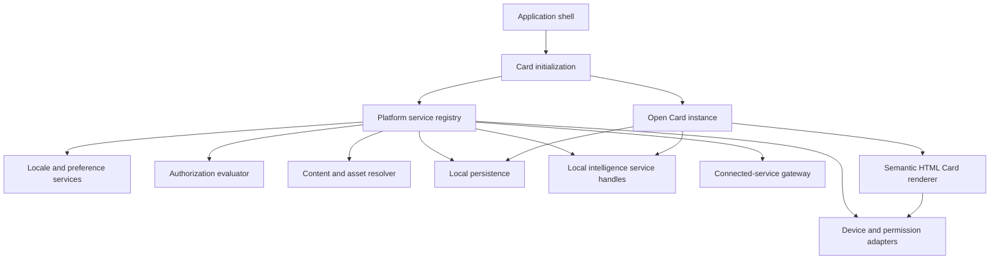

# Telugu Tutor App Skeleton Technical Design

**Status:** Discussion draft  
**Architecture direction:** Three semantic HTML schemes are under evaluation; none is selected  
**Implements:** `../spec/platform_spec.md`  
**Related:** `../spec/common_spec.md`, `../spec/capability_matrix.md`, and `../spec/student_onboarding_guide.md`

**Decision log:** [Architecture Decision Record log](ARCHITECTURE_DECISION_LOG.md)

**Candidate scheme designs:**

1. [Progressive Web App](PWA_PLATFORM_DESIGN.md)
2. [Tauri 2.0](TAURI_PLATFORM_DESIGN.md)
3. [Capacitor mobile plus Electron desktop](CAPACITOR_ELECTRON_PLATFORM_DESIGN.md)

See [Platform scheme Frequently Asked Questions](PLATFORM_OPTIONS_FAQ.md) for options considered but not currently shortlisted.

## 1. Purpose

This design turns the platform-neutral product specification into an implementable application skeleton. The skeleton must make platform services available to Cards without making Cards aware of operating systems, storage locations, identity vendors, model runtimes, or network endpoints.

The first skeleton should prove the boundaries for:

- internationalization and localization;
- ability-based authorization;
- course-content and media-asset resolution;
- learner preferences and local persistence;
- device permissions and capabilities;
- service registration and Card initialization;
- optional connected services; and
- local-intelligence integration.

This is not the design of the full tutor, a production backend, a content-authoring system, or a particular Artificial Intelligence (AI) model. It does not turn a Lesson into a workflow. A Lesson remains a directly navigable collection of Cards.

## 2. Product constraints carried into this design

- Android, iOS, Windows, and macOS are required. Web remains optional.
- Required applications must be capable of local intelligence and offline lesson use.
- Product functions should run in the installed client wherever technically feasible, including a local Large Language Model (LLM) when a Card needs one and the device is eligible.
- Cards should be semantic Hypertext Markup Language (HTML) throughout the presentation path and activated with standard JavaScript rather than depending on a frontend framework.
- Browser-native standards are preferred over third-party dependencies. A dependency is added only when it supplies material correctness, security, interoperability, or maintenance value.
- Cards use stable logical service handles, not providers, models, file paths, or Uniform Resource Locators (URLs).
- Telugu is canonical course content. Instruction language, interface locale, transliteration, and accessibility preferences are independent facts.
- English is the declared instruction-language default when no choice has been made. Any fallback to it must be disclosed.
- Authorization is based on explicitly granted abilities, not roles or persona names.
- Authored assets and learner evidence are different data classes with different storage, access, consent, retention, and deletion rules.
- Missing or unreliable device and intelligence services must produce an alternative or **Not assessed**, never fabricated learner feedback.

## 3. Proposed skeleton



The registry is dependency wiring, not a general service locator available throughout the application. Card initialization receives the registry, resolves only the handles declared by the Card, and creates a narrow set of bound handles for that Card instance.

### App layers

| Layer | Owns | Must not own |
|---|---|---|
| Application shell | Startup, lifecycle, top-level navigation, deep links, crash boundary | Lesson order or tutoring decisions |
| Card runtime | Card initialization, Card state, declared handle calls, retry and Accomplishment rules | Provider identity, raw platform APIs, asset locations |
| Platform services | Localization, authorization, assets, persistence, permissions, media, input, connectivity | Educational meaning or Card-specific policy |
| Platform adapters | Camera, microphone, files, drawing input, secure storage, native model runtime | Course semantics |
| Connected gateway | Network policy, token attachment, retry limits, endpoint clients | Silent fallback from local to connected intelligence |

### Client-first execution and optional Web

Every scheme keeps product functions in the client wherever technically feasible. The scheme-specific host provides authorization evaluation, package verification, asset resolution, persistence, evidence protection, device integration, and registered intelligence services through the same narrow `PlatformServices` contracts.

A local Large Language Model (LLM), speech model, or image model is registered behind capability-oriented service handles. Cards never import a model library or name a model. The PWA scheme uses browser workers, WebAssembly, and WebGPU; the Tauri scheme uses a Rust intelligence boundary; the split scheme uses browser providers or Capacitor/Electron native providers. Large or streaming results cross each boundary through a bounded stream or channel.

Web remains optional under the current platform specification. The PWA scheme explicitly tests whether that decision should change; the installed-host schemes may reuse the semantic HTML and JavaScript layer through a browser adapter without reducing required clients to the browser's lowest common denominator.

### Semantic HTML Card contract

The learner-facing representation of a Card is a semantic HTML fragment, not a framework component tree or a canvas-only screen. A Card should use native elements according to their meaning, including `article`, headings, sections, paragraphs, lists, `figure`, `audio`, `video`, forms, labels, buttons, progress, status, and output elements.

Standard JavaScript progressively activates declared interactions such as play, reveal, record, submit, retry, and navigate. A Card that has not yet activated should still expose meaningful readable content where the activity allows it. JavaScript uses native Document Object Model (DOM) APIs and ECMAScript modules. A virtual Document Object Model framework is not part of the initial skeleton.

Card presentation and Card authority remain separate:

```text
card.html       reviewed semantic learner-facing content
card.json       identity, version, unit references, abilities, service handles,
                accepted submissions, accomplishment rules and asset references
```

Course packages must not supply executable scripts, inline event handlers, arbitrary remote URLs, or unrestricted styles. Signed package validation parses Card HTML against an allowed element, attribute, URL, and media policy before activation. Application-owned JavaScript supplies behavior. Host bridge permissions and Telugu Tutor ability authorization are both enforced even for signed content.

An illustrative Card fragment is:

```html
<article id="card-greeting-listen" lang="te" aria-labelledby="greeting-title">
  <header>
    <p lang="en">Listen to the greeting, then record your attempt.</p>
    <h1 id="greeting-title">నమస్కారం</h1>
  </header>

  <figure>
    <audio controls preload="metadata" data-asset-ref="audio:greeting-natural:v1"></audio>
    <figcaption lang="en">A respectful greeting</figcaption>
  </figure>

  <section aria-labelledby="your-attempt-title">
    <h2 id="your-attempt-title" lang="en">Your attempt</h2>
    <button type="button" data-action="record-attempt" lang="en">Record</button>
    <output data-card-status aria-live="polite"></output>
  </section>
</article>
```

The package resolver supplies the approved instruction-language variant. Application JavaScript resolves the logical audio reference, activates `record-attempt`, and updates the status output. Native elements retain their browser semantics; JavaScript must not replace a button with a clickable `div` or reproduce a heading hierarchy through styling alone.

## 4. Potential platform schemes

The decision is between three deployment schemes for the same semantic HTML application and platform-service contracts. It is not a decision between three Card models.

| Scheme | Host arrangement | Main advantage | Main concern | Detailed design |
|---|---|---|---|---|
| Progressive Web App (PWA) | Browser-installed application on all targets | Smallest application-specific dependency surface and the most direct standards-based delivery | Required installed clients, durable offline storage, device integration, and useful local intelligence may not be sufficiently controllable | [PWA platform design](PWA_PLATFORM_DESIGN.md) |
| Tauri 2.0 | One HTML and JavaScript application hosted by Tauri on Android, iOS, Windows, and macOS | One installed-host model and a Rust boundary for protected services and local intelligence | Different operating-system web views, mobile plug-in coverage, media and input behavior, and accessibility need cross-platform proof | [Tauri platform design](TAURI_PLATFORM_DESIGN.md) |
| Capacitor mobile plus Electron desktop | Capacitor hosts Android and iOS; Electron hosts Windows and macOS | Uses host families with established focus on their respective mobile and desktop environments | Two host integrations, two plug-in ecosystems, and Electron's bundled browser increase dependency and maintenance surface | [Capacitor and Electron platform design](CAPACITOR_ELECTRON_PLATFORM_DESIGN.md) |

The third scheme has this deliberate shape:

```text
                 Semantic HTML application
                        /          \
                       /            \
          Capacitor mobile       Electron desktop
            /        \             /        \
       Android       iOS       Windows      macOS
```

### No selection yet

Each scheme must run the same representative Card package and conformance fixtures. The first spike should prove:

1. Telugu text, combining marks, selection, and scaling;
2. language switching and disclosed localization fallback without losing Card state;
3. screen-reader language metadata, keyboard navigation, focus order, and right-to-left pseudo-localization;
4. audio playback and capture, image selection or capture, and pointer, touch, or stylus strokes where supported;
5. offline installation and resolution of a signed course package;
6. local evaluation of an ability grant, including expired and wrong-resource refusal;
7. one small local-intelligence operation through a declared service handle with provenance; and
8. packaging and execution on Android, iOS, Windows, and macOS, except that the PWA scheme must instead prove an explicitly accepted install and support contract for each target.

The spike should implement risky seams, not polished screens. Selecting the PWA scheme would also require an explicit amendment to the current platform specification because that specification treats Web as optional and installed applications on all four targets as first-class requirements.

### Common dependency policy

- Do not add React, Vue, Svelte, or another component framework to the initial skeleton. Use semantic HTML, Cascading Style Sheets (CSS), ECMAScript modules, native Document Object Model APIs, Fetch, Streams, Web Crypto where appropriate, and the `Intl` family of browser APIs.
- A build tool may bundle and integrity-check static files, but the shipped Card runtime must not require a JavaScript package server or remotely hosted runtime code.
- Do not write custom cryptography, HTML sanitization, Unicode algorithms, database engines, or model runtimes merely to avoid a focused, well-maintained dependency.
- Every production dependency needs an identified owner, purpose, license, supported platforms, pinned version, and removal path. Transitive dependencies are counted.
- Package JavaScript, native libraries, models, fonts, and other runtime resources with integrity metadata. Do not load executable code from a content package or Content Delivery Network (CDN).
- Measure the complete application dependency and update surface for each scheme, including Rust crates, Capacitor plug-ins, Electron packages, browser capabilities, native libraries, and operating-system web views.

### Considered but not shortlisted

[Platform scheme Frequently Asked Questions](PLATFORM_OPTIONS_FAQ.md) records why Valdi, .NET Multi-platform App UI (.NET MAUI), Flutter, Compose Multiplatform, React Native, and other alternatives are not among the first three schemes. “Not shortlisted” is a current design judgment, not a permanent rejection.

### Why not four separate native applications initially

Separate renderers would maximize native control but create four implementations of Card semantics, localization fallback, ability enforcement, content-package validation, and learner-state rules. That cost is not justified until a shared renderer fails a measured requirement. Platform adapters remain native where the shared host is insufficient.

## 5. Platform-service contracts

Contracts should be small, asynchronous where an operation can wait, and independent of framework widgets. The following names express responsibilities; exact language signatures remain part of the skeleton implementation.

| Contract | Minimum operations |
|---|---|
| `PreferenceService` | resolve current values; update an explicitly authorized value; observe changes |
| `LocalizationService` | resolve a message or content reference; report actual language and fallback; report missing localization |
| `TransliterationService` | produce or retrieve a variant using canonical Telugu plus explicit language, script, and convention context |
| `AuthorizationService` | evaluate actor, ability, resource, and constraints; return allow or a safe refusal reason |
| `ContentRepository` | resolve immutable versioned content definitions and unit references |
| `AssetResolver` | resolve a logical asset reference to an available local resource or an authorized fetch plan |
| `PackageService` | verify, install, activate, roll back, and remove versioned packages |
| `SecureStore` | store small secrets and key material using the operating system's protected store |
| `LearnerStore` | transactionally store preferences, Card-map entries, Evaluations, Submissions, Accomplishments, and consent records |
| `EvidenceStore` | retain and delete permitted raw learner evidence under purpose, consent, retention, and authorization constraints |
| `PermissionService` | report and request an operating-system permission in context |
| `CapabilityDiscovery` | report available device, media, storage, connectivity, and intelligence capabilities |
| `ConnectedGateway` | make explicitly allowed network calls with authentication, privacy, and retry policy applied |

All results should be explicit success, unavailable, denied, invalid, or failed values. A normal missing capability must not escape as an unhandled exception.

## 6. Internationalization and localization

Internationalization is split into two delivery paths because application-shell strings and course content have different release cycles.

### Shell localization

- Store application-owned labels, platform messages, and accessibility text in versioned JavaScript Object Notation (JSON) message catalogues with stable semantic keys.
- Use the standard JavaScript `Intl` APIs for locale-aware numbers, dates, lists, relative time, plural categories, display names, and text segmentation where supported by the platform matrix.
- Keep initial messages structurally simple. If the product needs a general message grammar for complex plural or selection rules, adopt one focused standards-based library rather than building an undocumented template language.
- Package shell catalogues with the application release and expose them through the same `LocalizationService` used by semantic Card HTML.
- Use stable semantic message keys. Do not use English sentences as keys.
- Include pseudo-locales in automated layout and fallback tests.

### Course localization

- Store localized prompts, explanations, illustrations, and recorded audio in versioned course packages, not in the shell JSON catalogues.
- A Card refers to `ContentRef` and `AssetRef` values. It never embeds an English fallback or storage URL.
- Resolve in this order unless a package declares a narrower rule: exact language-script-region, language-script, language, then declared fallback.
- Return the requested locale, actual locale, content version, and `isFallback` with every resolved value.
- When `isFallback` is true, render a visible and screen-reader-accessible disclosure.
- Changing instruction language re-resolves presentation content. It does not replace the Card definition, canonical Telugu, submission, Evaluation, Accomplishment, or progress.

### Independent preference context

The runtime context must keep at least these fields separate:

```text
instructionLanguage: language + optional script and region
interfaceLocale: language + optional script and region
transliteration: visible/hidden + target script + convention
accessibility: text scale, captions, transcript, reduced motion, voice and speaking rate where supported
```

Device locale may suggest initial values but cannot overwrite an explicit selection. Absence uses declared defaults and is not an onboarding-complete state.

### Transliteration

Transliteration remains a runtime service even when it returns a cached reviewed result. Its cache key includes canonical Telugu content version, instruction language, target script, convention, provider contract version, and provider implementation version. Missing or unreviewed variants must be identified honestly.

## 7. Ability-based authorization

### Model

An authorization request contains:

```text
actor identity or anonymous installation identity
ability identifier
resource type and stable resource identifier
operation context
current time
relevant consent and device state references
```

A grant contains an ability plus optional constraints such as course, chapter, Card, learner, operation, expiry, usage allowance, or evidence purpose. Grants never contain or imply application roles.

### Connected and offline decisions

- Public content needs no artificial sign-in requirement.
- A connected authorization service is authoritative for restricted downloads, purchases, exports, cross-learner evidence access, and other server-side operations.
- After authentication, the server may issue a short-lived, signed offline entitlement envelope containing the minimum abilities and resource scopes needed on that device.
- The local evaluator verifies signature, issuer, audience, time bounds, device binding where used, ability, resource scope, and policy version before allowing a protected local action.
- Online critical operations are re-evaluated by the server; a prior local allow is not proof for the server request.
- Unknown, malformed, expired, or unsupported authorization fails closed for the protected operation. The Card may still offer an unprotected alternative.

Native sign-in should use OpenID Connect (OIDC) over OAuth 2.0 Authorization Code flow with Proof Key for Code Exchange (PKCE) through the system browser. The identity provider is deferred. Access tokens stay in memory where practical; refresh credentials and device keys use the operating system's secure storage.

### Open authorization questions

- Maximum offline entitlement lifetime and the resulting revocation delay.
- Whether envelopes are bound to a device-held key.
- Whether limited-use allowances must work offline and how concurrent devices reconcile them.
- Which refusal reasons are safe and useful to expose to a learner.
- Whether anonymous progress can later be attached to an account and under what proof.

These questions must be answered before paid content or sensitive evidence is enabled. They do not block public, device-local Chapter 01 work.

## 8. Content and asset locations

### Stable references

Cards use typed logical references, for example:

```text
ContentRef(namespace, id, version)
AssetRef(namespace, id, version, variant)
EvidenceRef(learner-scoped opaque identifier)
```

An `AssetRef` is not a path or URL. A signed package manifest maps it to media type, byte length, cryptographic digest, localization and accessibility metadata, provenance, and one or more package-relative objects.

### Resolution order

The resolver checks locations in this order:

1. bootstrap assets packaged with the application;
2. the active, integrity-checked course package in the local cache;
3. another already-installed compatible package; and
4. an authorized remote package source through the connected gateway.

Only the resolver knows the physical location. A Card receives a readable local handle or an explicit unavailable result. Remote media should be downloaded and verified before use when offline continuity is promised.

### Data-class separation

| Data class | Location and lifecycle |
|---|---|
| Shell assets | Versioned with the application |
| Canonical course definitions | Immutable, signed course packages; locally cached and remotely distributed |
| Localized instructional assets | Versioned package variants linked to canonical content versions |
| Local model resources | Separate integrity-checked packages removable without deleting learner progress |
| Learner records | Transactional local database; optional synchronization is deferred |
| Raw learner evidence | Private encrypted files with purpose, consent, retention, deletion, and authorization metadata; never mixed with course assets |
| Exports | Generated on explicit authorized request into a user-selected location or a short-lived authenticated download |

Course packages should be immutable. A correction creates a new version and activation is atomic. Keep the previous compatible version until the new package verifies and activates successfully. Do not overwrite objects in place under an existing version.

## 9. Local persistence

Use an embedded Structured Query Language (SQL) database, provisionally SQLite, for preferences, package metadata, the Student Card map, Submissions, Evaluations, Accomplishments, consent, and evidence metadata. Store large audio, image, video, stroke, and model objects as files referenced by database records rather than as database binary values.

Use the operating system's protected credential store for refresh credentials, signing keys, evidence-encryption keys, and similar small secrets. A general preferences file is not a secret store.

Required properties are:

- transactional Card-result updates;
- explicit schema versions and forward migrations;
- foreign-key or equivalent referential checks;
- encryption for sensitive local evidence and secrets;
- idempotent package installation and recovery after interruption; and
- deletion that removes both metadata and the referenced raw evidence.

Cross-device synchronization remains deferred. Repository contracts must not pretend that a local write has synchronized.

## 10. Minimal connected platform

Start with a modular monolith, not microservices. The first connected deployment needs only clear modules for:

- identity integration and token validation;
- ability and entitlement evaluation;
- course catalogue and signed package manifests;
- authorized package and asset delivery; and
- learner-initiated account or submission export when those capabilities are introduced.

Private learner evidence upload, progress synchronization, commerce, remote intelligence, and content administration are later modules unless a validated release requirement needs them.

Expose versioned Hypertext Transfer Protocol (HTTP) contracts described with OpenAPI. The client domain and service contracts must not depend on generated network models directly; gateway adapters translate between them.

### Backend language is not yet selected

| Candidate             | Best reason to choose it                                                                      | Decision input still needed                                            |
| --------------------- | --------------------------------------------------------------------------------------------- | ---------------------------------------------------------------------- |
| Kotlin with Ktor      | One language with a Compose Multiplatform fallback and strong typed domain code               | Whether Kotlin is the team's preferred operating stack                 |
| TypeScript on Node.js | Fast iteration and a broad identity, content, and administration ecosystem                    | Runtime operations discipline and type boundaries at persistence edges |
| Go                    | Small deployables and straightforward concurrency for package delivery and authorization APIs | Team fluency and authoring/admin ecosystem needs                       |

Choose after the client spike and hosting/operational ownership are known. The network contracts, ability model, package format, and conformance tests should survive this choice.

## 11. Proposed repository shape during scheme evaluation

```text
app/
  index.html              semantic application shell
  src/
    shell/                lifecycle and top-level navigation
    card-runtime/         HTML loading, activation and Card state
    services/             narrow JavaScript service clients
    localization/         JSON catalogues, Intl use and locale policy
    styles/               shared accessible presentation rules
  hosts/
    pwa/                   service worker, manifest and browser adapters
    tauri/                 Rust services, capabilities and native adapters
    capacitor/             Android and iOS bridge adapters
    electron/              Windows and macOS main process and preload bridge
content/
  schemas/               Card manifest, unit, package and HTML-policy schemas
  cards/                 semantic Card HTML plus structured manifests
  fixtures/              minimal signed test course packages
server/
  api/                    versioned transport contracts
  modules/               authorization, catalogue, packages and exports
conformance/
  card_contracts/        cross-platform Card behaviour fixtures
  localization/          fallback and pseudo-locale fixtures
  authorization/         grant allow/refuse fixtures
  packages/              signature, digest, activation and rollback fixtures
```

This is a responsibility map, not permission to create every host as permanent production code. Candidate host folders may contain isolated feasibility spikes. After selection, retain the shared fixtures and chosen host, and remove candidate-only code through an explicit reviewed change.

## 12. Verification strategy

### Shared conformance tests

- The same Card fixture resolves to educationally equivalent blocks and interactions on every required platform.
- Locale changes preserve Card and learner-state identifiers.
- Missing localization returns an explicit disclosed fallback.
- Authorization fixtures exercise exact scope, wrong scope, expiry, unknown ability, malformed envelope, and offline state.
- Asset fixtures exercise bundled, cached, downloadable, corrupted, missing, rolled-back, and wrong-version resources.
- Learner evidence can never resolve through a course `AssetRef`.
- A failed package update leaves the previous active package usable.
- Missing camera, microphone, storage, or intelligence produces the configured alternative or **Not assessed**.

### Platform checks

- Telugu shaping, font fallback, selection, scaling, and screen-reader output.
- Keyboard, mouse, touch, and stylus input where applicable.
- Permission denial and later permission changes.
- Secure-store behavior after restart, sign-out, and application removal.
- Package size, startup time, memory use, and native intelligence loading.

## 13. Decisions to discuss next

1. Which of the three schemes should enter the first feasibility spike?
2. Which one or two Cards are the minimum representative skeleton: a localized read/listen Card plus a handwriting or speech Card?
3. Which instruction language, in addition to English, should prove real fallback and script behavior?
4. Must restricted course content remain usable offline in the first release, and for how long?
5. Which assets ship in the application and which arrive only through course packages?
6. Is an account required for the first technical prototype, or should it prove public and anonymous device-local use first?
7. Which first connected capability makes a backend necessary: restricted lesson access, package publication, purchase, or export?

## 14. Current comparison summary

- No application host is selected. Compare the PWA, Tauri, and Capacitor-plus-Electron schemes against the same Card and platform-service contracts.
- Treat semantic HTML as the learner-facing Card contract and keep abilities, service requirements, and integrity information in a structured Card manifest.
- The PWA has the smallest application-specific dependency surface, but it must prove and formally reconcile required-platform installation, offline durability, device behavior, and local intelligence.
- Tauri offers one installed-host model and a Rust client boundary, but its operating-system web views and mobile plug-in coverage require cross-platform proof.
- Capacitor plus Electron uses specialized mobile and desktop hosts, but carries two integration surfaces and Electron's bundled browser runtime.
- Put protected data access, package verification, and local Large Language Model (LLM) or other intelligence runtimes behind scheme-independent service handles.
- Prefer browser-native APIs and keep production dependencies explicit, local, auditable, and replaceable.
- Keep platform services behind narrow contracts bound during Card initialization.
- Use JSON shell catalogues with standard `Intl` APIs and versioned content packages for course localization.
- Use explicit ability grants and signed offline entitlement envelopes; never introduce roles.
- Resolve immutable authored assets through logical references and signed manifests.
- Store learner records transactionally, raw evidence privately, and secrets in operating-system secure storage.
- Begin connected services as a modular monolith and defer its implementation language until client and operating constraints are known.
- Do not begin full application construction until the cross-platform risk spike passes.

## 15. Related designs and primary references

- [PWA platform design](PWA_PLATFORM_DESIGN.md)
- [Tauri platform design](TAURI_PLATFORM_DESIGN.md)
- [Capacitor mobile plus Electron desktop platform design](CAPACITOR_ELECTRON_PLATFORM_DESIGN.md)
- [Platform scheme Frequently Asked Questions](PLATFORM_OPTIONS_FAQ.md)
- [Making Progressive Web Apps installable](https://developer.mozilla.org/en-US/docs/Web/Progressive_web_apps/Guides/Making_PWAs_installable)
- [Tauri 2.0 platform overview](https://v2.tauri.app/)
- [Capacitor documentation](https://capacitorjs.com/docs)
- [Electron process model](https://www.electronjs.org/docs/latest/tutorial/process-model)
- [OAuth 2.0 for Native Apps, RFC 8252](https://datatracker.ietf.org/doc/html/rfc8252)
