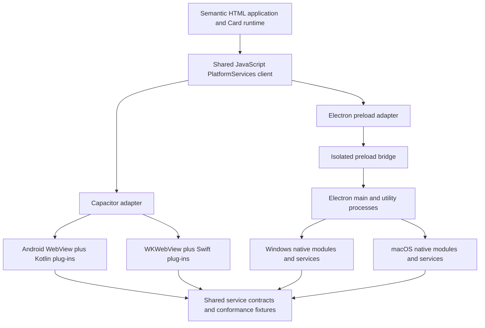

# Capacitor Mobile and Electron Desktop Platform Scheme

**Status:** Candidate design; not selected  
**Scheme:** Shared semantic HTML and JavaScript application hosted by Capacitor on mobile and Electron on desktop  
**Parent design:** [App skeleton technical design](APP_SKELETON_TECH_DESIGN.md)  
**Product contract:** [Platform and logical presentation specification](../spec/platform_spec.md)

## 1. Decision this scheme tests

This scheme tests whether using platform-specialized, established web application hosts provides better mobile device integration and more predictable desktop web behavior than a single four-platform host, while preserving one semantic Hypertext Markup Language (HTML) Card runtime.

The scheme intentionally accepts two host implementations:

```text
                 Semantic HTML application
                        /          \
                       /            \
          Capacitor mobile       Electron desktop
            /        \             /        \
       Android       iOS       Windows      macOS
```

Cards do not know which host is active. They call one shared `PlatformServices` interface implemented by a Capacitor adapter or an Electron adapter.

## 2. Architecture



The shared frontend is packaged into both hosts. Host adapters translate shared requests and results; they do not redefine Card state, educational meaning, authorization abilities, or completion rules.

## 3. Shared application and Card layer

- Maintain one semantic HTML application shell, CSS system, standard JavaScript Card runtime, localization implementation, and Card HTML policy.
- Keep reviewed `card.html` presentation separate from the structured `card.json` authority and execution manifest.
- Use standard JavaScript modules; do not require Ionic components, React, Angular, Vue, or another frontend framework merely because Capacitor or Electron can host them.
- Define one versioned `PlatformServices` JavaScript contract used by both hosts and the optional browser test adapter.
- Package no host names, plug-in names, Electron channel names, filesystem paths, model identities, or platform branches inside Card definitions.
- Conformance-test the built frontend resources once, then run host-specific integration tests using the same Card fixtures.

## 4. Host responsibilities

### Capacitor mobile

Capacitor owns:

- Android and iOS application lifecycle and packaging;
- the mobile WebView;
- JavaScript-to-native plug-in calls;
- Kotlin/Java Android adapters;
- Swift iOS adapters;
- mobile permissions, camera, files, notifications, and other evaluated plug-ins; and
- mobile application-store integration.

### Electron desktop

Electron owns:

- Windows and macOS application lifecycle and packaging;
- a bundled Chromium renderer;
- a privileged main process;
- isolated preload bridges;
- utility processes for long-running or crash-prone work;
- Node.js or native-module integration; and
- desktop menus, dialogs, updates, exports, and operating-system integration.

## 5. Platform-service implementation

| Shared contract | Capacitor mobile | Electron desktop |
|---|---|---|
| `PreferenceService` | Native SQLite plug-in or evaluated local repository | SQLite through the main/utility process |
| `LocalizationService` | Shared JSON catalogues and localized packages | Same shared implementation and packages |
| `AuthorizationService` | Native plug-in or shared JavaScript validation with protected key storage | Main-process evaluator with protected key storage |
| `ContentRepository` | Capacitor filesystem/database adapters | Main-process filesystem/database repository |
| `AssetResolver` | Opaque local file or converted WebView resource handle | Validated application protocol or opaque file handle |
| `PackageService` | Kotlin/Swift or portable native package verifier | Node/native package verifier in a utility process |
| `SecureStore` | Keychain/Keystore through an evaluated plug-in | Keychain or Windows credential protection through a native module |
| `LearnerStore` | SQLite with migrations and transactions | SQLite with the same logical schema and migrations |
| `EvidenceStore` | Private application files plus metadata | Private application files plus metadata |
| `PermissionService` | Capacitor and custom mobile permission plug-ins | Operating-system and Electron permission handling |
| `CapabilityDiscovery` | Mobile plug-in registry and runtime probes | Electron/native-module registry and runtime probes |
| Intelligence handles | WebGPU/Wasm or native mobile plug-in | WebGPU/Wasm, Node native module, or utility-process native runtime |
| `ConnectedGateway` | Shared HTTPS client or native network plug-in when justified | Main-process HTTPS client with bounded renderer interface |

The logical request and result shapes must be identical. Host-specific metadata remains in service registration and Evaluation provenance rather than Card requests.

## 6. Internationalization

- Use identical semantic Card HTML, `lang`, `dir`, JSON catalogues, localization keys, fallback disclosure, and preference rules in both hosts.
- Use standard JavaScript `Intl` APIs only within the supported feature matrix.
- Package the same approved fonts and localized content variants where licensing and platform rules permit.
- Verify Telugu shaping and instruction-language input on Android WebView, WKWebView, and Electron's bundled Chromium.
- Treat Electron's controlled Chromium version as a desktop benefit, not evidence for mobile behavior.
- Preserve Card identity, Submissions, Evaluations, Accomplishments, and progress when language or presentation preferences change.

## 7. Authorization and identity

- Public content does not require sign-in.
- Mobile sign-in uses the system browser and an application link or custom redirect through a Capacitor-compatible authentication adapter.
- Desktop sign-in uses the system browser with loopback or an approved application redirect; do not embed identity-provider credentials inside the Electron renderer.
- Both hosts validate the same signed offline ability envelope fields and policy version.
- Connected protected actions are revalidated by the server.
- Capacitor and Electron host permissions restrict the bridge surface but do not replace actor ability authorization.
- Refresh credentials and device keys remain outside the WebView/renderer in protected host storage.

## 8. Assets, persistence, and evidence

- Package the same application-owned frontend resources in both hosts.
- Use the same immutable logical course and model package format.
- Allow different physical paths, database libraries, and download implementations behind shared repository contracts.
- Use a common logical SQLite schema and migration test suite where practical.
- Keep raw evidence outside the renderer's browser storage when it is retained durably.
- Pass large objects by opaque identifier or bounded stream, not repeated JavaScript Object Notation (JSON) serialization.
- Keep course assets, learner evidence, exports, models, and credentials in distinct repositories and authorization paths.
- Verify deletion and export independently on each host.

## 9. Local intelligence

The first preference is a shared browser provider when it passes every target's requirements:

- WebGPU or WebAssembly in a worker;
- WebLLM for a compatible local LLM; or
- Transformers.js or an evaluated equivalent for speech, image, or language tasks.

When a browser provider is inadequate:

- Capacitor calls a narrow Kotlin or Swift model plug-in;
- Electron calls a Node native module or a native runtime in a utility process; and
- both register the same service handle and result contract.

Models and runtimes may differ by host and platform after shared behavioral, safety, reliability, language, and resource evaluation. Cards cannot observe that difference. Model installation, provenance, cancellation, memory pressure, backgrounding, removal, and unavailable behavior are explicit.

## 10. Security boundary

### Shared frontend

- Apply a restrictive Content Security Policy (CSP).
- Package all executable frontend code locally.
- Validate Card HTML and prohibit content-supplied scripts, handlers, arbitrary remote URLs, unrestricted styles, and executable Wasm.
- Construct model and learner text through safe DOM APIs.

### Capacitor

- Do not load the application shell from an arbitrary remote origin.
- Expose only required plug-in methods.
- Validate every path, identifier, ability, and consent state inside the native plug-in.
- Treat community plug-ins as production dependencies requiring source and permission review.

### Electron

- Enable context isolation and renderer sandboxing.
- Disable Node.js integration in the renderer.
- Expose a narrow preload interface instead of raw inter-process communication (IPC).
- Validate the sender, channel, request schema, paths, abilities, and resource scopes in the main process.
- Run long-lived inference or risky native code outside the main user-interface process.
- Do not navigate the privileged application window to remote content.

## 11. Distribution and updates

- Build and sign Android and iOS applications through Capacitor platform projects.
- Build and sign Windows and macOS applications through Electron packaging.
- Release the same frontend version and Card contract version across hosts, but do not require simultaneous model-provider releases when compatible handles pass conformance.
- Version application shells separately from course and model packages.
- Keep host-specific release pipelines while sharing content validation, frontend tests, schemas, fixtures, and release metadata.
- Respect Google Play, Apple App Store, Microsoft Store, and Mac distribution rules independently.

## 12. Dependency policy

- Count the two host runtimes and their complete plug-in/native-module graphs.
- Keep the shared frontend framework-free initially.
- Prefer official Capacitor plug-ins where they meet the contract; review community plug-ins before adoption.
- Minimize Electron packages and renderer dependencies; keep native model/runtime dependencies isolated.
- Record purpose, owner, license, platform support, pinned version, transitive surface, update cadence, and removal path.
- Do not duplicate a shared capability in both JavaScript and native code without a documented fallback reason.

This scheme has a larger host dependency surface than PWA or a single-host design. Its justification must be measurably better mobile and desktop capability coverage.

## 13. Main advantages

- Cards remain literal semantic HTML and standard JavaScript.
- Capacitor is purpose-built for mobile web applications and has a broad mobile plug-in ecosystem.
- Electron supplies a consistent bundled Chromium version on Windows and macOS.
- Desktop local intelligence can use Node/native modules and utility processes.
- Each host can follow the conventions and release tooling of its target class.
- The optional browser product can reuse the shared frontend through a third adapter.

## 14. Main risks

- Two application hosts, bridges, security models, dependency graphs, and release pipelines.
- Mobile uses system WebViews while desktop uses bundled Chromium.
- Host implementations may drift despite shared contracts.
- Native intelligence can become four implementations hidden behind two hosts.
- Electron increases application size, memory use, and security-update responsibility.
- Capacitor plug-in quality and platform parity vary.
- Authentication, exports, updates, background behavior, and evidence paths require separate mobile and desktop verification.

## 15. Required feasibility spike

Build one shared frontend and execute the same Card fixtures through both hosts:

1. Android and iOS Capacitor packages;
2. Windows and macOS Electron packages;
3. Telugu rendering, language switching, right-to-left pseudo-localization, and accessibility;
4. audio playback and interruption-aware capture;
5. camera/upload and direct-writing input;
6. the shared SQLite logical schema and migration fixtures;
7. signed course/model package install and rollback;
8. exact, wrong, expired, and malformed ability envelopes;
9. evidence retention, protected access, deletion, and export; and
10. a real local model through a browser provider or host-specific provider with the same service result.

## 16. Acceptance conditions

This scheme remains viable only if:

- one unchanged Card and frontend build can be packaged by both hosts;
- host adapters pass identical service conformance fixtures;
- host-specific branching remains outside Cards and shared educational logic;
- mobile capability coverage materially exceeds the PWA scheme;
- desktop consistency or native capability materially justifies Electron's weight;
- the doubled dependency and release surface remains operationally affordable; and
- missing or unreliable services produce the configured alternative or **Not assessed**.

## 17. References

- [Capacitor documentation](https://capacitorjs.com/docs)
- [Electron documentation](https://www.electronjs.org/docs/latest/)
- [Electron process model](https://www.electronjs.org/docs/latest/tutorial/process-model)
- [Electron security checklist](https://www.electronjs.org/docs/latest/tutorial/security)
- [WebLLM](https://github.com/mlc-ai/web-llm)
- [Transformers.js](https://huggingface.co/docs/transformers.js/main/index)
