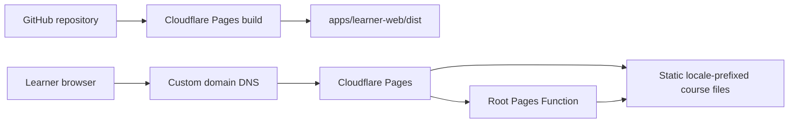

# Cloudflare Pages Hosting and DNS Specification

**Status:** Proposed implementation specification  
**Scope:** Public deployment of the generated learner course site  
**Application:** `apps/learner-web`  
**Hosting provider:** Cloudflare Pages  
**Related:** [Learner web build instructions](../../apps/learner-web/build-tools/README.md), [Progressive Web App platform design](../design/PWA_PLATFORM_DESIGN.md)

## 1. Purpose

This specification defines how to publish the generated learner course files from `apps/learner-web/dist/` on Cloudflare Pages. It also defines language routing, custom-domain and Domain Name System (DNS) setup, release verification, rollback, and the operational boundary between Cloudflare Pages and a future identity provider.

The first release is a public static course site. Authentication may identify a learner and enable future saved progress, but it does not make files in `dist/` private.

## 2. Goals

- Publish only generated course output from `apps/learner-web/dist/`.
- Build English and Hindi instruction-language variants from source on every deployment.
- Serve course HTML, Cascading Style Sheets (CSS), and images as static assets.
- Use stable locale-prefixed URLs that can be cached, bookmarked, shared, and indexed.
- Remember the learner's instruction-language preference in a cookie.
- Invoke a Cloudflare Pages Function only at the site root.
- Support automatic deployments from the production Git branch and preview deployments from other branches or pull requests.
- Serve a custom domain over Hypertext Transfer Protocol Secure (HTTPS).
- Preserve existing DNS and mail service during a DNS migration.
- Provide a tested rollback path that does not require rebuilding the previous release.

## 3. Non-goals

- Protecting or paywalling course HTML in `dist/`.
- Implementing Supabase, Firebase, Clerk, or another identity provider.
- Saving learner progress or preferences outside the language cookie.
- Adding a service worker, offline installation, or a complete Progressive Web App.
- Moving canonical course content out of the repository.
- Serving application programming interface (API) traffic through Pages Functions.

If course content must later be restricted, protected content must not be published as a static asset. That change requires a separate authorization and content-delivery design.

## 4. Deployment topology



The Pages project must publish `dist/` as its output directory. Source HTML, content files, build tools, tests, documentation, and repository metadata must not be exposed by the deployment.

## 5. Canonical URL design

The deployed paths retain the generated structure:

```text
/
/en/html/pages/index.html
/en/html/pages/chapter-01.html
/en/html/pages/chapter-01-lesson-01.html
/hi/html/pages/index.html
/hi/html/pages/chapter-01.html
/hi/html/pages/chapter-01-lesson-01.html
```

The locale prefix is authoritative. The cookie helps choose a locale only when the learner visits `/`; it must not silently rewrite an explicitly selected `/en/` or `/hi/` URL.

The initial supported instruction languages are:

| Language | Locale prefix | Selection values |
|---|---|---|
| English | `en` | `en`, an `Accept-Language` English match, or the default |
| Hindi | `hi` | `hi` or an `Accept-Language` Hindi match |

Unknown, empty, or malformed language values fall back to `en`.

## 6. Language routing

### 6.1 Preference cookie

Use one cookie with this contract:

| Attribute | Value |
|---|---|
| Name | `tb_instruction_language` |
| Allowed values | `en`, `hi` |
| Path | `/` |
| Maximum age | 31,536,000 seconds (one year) |
| Secure | Yes |
| SameSite | `Lax` |
| HttpOnly | No; the hosted web application writes this preference |

The cookie contains a non-sensitive preference and must never contain identity, authorization, or session data. It is deliberately not `HttpOnly` because the hosted application, rather than a Cloudflare endpoint, writes it. The locale prefix remains the authoritative description of the current page language.

### 6.2 Root route

`GET /` must:

1. Read and validate `tb_instruction_language`.
2. If the cookie is absent or invalid, inspect `Accept-Language`.
3. Select `hi` only when Hindi is the best supported match; otherwise select `en`.
4. Return a temporary redirect to `/<language>/html/pages/index.html`.
5. Return `Cache-Control: private, no-store` because the result varies by learner.
6. Return `Vary: Cookie, Accept-Language`.

The redirect must be temporary (`302` or `307`), never permanent, so a prior choice is not fixed in browser or intermediary caches.

### 6.3 Language selection without a dynamic route

No separate Cloudflare endpoint handles language changes. Every language control must be an ordinary link to the corresponding locale-prefixed page, so changing language remains functional without JavaScript.

On a hosted page, application-owned JavaScript may remember the current locale by deriving it from the validated leading `/en/` or `/hi/` path segment and writing `tb_instruction_language`. The script must ignore every other path value and must use the cookie attributes in section 6.1.

For example, a visit to a valid `/hi/` page may write:

```text
tb_instruction_language=hi; Path=/; Max-Age=31536000; Secure; SameSite=Lax
```

The Cloudflare root Function continues to treat the cookie as untrusted input and validates it before redirecting. Locally bundled iOS or Android HTML must use the application's platform preference adapter instead of depending on this website cookie.

### 6.4 Function route isolation

The published `dist/_routes.json` must restrict Pages Functions to the root route:

```json
{
  "version": 1,
  "include": ["/"],
  "exclude": []
}
```

All locale-prefixed pages and static dependencies must bypass Functions. This preserves Cloudflare Pages' free and unlimited static asset requests and avoids spending a Function invocation on each HTML, CSS, or image request.

The Cloudflare Workers Free quota is currently 100,000 requests per day per account, shared by Workers and Pages Functions, and resets at midnight Coordinated Universal Time (UTC). The routing above should consume approximately one invocation for a root visit rather than one invocation for every page or asset.

## 7. Repository changes required by implementation

The implementation should introduce or generate the following deployment-owned files:

```text
apps/learner-web/
├── functions/
│   └── index.js          # GET /
├── ops/
│   └── cloudflare/
│       └── README.md     # concise operator runbook and project identifiers
└── dist/
    ├── _headers          # generated/copied deployment headers
    ├── _routes.json      # generated/copied function route selection
    ├── en/
    └── hi/
```

`dist/` remains generated and ignored by Git. Authoritative copies or generators for `_headers` and `_routes.json` must live outside `dist/`, and the learner-web publish stage must copy them into each complete deployment output.

Do not store Cloudflare API tokens, account identifiers treated as secrets, registrar credentials, Supabase secrets, or private keys in the repository.

## 8. Static response headers

The deployment must publish a Cloudflare Pages `_headers` file. The initial policy should include:

```text
/*
  X-Content-Type-Options: nosniff
  Referrer-Policy: strict-origin-when-cross-origin
  X-Frame-Options: DENY
  Permissions-Policy: camera=(), geolocation=(), microphone=()

/assets/*
  Cache-Control: public, max-age=3600

/*/assets/*
  Cache-Control: public, max-age=3600

/*/css/*
  Cache-Control: public, max-age=3600

/*/html/pages/*
  Cache-Control: public, max-age=0, must-revalidate
```

These cache lifetimes are intentionally conservative because current asset filenames are not content-hashed. Long immutable caching must wait until the build emits fingerprinted asset names.

A Content Security Policy (CSP) must be designed alongside authentication. Do not ship a policy that blocks the selected identity provider's scripts, connections, frames, or form actions, and do not weaken the policy with broad wildcards merely to make sign-in work.

## 9. Cloudflare Pages project configuration

Create one Pages project with these settings:

| Setting | Required value |
|---|---|
| Project name | `tutorbrains-courses` or another stable, recorded name |
| Git provider | GitHub |
| Repository | `The-ArtBrain/TutorBrains` |
| Production branch | The repository's protected release branch, initially `main` if that is the release branch |
| Root directory | `apps/learner-web` |
| Framework preset | None |
| Build output directory | `dist` |
| Node.js dependency install | None required for the static build |

Use this build command from the configured root directory:

```sh
python3 -m venv build-tools/.venv && build-tools/.venv/bin/python -m pip install --group build-tools/pyproject.toml:build && build-tools/.venv/bin/python build-tools/build.py && build-tools/.venv/bin/python build-tools/build.py --instruction-language hi
```

The command installs the pinned build dependency, builds English, and then builds Hindi without deleting the first language. A deployment must fail if either language build fails.

Before enabling production deployments, verify that Cloudflare's selected build image supplies a Python and `pip` version compatible with dependency groups. Pin the build-image version in the Pages configuration after verification so an unannounced build-image change cannot alter the release unexpectedly.

No runtime environment variable or secret is required for static hosting and locale routing.

## 10. Deployment workflow

### 10.1 Preview deployment

1. Push the implementation to a non-production branch.
2. Allow Pages to create a preview deployment.
3. Run the verification checklist in section 14 against the preview hostname.
4. Confirm that only `/` appears as a Function invocation.
5. Confirm that no repository source or build input is reachable.

Preview hostnames should not be added to search indexes. If Cloudflare does not protect or mark preview deployments automatically, add an appropriate preview-only `X-Robots-Tag: noindex` response policy.

### 10.2 Production deployment

1. Merge an approved revision to the production branch.
2. Wait for both language builds and the Pages deployment to succeed.
3. Smoke-test the generated `pages.dev` hostname.
4. Attach or validate the custom domain.
5. Run production verification.
6. Record the Git commit, Cloudflare deployment identifier, time, and verifier in the release record.

The first production release should keep the assigned `*.pages.dev` hostname available for diagnosis but should advertise only the custom domain.

## 11. Domain naming policy

The recommended first hostname is a dedicated subdomain:

```text
learn.example.com
```

This preserves the apex domain for a future product or marketing site and permits the course deployment to move independently. Replace `example.com` with the selected registered domain before implementation.

Select exactly one canonical public hostname. Any additional hostname, such as `www.example.com` or the apex, must permanently redirect to the canonical hostname rather than independently serving duplicate content.

## 12. DNS management

Choose one of the following DNS paths. Path A is recommended when Cloudflare will manage the complete zone. Path B is the lowest-risk option when an existing DNS provider must remain authoritative and the course uses a subdomain.

### 12.1 Pre-change inventory for either path

Before changing DNS:

1. Identify the registrar and the current authoritative DNS provider; they may be different companies.
2. Export or record every current DNS record and its Time to Live (TTL).
3. Pay particular attention to:
   - apex `A`, `AAAA`, `ALIAS`, or `CNAME` records;
   - `www` and application subdomains;
   - mail exchanger (`MX`) records;
   - Sender Policy Framework (SPF), DomainKeys Identified Mail (DKIM), and Domain-based Message Authentication, Reporting and Conformance (DMARC) `TXT` records;
   - provider-verification `TXT` records;
   - Certification Authority Authorization (CAA) records;
   - subdomain delegations (`NS` records); and
   - existing redirects or proxies.
4. Record whether DNS Security Extensions (DNSSEC) is enabled and whether a Delegation Signer (DS) record exists at the registrar.
5. If the current provider permits it, lower TTLs for records that will change to 300 seconds at least one prior TTL period before migration.
6. Verify access to the registrar, current DNS provider, Cloudflare account, and GitHub organization before beginning the change window.
7. Choose a change window and name the person authorized to roll back.

Do not proceed with a nameserver migration based only on Cloudflare's automatic record scan. Compare the imported zone with the recorded inventory.

### 12.2 Path A: Cloudflare manages the complete DNS zone

Use this path for an apex custom domain or when Cloudflare should become the authoritative DNS provider.

1. In Cloudflare, select **Domains > Onboard a domain** and add the apex domain.
2. Select the Free plan unless another requirement justifies a paid zone plan.
3. Allow Cloudflare to scan existing records.
4. Compare every imported record with the pre-change inventory; manually add anything missing.
5. Confirm that mail, verification, and delegated-subdomain records are present before changing nameservers.
6. If DNSSEC is enabled, disable it at the current provider or registrar and remove the old DS record before changing nameservers. Changing nameservers while an old DS record remains can make the domain unreachable.
7. Copy the two Cloudflare-assigned authoritative nameservers from the zone Overview page.
8. At the registrar, replace all previous authoritative nameservers with exactly the two assigned Cloudflare nameservers. Do not leave an old provider's nameserver in the set.
9. Wait until Cloudflare reports the zone as **Active**. Registrar propagation can take up to 24 hours.
10. Verify delegation independently:

    ```sh
    dig NS example.com @1.1.1.1
    dig NS example.com @8.8.8.8
    dig example.com +trace
    ```

11. Verify existing web, mail, and verification records before attaching Pages.
12. In **Workers & Pages**, open the Pages project, select **Custom domains > Set up a domain**, and enter the canonical hostname.
13. Confirm the proposed DNS record. Cloudflare will create the Pages record when the zone is in the same account.
14. Wait for the custom domain and managed certificate to become active.
15. Re-enable DNSSEC in Cloudflare, publish the new DS information through the registrar when instructed, and confirm DNSSEC validation before closing the change.
16. Restore ordinary TTL values after the deployment is stable.

For an apex hostname, the zone must be active on Cloudflare for a normal Pages custom-domain setup. Do not invent fixed Cloudflare `A` record addresses.

### 12.3 Path B: retain an external DNS provider and use a subdomain

Use this path for a hostname such as `learn.example.com` when the apex zone should remain at its current DNS provider.

1. Deploy and verify the Pages project at `<project>.pages.dev`.
2. In the Pages project, select **Custom domains > Set up a domain** and enter `learn.example.com`.
3. Complete the Pages custom-domain association before manually creating the DNS record. Creating only a CNAME without associating the hostname in Pages can produce a `522` error.
4. At the authoritative DNS provider, create:

    | Type | Name | Target |
    |---|---|---|
    | `CNAME` | `learn` | `<project>.pages.dev` |

5. Remove any conflicting `A`, `AAAA`, or `CNAME` record for `learn`.
6. Wait for DNS propagation and Cloudflare certificate issuance.
7. Verify the CNAME and HTTPS response:

    ```sh
    dig CNAME learn.example.com @1.1.1.1
    curl -I https://learn.example.com/
    ```

8. Keep DNSSEC management with the existing authoritative provider; no nameserver change is required for this path.

The external-provider path is for a subdomain. Use Path A if the Pages project must serve the apex domain.

### 12.4 TLS and zone settings

After the domain is active:

- Require HTTPS and redirect plain HTTP to HTTPS.
- Use modern Transport Layer Security (TLS) versions supported by the required browser matrix.
- Keep certificate renewal managed by Cloudflare.
- Review restrictive CAA records if certificate issuance remains pending; do not delete intentional CAA policy without owner approval.
- Use `Full (strict)` for any future proxied origin traffic. Pages itself does not require a separately managed origin certificate.
- Do not enable automatic HTML or JavaScript rewriting features without regression testing the generated pages.

### 12.5 DNS rollback

For Path A, rollback means restoring the recorded DNS zone at the prior provider and restoring its authoritative nameservers at the registrar. If DNSSEC was re-enabled, coordinate DS removal or replacement before nameserver rollback to avoid validation failure.

For Path B, rollback means removing the `learn` CNAME or restoring its previous recorded value. Other zone records remain untouched.

DNS rollback does not replace a Pages deployment rollback. Choose the smallest rollback that addresses the failure.

## 13. Identity-provider preparation

After the production custom domain is active, use only that canonical origin in future identity configuration:

- register the production origin with the identity provider;
- register an explicit authentication callback path;
- allow only required preview or local-development callbacks;
- keep provider client secrets out of static files and Git;
- expose only browser-safe publishable configuration in the generated site; and
- apply database row-level authorization independently of the client interface.

The assigned `pages.dev` hostname must not silently become an unrestricted production OAuth redirect unless there is a documented need.

## 14. Verification checklist

### 14.1 Build and publication

- [ ] Unit tests for the build pipeline pass.
- [ ] End-to-end learner-web tests pass.
- [ ] The Pages build generates both `dist/en/` and `dist/hi/`.
- [ ] No unresolved `[#placeholder]` or `<!--#include` marker exists in published HTML.
- [ ] `dist/_routes.json` and `dist/_headers` exist.
- [ ] Repository source, YAML content, build scripts, and tests are not served.

### 14.2 Routing and cookies

- [ ] A first visit to `/` with Hindi preferred redirects to the Hindi index.
- [ ] A first visit with no supported preference redirects to English.
- [ ] A valid cookie overrides `Accept-Language` at `/`.
- [ ] Direct `/en/` and `/hi/` URLs are never overridden by the cookie.
- [ ] Language controls are ordinary links to the corresponding localized page.
- [ ] Hosted application JavaScript writes only validated `en` or `hi` preference values.
- [ ] Locally bundled applications do not depend on the website cookie.
- [ ] Static course and asset requests do not invoke a Pages Function.
- [ ] The root response is not publicly cached.

### 14.3 DNS and HTTPS

- [ ] Public resolvers return the intended DNS record and authoritative nameservers.
- [ ] The custom-domain certificate is valid and covers the exact hostname.
- [ ] HTTP redirects to HTTPS without a loop.
- [ ] The canonical hostname loads both locales.
- [ ] Additional hostnames redirect to the canonical hostname.
- [ ] Existing mail and verification records still resolve.
- [ ] DNSSEC validates if enabled.

### 14.4 Browser and accessibility checks

- [ ] Current supported mobile and desktop browsers render the deployed pages.
- [ ] Relative CSS, image, chapter, lesson, account, and alternate-language links work.
- [ ] Language selection works with keyboard-only navigation.
- [ ] Focus moves predictably after navigation.
- [ ] Page and embedded-language `lang` attributes remain correct.
- [ ] Pages remain understandable when CSS is unavailable.

## 15. Monitoring and operational limits

Monitor at least:

- Pages deployment failures;
- custom-domain and certificate status;
- Function invocation count and errors;
- unexpected Function routes;
- `4xx` and `5xx` response trends where available; and
- the Workers account-wide free-tier quota.

Cloudflare currently allows 100,000 Workers and Pages Functions requests per day on the Free plan, shared across the account. Exceeding the free daily request limit can return Cloudflare error `1027`, depending on fail-open/fail-closed configuration. The locale router must fail open only if bypassing it leads to a valid static fallback; it must never fail open for a future security or authorization decision.

If dynamic traffic approaches the quota, first confirm that `_routes.json` still excludes static traffic. Upgrading to Workers Paid should follow measured demand, not compensate for accidental middleware coverage.

## 16. Rollback and recovery

### 16.1 Application rollback

1. Select the last verified production deployment in Cloudflare Pages.
2. Roll production traffic back to that deployment.
3. Verify the root redirect, both locale indexes, one chapter, one lesson, CSS, and an image.
4. Revert or correct the source revision separately so the next Git deployment does not reintroduce the failure.
5. Record the failed deployment, symptoms, rollback deployment, and follow-up owner.

### 16.2 Function failure fallback

The implementation should publish a static English fallback at a documented path such as `/en/html/pages/index.html`. Operators and status communications can always link directly to it if root routing fails.

### 16.3 Build failure

A failed build must leave the currently active production deployment untouched. Do not clean up or replace the previous successful deployment until the new deployment has passed smoke tests.

## 17. Acceptance criteria

The Cloudflare hosting implementation is complete when:

1. A production-branch revision automatically builds and deploys both locales.
2. Only `dist/` contents are publicly served.
3. `/` selects a supported locale from the validated cookie or request language.
4. Explicit language selection uses locale-prefixed links and does not require a Cloudflare endpoint.
5. The hosted application remembers only validated language values in the preference cookie.
6. Static requests bypass Pages Functions.
7. The custom domain resolves through the selected DNS path and serves a valid managed certificate.
8. Existing DNS-dependent services continue to work.
9. DNSSEC is correctly configured or its intentional absence is recorded.
10. Preview, production, and rollback procedures have each been exercised once.
11. The verification checklist has release evidence attached to the production deployment.

## 18. Implementation sequence

1. Add tests for language selection, hosted cookie persistence, cookie validation, and route isolation.
2. Implement the root Pages Function and application-side preference writer.
3. Add source-controlled `_routes.json` and `_headers` inputs and copy them through the publish stage.
4. Connect the GitHub repository to a Cloudflare Pages preview project.
5. Verify build-image compatibility and pin it.
6. Complete preview verification.
7. Inventory DNS and choose Path A or Path B.
8. Configure the custom domain and HTTPS.
9. Complete production verification.
10. Exercise Pages rollback and record the runbook outcome.
11. Configure the future identity provider only after the canonical production origin is stable.

## 19. References

- [Cloudflare Pages custom domains](https://developers.cloudflare.com/pages/configuration/custom-domains/)
- [Cloudflare Pages Functions routing](https://developers.cloudflare.com/pages/functions/routing/)
- [Cloudflare Pages Functions pricing](https://developers.cloudflare.com/pages/functions/pricing/)
- [Cloudflare Workers pricing](https://developers.cloudflare.com/workers/platform/pricing/)
- [Cloudflare Workers limits](https://developers.cloudflare.com/workers/platform/limits/)
- [Cloudflare Pages headers](https://developers.cloudflare.com/pages/configuration/headers/)
- [Cloudflare primary DNS setup](https://developers.cloudflare.com/dns/zone-setups/full-setup/setup/)
- [Cloudflare DNSSEC](https://developers.cloudflare.com/dns/dnssec/)
