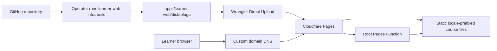

# Cloudflare Pages Hosting and DNS Specification

**Status:** Proposed implementation specification  
**Scope:** Public deployment of the generated learner course site  
**Application:** `apps/learner-web`  
**Hosting provider:** Cloudflare Pages  
**Related:** [Learner web build instructions](../../apps/learner-web/build-tools/README.md), [Progressive Web App platform design](../design/PWA_PLATFORM_DESIGN.md)

## 1. Purpose

This specification defines how to publish one generated learner course root from `apps/learner-web/dist/<root>/` on Cloudflare Pages. It also defines language routing, custom-domain and Domain Name System (DNS) setup, release verification, rollback, and the operational boundary between Cloudflare Pages and a future identity provider.

This deployment is the independent Telugu Tutor course root. Its product name is **TeluguTutorBrains**; its Cloudflare project identifier is the required lowercase form `telugututorbrains`. Other independent courses must receive separate deployment roots and must not be added beneath this project's URL path. A course may initially reuse the shared learner-web implementation, but it becomes a separately owned application when its lifecycle or product requirements justify that boundary.

The first release is a public static course site. Authentication may identify a learner and enable future saved progress, but it does not make files in `dist/` private.

## 2. Goals

- Publish only the selected generated course output from `apps/learner-web/dist/<root>/`.
- Build English and Hindi instruction-language variants from source on every deployment.
- Serve course HTML, Cascading Style Sheets (CSS), and images as static assets.
- Use stable locale-prefixed URLs that can be cached, bookmarked, shared, and indexed.
- Remember the learner's instruction-language preference in a cookie.
- Invoke a Cloudflare Pages Function only at the site root.
- Support explicit, operator-initiated preview and production deployments from a locally verified artifact.
- Serve a custom domain over Hypertext Transfer Protocol Secure (HTTPS).
- Preserve existing DNS and mail service during a DNS migration.
- Provide a tested rollback path that does not require rebuilding the previous release.

## 3. Non-goals

- Protecting or paywalling course HTML in `dist/`.
- Implementing Supabase, Firebase, Clerk, or another identity provider.
- Saving learner progress or preferences outside the language cookie.
- Adding a service worker, offline installation, or a complete Progressive Web App.
- Moving canonical course content out of the repository.
- Serving application programming interface (API) traffic through Pages Functions.

If course content must later be restricted, protected content must not be published as a static asset. That change requires a separate authorization and content-delivery design.

## 4. Deployment topology



The Pages project must publish one `dist/<root>/` directory, defaulting to `dist/telugu/`. The parent `dist/` directory must not be uploaded because it may contain other independently deployable course roots. Source HTML, content files, build tools, tests, documentation, and repository metadata must not be exposed by the deployment.

## 5. Canonical URL design

The deployed paths retain the generated structure:

```text
/
/en/index.html
/en/chapter-01.html
/en/chapter-01-lesson-01.html
/hi/index.html
/hi/chapter-01.html
/hi/chapter-01-lesson-01.html
```

The locale prefix is authoritative. The cookie helps choose a locale only when the learner visits `/`; it must not silently rewrite an explicitly selected `/en/` or `/hi/` URL.

The initial supported instruction languages are:

| Language | Locale prefix | Selection values |
|---|---|---|
| English | `en` | `en`, an `Accept-Language` English match, or the default |
| Hindi | `hi` | `hi` or an `Accept-Language` Hindi match |

Unknown, empty, or malformed language values fall back to `en`.

## 6. Language routing

### 6.1 Preference cookie

Use one cookie with this contract:

| Attribute | Value |
|---|---|
| Name | `tb_instruction_language` |
| Allowed values | `en`, `hi` |
| Path | `/` |
| Maximum age | 31,536,000 seconds (one year) |
| Secure | Yes |
| SameSite | `Lax` |
| HttpOnly | No; the hosted web application writes this preference |

The cookie contains a non-sensitive preference and must never contain identity, authorization, or session data. It is deliberately not `HttpOnly` because the hosted application, rather than a Cloudflare endpoint, writes it. The locale prefix remains the authoritative description of the current page language.

### 6.2 Root route

`GET /` must:

1. Read and validate `tb_instruction_language`.
2. If the cookie is absent or invalid, inspect `Accept-Language`.
3. Select `hi` only when Hindi is the best supported match; otherwise select `en`.
4. Return a temporary redirect to `/<language>/index.html`.
5. Return `Cache-Control: private, no-store` because the result varies by learner.
6. Return `Vary: Cookie, Accept-Language`.

The redirect must be temporary (`302` or `307`), never permanent, so a prior choice is not fixed in browser or intermediary caches.

### 6.3 Language selection without a dynamic route

No separate Cloudflare endpoint handles language changes. Every language control must be an ordinary link to the corresponding locale-prefixed page, so changing language remains functional without JavaScript.

On a hosted page, application-owned JavaScript may remember the current locale by deriving it from the validated leading `/en/` or `/hi/` path segment and writing `tb_instruction_language`. The script must ignore every other path value and must use the cookie attributes in section 6.1.

For example, a visit to a valid `/hi/` page may write:

```text
tb_instruction_language=hi; Path=/; Max-Age=31536000; Secure; SameSite=Lax
```

The Cloudflare root Function continues to treat the cookie as untrusted input and validates it before redirecting. Locally bundled iOS or Android HTML must use the application's platform preference adapter instead of depending on this website cookie.

### 6.4 Function route isolation

The published `dist/<root>/_routes.json` must restrict Pages Functions to the root route:

```json
{
  "version": 1,
  "include": ["/"],
  "exclude": []
}
```

All locale-prefixed pages and static dependencies must bypass Functions. This preserves Cloudflare Pages' free and unlimited static asset requests and avoids spending a Function invocation on each HTML, CSS, or image request.

The Cloudflare Workers Free quota is currently 100,000 requests per day per account, shared by Workers and Pages Functions, and resets at midnight Coordinated Universal Time (UTC). The routing above should consume approximately one invocation for a root visit rather than one invocation for every page or asset.

## 7. Repository changes required by implementation

The implementation should introduce or generate the following deployment-owned files:

```text
apps/learner-web/
├── infra/
│   ├── .dockerignore
│   ├── README.md
│   ├── compose.yaml
│   ├── Dockerfile.wrangler
│   ├── deploy-cloudflare-pages.sh
│   ├── functions/        # Pages Functions
│   └── policies/         # authoritative _headers, _redirects, and _routes.json
└── dist/
    └── telugu/           # independently deployable root selected by --root
        ├── _headers      # generated/copied deployment headers
        ├── _routes.json  # generated/copied function route selection
        ├── en/
        └── hi/
```

`dist/` remains generated and ignored by Git. Authoritative `_headers`, `_redirects`, and `_routes.json` files live under `infra/policies/`; the manual deployment entry point stages recognized policies into the complete output. Cloudflare JavaScript Functions live under `infra/functions/`. Wrangler runs from `infra/` so it can discover that Functions directory without publishing infrastructure source as a static asset.

Do not store Cloudflare API tokens, account identifiers treated as secrets, registrar credentials, Supabase secrets, or private keys in the repository.

## 8. Static response headers

The deployment must publish a Cloudflare Pages `_headers` file. The initial policy should include:

```text
/*
  X-Content-Type-Options: nosniff
  Referrer-Policy: strict-origin-when-cross-origin
  X-Frame-Options: DENY
  Permissions-Policy: camera=(), geolocation=(), microphone=()

/assets/*
  Cache-Control: public, max-age=3600

/*/assets/*
  Cache-Control: public, max-age=3600

/*/css/*
  Cache-Control: public, max-age=3600

/*/*.html
  Cache-Control: public, max-age=0, must-revalidate
```

These cache lifetimes are intentionally conservative because current asset filenames are not content-hashed. Long immutable caching must wait until the build emits fingerprinted asset names.

A Content Security Policy (CSP) must be designed alongside authentication. Do not ship a policy that blocks the selected identity provider's scripts, connections, frames, or form actions, and do not weaken the policy with broad wildcards merely to make sign-in work.

## 9. Cloudflare Pages project configuration

Create one **Direct Upload** Pages project with these settings:

| Setting                   | Required value                                      |
| ------------------------- | --------------------------------------------------- |
| Product/project name      | `TeluguTutorBrains`                                |
| Cloudflare identifier     | `telugututorbrains`                                |
| Production branch         | `main`                                              |
| Git provider              | None                                                |
| Cloudflare build command  | None; Cloudflare receives a prebuilt artifact       |
| Uploaded static directory | `apps/learner-web/dist/telugu`                      |
| Deployment entry point    | `apps/learner-web/infra/deploy-cloudflare-pages.sh` |

Create the project once with the current stable Wrangler tooling isolated in a repository-owned container:

```sh
docker compose -f apps/learner-web/infra/compose.yaml build --pull wrangler
docker compose -f apps/learner-web/infra/compose.yaml run wrangler --version
docker compose -f apps/learner-web/infra/compose.yaml run wrangler  pages project create telugututorbrains --production-branch main
```

The image build resolves npm's `latest` distribution tag so an explicit rebuild selects the newest stable Wrangler release. The reported version and full test suite must be reviewed before deployment. The repository-owned image keeps Wrangler and its Node.js dependency tree outside the host environment. The repository is mounted read-only, container state is temporary, and only the Cloudflare account identifier and restricted API token are passed through. The deployment entry point requires the prebuilt `tutorbrains-wrangler:stable` image and does not download or refresh tooling during a release.

The project must not be connected to Cloudflare's native Git integration in this phase. The build and tests run in the operator's checked-out repository; Wrangler uploads only the verified `dist/` artifact and any Functions discovered from `infra/functions/`.

Cloudflare does not allow a Direct Upload project to be converted later to native Git integration. Future automation should therefore invoke Wrangler from a controlled continuous-integration workflow against this same project. Its deployment logic, Functions, and policies remain owned by `infra/`.

Wrangler accepts `--production-branch` during project creation but does not currently expose a Pages project-update command. Changing the production branch of this Direct Upload project therefore requires the Cloudflare Pages Update Project API documented in `apps/learner-web/infra/README.md`. The value remains a Cloudflare deployment-classification label and does not create or validate a Git branch.

No runtime secret is required for static hosting and locale routing. Deployment uses restricted `CLOUDFLARE_ACCOUNT_ID` and `CLOUDFLARE_API_TOKEN` environment variables passed into the one-off container; these credentials must never enter Git.

## 10. Deployment workflow

### 10.1 Preview deployment

1. Commit the exact revision to be tested and ensure the worktree is clean.
2. Run `./infra/deploy-cloudflare-pages.sh preview <git-branch>` from `apps/learner-web`. The supplied name must match the currently checked-out Git branch.
3. The script runs unit tests, browser tests, a clean two-language build, policy staging, and an explicit Wrangler upload.
4. Run the verification checklist in section 14 against the returned preview hostname.
5. Confirm that only `/` appears as a Function invocation.
6. Confirm that no repository source or build input is reachable.

Preview hostnames should not be added to search indexes. If Cloudflare does not protect or mark preview deployments automatically, add an appropriate preview-only `X-Robots-Tag: noindex` response policy.

Uncommitted work may be tested only through `./infra/deploy-cloudflare-pages.sh preview-uncommitted <preview-label>`. This command runs the same verification and build stages, marks the uploaded deployment as dirty, and rejects the production label `main`. It must not be used as release evidence or promoted as a production artifact.

### 10.2 Production deployment

1. Review and commit the exact release revision; the worktree must be clean.
2. Run `./infra/deploy-cloudflare-pages.sh build` and inspect the generated `dist/` when a separate preflight is desired.
3. Run `./infra/deploy-cloudflare-pages.sh production --confirm learntelugu.brainos.in`. This uses `main` by default. To use another Cloudflare-configured production branch, add `--branch <git-branch>`; the supplied name must match the currently checked-out Git branch.
4. The script reruns all verification, rebuilds the artifact, and explicitly uploads it to the Pages production branch.
5. Smoke-test the generated `pages.dev` hostname.
6. Attach or validate the custom domain.
7. Run production verification.
8. Record the Git commit, Cloudflare deployment identifier, time, and verifier in the release record.

The first production release should keep the assigned `*.pages.dev` hostname available for diagnosis but should advertise only the custom domain.

## 11. Domain naming policy

The production hostname is:

```text
learntelugu.brainos.in
```

DNS hostnames are case-insensitive. A user may type `learnTelugu.brainos.in`, but links, canonical metadata, redirects, certificates, tests, and operational documentation must consistently use the lowercase form `learntelugu.brainos.in`.

The Pages project must attach only `learntelugu.brainos.in`. It must not attach, redirect, proxy, or otherwise change `brainos.in` or `www.brainos.in`. The existing apex website and any other subdomains remain independent of the learner site.

## 12. DNS management

The recommended first setup changes only one DNS record at the current DNS provider. Moving the complete `brainos.in` DNS zone to Cloudflare is optional and can be performed later without changing the destinations of the existing apex or `www` records.

### 12.1 Observed starting point

Public DNS was inspected on 25 September 2026 and returned:

| Name                     | Type    | Current value                                      |
| ------------------------ | ------- | -------------------------------------------------- |
| `brainos.in`             | `NS`    | `ns45.domaincontrol.com`, `ns46.domaincontrol.com` |
| `brainos.in`             | `A`     | `76.223.105.230`, `13.248.243.5`                   |
| `www.brainos.in`         | `CNAME` | `brainos.in`                                       |
| `learntelugu.brainos.in` | —       | No record observed                                 |
| `brainos.in`             | `DS`    | No record observed                                 |

This public check cannot enumerate every record in the GoDaddy zone. Before any nameserver migration, export or manually record the complete zone from the GoDaddy DNS dashboard, including mail, verification, service, and inactive records. Recheck all public values immediately before making changes.

### 12.2 Recommended setup: create only the learner subdomain

This path leaves the current GoDaddy nameservers, apex records, `www`, mail, and every unrelated subdomain unchanged. The new subdomain is created by adding one `CNAME` record; it is not purchased or registered separately.

1. Create the Cloudflare Pages project described in section 9 and complete a successful production deployment.
2. Open the generated `https://<project>.pages.dev` hostname and verify the English page, Hindi page, styles, and assets before changing DNS.
3. Record the exact Pages hostname. For the `telugututorbrains` project identifier, the expected target is `telugututorbrains.pages.dev`; use the actual value shown by Cloudflare.
4. In Cloudflare, open **Workers & Pages > TeluguTutorBrains (`telugututorbrains`) > Custom domains**.
5. Select **Set up a domain**.
6. Enter `learntelugu.brainos.in` in lowercase and continue.
7. Cloudflare will report that DNS validation is pending and show the required target. Keep this browser page open or record the exact target.
8. In GoDaddy, open **My Products > brainos.in > DNS > Manage DNS**.
9. Select **Add New Record** and enter:

    | Field | Value |
    |---|---|
    | Type | `CNAME` |
    | Name/Host | `learntelugu` |
    | Value/Points to | `<project>.pages.dev` using the exact Pages target |
    | TTL | 600 seconds if available; otherwise GoDaddy's default |

10. Before saving, confirm that no `A`, `AAAA`, or other `CNAME` record already uses the exact host `learntelugu`. Do not delete or edit `@`, `brainos.in`, `www`, either nameserver, or any mail record.
11. Save the new `CNAME` record.
12. Wait for DNS propagation and for the custom domain in Cloudflare Pages to report **Active**. Cloudflare will issue and renew the HTTPS certificate.
13. Verify DNS from public resolvers:

    ```sh
    dig CNAME learntelugu.brainos.in @1.1.1.1
    dig CNAME learntelugu.brainos.in @8.8.8.8
    ```

14. Verify the deployed site and certificate:

    ```sh
    curl -I https://learntelugu.brainos.in/
    curl -I https://learntelugu.brainos.in/en/index.html
    curl -I https://learntelugu.brainos.in/hi/index.html
    ```

15. Recheck the existing main site without changing it:

    ```sh
    dig A brainos.in @1.1.1.1
    dig CNAME www.brainos.in @1.1.1.1
    curl -I https://brainos.in/
    curl -I https://www.brainos.in/
    ```

16. Set the production canonical origin used by page metadata, the sitemap, `robots.txt`, and future identity configuration to exactly `https://learntelugu.brainos.in`.

The Pages custom-domain association must be created before or together with the CNAME. Pointing an unassociated hostname at a Pages project can return a Cloudflare `522` error.

### 12.3 Optional later transition: move `brainos.in` DNS to Cloudflare

This transition changes the authoritative DNS provider for the whole zone, but it must not change where the apex website, `www`, mail, or any existing service resolves. Perform it only after the learner subdomain works through the recommended setup.

1. Export the complete `brainos.in` zone from GoDaddy or capture every record and TTL from its DNS dashboard.
2. Record the current website responses and resolve every important hostname from at least two public resolvers.
3. In Cloudflare, select **Domains > Onboard a domain**, enter `brainos.in`, and choose the Free plan.
4. Let Cloudflare scan the current zone, but treat the scan as a starting point rather than a complete migration.
5. Compare the imported zone record by record with the GoDaddy export. Add every missing `A`, `AAAA`, `CNAME`, `MX`, `TXT`, `CAA`, `SRV`, and delegated `NS` record.
6. Confirm that these existing public records retain their exact targets:

    | Name | Type | Required value during migration |
    |---|---|---|
    | `brainos.in` / `@` | `A` | `76.223.105.230` |
    | `brainos.in` / `@` | `A` | `13.248.243.5` |
    | `www` | `CNAME` | `brainos.in` |
    | `learntelugu` | `CNAME` | the exact `<project>.pages.dev` target |

7. Initially set the existing apex and `www` website records to **DNS only** (gray cloud). This keeps Cloudflare from becoming a reverse proxy for the main site during the DNS migration. Mail-related records must also remain DNS-only.
8. Leave the Pages custom-domain association intact. Confirm that `learntelugu` appears in the imported Cloudflare zone and remains connected to the Pages project.
9. Check DNSSEC at the registrar immediately before migration. No public `DS` record was observed on 25 September 2026, but this must be rechecked. If a DS record exists, disable the old DNSSEC configuration and remove the DS record before changing nameservers.
10. In the Cloudflare zone Overview, copy the two assigned Cloudflare nameservers.
11. At GoDaddy, open the domain's nameserver settings, choose custom nameservers, remove `ns45.domaincontrol.com` and `ns46.domaincontrol.com`, and enter exactly the two Cloudflare-assigned nameservers.
12. Do not change the domain registration, contacts, renewal, or transfer-lock settings.
13. Wait until Cloudflare reports the zone as **Active**. Nameserver propagation can take up to 24 hours.
14. Verify delegation:

    ```sh
    dig NS brainos.in @1.1.1.1
    dig NS brainos.in @8.8.8.8
    dig brainos.in +trace
    ```

15. Verify the existing main site, `www`, mail records, verification records, and the learner subdomain before changing any proxy setting.
16. In Cloudflare Pages, confirm that `learntelugu.brainos.in` is still **Active** and its managed certificate is valid.
17. Re-enable DNSSEC in Cloudflare and add the Cloudflare-provided DS record at GoDaddy. Confirm DNSSEC validation before declaring the migration complete.
18. Keep the apex and `www` records DNS-only unless a separate reviewed change explicitly authorizes proxying the main site through Cloudflare.

### 12.4 TLS and zone settings

After the domain is active:

- Require HTTPS and redirect plain HTTP to HTTPS.
- Use modern Transport Layer Security (TLS) versions supported by the required browser matrix.
- Keep certificate renewal managed by Cloudflare.
- Review restrictive CAA records if certificate issuance remains pending; do not delete intentional CAA policy without owner approval.
- Use `Full (strict)` for any future proxied origin traffic. Pages itself does not require a separately managed origin certificate.
- Do not enable automatic HTML or JavaScript rewriting features without regression testing the generated pages.

### 12.5 DNS rollback

For the recommended subdomain-only setup, rollback means removing the `learntelugu` CNAME from GoDaddy and detaching `learntelugu.brainos.in` from the Pages project. No main-domain record changes are involved.

For a full DNS migration rollback, first make sure the complete GoDaddy zone is restored, then remove or replace the Cloudflare DS record if DNSSEC was enabled, and finally restore `ns45.domaincontrol.com` and `ns46.domaincontrol.com` at GoDaddy. Recheck the apex website, `www`, mail, and learner subdomain after delegation propagates.

DNS rollback does not replace a Pages deployment rollback. Choose the smallest rollback that addresses the failure.

## 13. Identity-provider preparation

After the production custom domain is active, use it as the explicit Telugu Tutor return origin for the shared identity configuration described in [Supabase authentication design and URL setup](SUPABASE_AUTH_DESIGN.md):

- add the exact `https://learntelugu.brainos.in/<language>/auth-callback.html` return URLs to the Supabase allowlist;
- register the shared `https://auth.brainos.com/auth/v1/callback` with each identity provider after the paid Supabase custom domain is activated;
- allow only required preview or local-development callbacks;
- keep provider client secrets out of static files and Git;
- expose only browser-safe publishable configuration in the generated site; and
- apply database row-level authorization independently of the client interface.

The assigned `pages.dev` hostname must not silently become an unrestricted production OAuth redirect unless there is a documented need.

## 14. Verification checklist

### 14.1 Build and publication

- [x] Unit tests for the build pipeline pass.
- [x] End-to-end learner-web tests pass.
- [x] The manual infrastructure build generates both `dist/telugu/en/` and `dist/telugu/hi/` before upload.
- [ ] No unresolved `[#placeholder]` or `<!--#include` marker exists in published HTML.
- [x] `dist/telugu/_routes.json` and `dist/telugu/_headers` exist.
- [x] Repository source, YAML content, build scripts, and tests are not served.

### 14.2 Routing and cookies

- [ ] A first visit to `/` with Hindi preferred redirects to the Hindi index.
- [ ] A first visit with no supported preference redirects to English.
- [ ] A valid cookie overrides `Accept-Language` at `/`.
- [ ] Direct `/en/` and `/hi/` URLs are never overridden by the cookie.
- [ ] Language controls are ordinary links to the corresponding localized page.
- [ ] Hosted application JavaScript writes only validated `en` or `hi` preference values.
- [ ] Locally bundled applications do not depend on the website cookie.
- [ ] Static course and asset requests do not invoke a Pages Function.
- [ ] The root response is not publicly cached.

### 14.3 DNS and HTTPS

- [ ] Public resolvers return the intended DNS record and authoritative nameservers.
- [ ] The custom-domain certificate is valid and covers the exact hostname.
- [ ] HTTP redirects to HTTPS without a loop.
- [ ] The canonical hostname loads both locales.
- [ ] `brainos.in` and `www.brainos.in` retain their pre-change DNS destinations and behavior.
- [ ] Existing mail and verification records still resolve.
- [ ] DNSSEC validates if enabled.

### 14.4 Browser and accessibility checks

- [ ] Current supported mobile and desktop browsers render the deployed pages.
- [ ] Relative CSS, image, chapter, lesson, account, and alternate-language links work.
- [ ] Language selection works with keyboard-only navigation.
- [ ] Focus moves predictably after navigation.
- [ ] Page and embedded-language `lang` attributes remain correct.
- [ ] Pages remain understandable when CSS is unavailable.

## 15. Monitoring and operational limits

Monitor at least:

- Pages deployment failures;
- custom-domain and certificate status;
- Function invocation count and errors;
- unexpected Function routes;
- `4xx` and `5xx` response trends where available; and
- the Workers account-wide free-tier quota.

Cloudflare currently allows 100,000 Workers and Pages Functions requests per day on the Free plan, shared across the account. Exceeding the free daily request limit can return Cloudflare error `1027`, depending on fail-open/fail-closed configuration. The locale router must fail open only if bypassing it leads to a valid static fallback; it must never fail open for a future security or authorization decision.

If dynamic traffic approaches the quota, first confirm that `_routes.json` still excludes static traffic. Upgrading to Workers Paid should follow measured demand, not compensate for accidental middleware coverage.

## 16. Rollback and recovery

### 16.1 Application rollback

1. Select the last verified production deployment in Cloudflare Pages.
2. Roll production traffic back to that deployment.
3. Verify the root redirect, both locale indexes, one chapter, one lesson, CSS, and an image.
4. Revert or correct the source revision separately so the next Git deployment does not reintroduce the failure.
5. Record the failed deployment, symptoms, rollback deployment, and follow-up owner.

### 16.2 Function failure fallback

The implementation should publish a static English fallback at a documented path such as `/en/index.html`. Operators and status communications can always link directly to it if root routing fails.

### 16.3 Build failure

A failed build must leave the currently active production deployment untouched. Do not clean up or replace the previous successful deployment until the new deployment has passed smoke tests.

## 17. Acceptance criteria

The Cloudflare hosting implementation is complete when:

1. The manual infrastructure entry point tests and builds both locales, and no Git commit automatically deploys them.
2. Only `dist/` contents are publicly served.
3. `/` selects a supported locale from the validated cookie or request language.
4. Explicit language selection uses locale-prefixed links and does not require a Cloudflare endpoint.
5. The hosted application remembers only validated language values in the preference cookie.
6. Static requests bypass Pages Functions.
7. The custom domain resolves through the selected DNS path and serves a valid managed certificate.
8. Existing DNS-dependent services continue to work.
9. DNSSEC is correctly configured or its intentional absence is recorded.
10. Preview, production, and rollback procedures have each been exercised once.
11. The verification checklist has release evidence attached to the production deployment.

## 18. Implementation sequence

1. **Complete:** Add tests for language selection, hosted cookie persistence, cookie validation, and route isolation.
2. **Complete:** Implement the root Pages Function and application-side preference writer.
3. **Complete:** Add source-controlled `_routes.json` and `_headers` inputs under `infra/policies/` and stage them through the deployment entry point.
4. Create a Direct Upload Cloudflare Pages project without connecting a Git provider.
5. Build and review the current stable Wrangler container for repeatable operator deployments.
6. Exercise the manual preview command and complete preview verification.
7. Inventory DNS and add only the `learntelugu` CNAME at the current provider.
8. Activate `learntelugu.brainos.in` as the custom domain and verify HTTPS without changing the apex or `www`.
9. Complete production verification.
10. Exercise Pages rollback and record the runbook outcome.
11. Configure the future identity provider only after the canonical production origin is stable.

## 19. References

- [Cloudflare Pages custom domains](https://developers.cloudflare.com/pages/configuration/custom-domains/)
- [Cloudflare Pages Direct Upload](https://developers.cloudflare.com/pages/get-started/direct-upload/)
- [Wrangler Pages commands](https://developers.cloudflare.com/workers/wrangler/commands/pages/)
- [Cloudflare Pages Functions routing](https://developers.cloudflare.com/pages/functions/routing/)
- [Cloudflare Pages Functions pricing](https://developers.cloudflare.com/pages/functions/pricing/)
- [Cloudflare Workers pricing](https://developers.cloudflare.com/workers/platform/pricing/)
- [Cloudflare Workers limits](https://developers.cloudflare.com/workers/platform/limits/)
- [Cloudflare Pages headers](https://developers.cloudflare.com/pages/configuration/headers/)
- [Cloudflare primary DNS setup](https://developers.cloudflare.com/dns/zone-setups/full-setup/setup/)
- [Cloudflare DNSSEC](https://developers.cloudflare.com/dns/dnssec/)
