# Firebase Authentication design and setup

**Status:** Proposed production configuration; web implementation is ready for project placeholders
**Applies to:** TutorBrains course sites, shared HTML in Android/iOS apps
**Authentication authority:** One Firebase project; no TutorBrains authentication server

## 1. Decision and boundary

Use one Firebase project for all courses. Firebase Authentication owns provider sign-in, phone verification, user identifiers, display names, browser sessions, and refresh. Course pages remain static HTML, with the shared authentication JavaScript bundled locally by the learner-web build. Start with Firebase Blaze because production phone SMS requires a billing account. Basic social Authentication remains in its standard service tier; do not upgrade to Firebase Authentication with Identity Platform unless needed for LinkedIn OpenID Connect (OIDC) or other enterprise features.

Use `auth.brainos.com` as the Firebase Authentication helper domain, served by Firebase Hosting from the same Firebase project. Course HTML is hosted separately at one exact course subdomain such as `https://learntelugu.brainos.com`. Firebase SDK configuration, OAuth client IDs, SMS country policy, and app identifiers are public or provider-console configuration; private OAuth client secrets stay only in Firebase Console/provider consoles. Do not add an app-owned backend or ship a service-account key.

Firebase `uid` is the durable learner identifier shared among course apps attached to the project. Browser IndexedDB sessions remain origin-scoped, so signing in on one course origin does not silently sign another origin in. Each course page reads the cached Firebase session locally; Firebase handles refresh. No auth request is made solely because the learner opens another static lesson URL.

Phone-only accounts are allowed. They have a verified phone number but no email. This means email uniqueness cannot prevent one person from creating separate phone and social accounts. Firebase's “one account per email address” setting prevents duplicate accounts for providers that return the same email, but cannot merge a phone-only user with a social user. Provide account linking from an authenticated session and do not merge accounts by name or device.

## 2. Provider matrix

| Sign-in method | Firebase provider | Notes |
|---|---|---|
| Google | `google.com` | Standard Firebase Authentication; enable and configure OAuth consent/client setup |
| Apple | `apple.com` | Standard provider; requires Apple Developer configuration and secret renewal |
| Facebook | `facebook.com` | Standard provider; review requested email permission and app review state |
| Microsoft | `microsoft.com` | Standard provider; choose supported Microsoft account audience and configure client secret in Firebase |
| X | `twitter.com` | Firebase labels this Twitter; use X developer app credentials and its current callback requirements |
| LinkedIn | `oidc.linkedin` | Requires Firebase Authentication with Identity Platform and an OIDC provider configuration; applies Identity Platform quotas/pricing |
| Phone one-time password (OTP) | Firebase Phone | Production messages are billed per SMS and use reCAPTCHA on web |
| Reddit | unavailable | Not a built-in Firebase Auth provider; Reddit OAuth is not an OIDC identity provider for Firebase's generic OIDC setup |
| Instagram | unavailable | Not a built-in Firebase Auth provider; do not label Facebook sign-in as Instagram sign-in |

Provider identities do not always return the same email. Some users may hide email, and X or phone sign-in may not provide one. Keep the Firebase `uid` as the record key. Enable one-account-per-email protection and support explicit provider linking after the learner signs in. A provider collision requires signing in through the existing method first; do not expose provider lists for an email address before authentication.

## 3. Shared JavaScript contract

Source lives under `apps/learner-web/auth/src/`. Its exact Firebase dependencies and build machinery live under `apps/learner-web/build-tools/auth-build/`; `npm run build` produces an intermediate browser bundle directly in `apps/learner-web/dist/auth.js`. The normal HTML build copies the same bundle into each course output at `dist/<course-root>/<language>/assets/js/firebase-auth.js` and injects a small course-specific public config only when `--firebase-config` is supplied. The bundle is not loaded from a public content delivery network (CDN). Each course build config sets its exact HTTPS origin, a stable course identifier, enabled social providers, and whether phone is enabled.

The library exports a presentation-safe global for calling HTML:

```js
window.BrainosAuth.getAuthView();
window.BrainosAuth.onAuthViewChange((view) => {
  // view: { isAuthenticated, userId, displayName, avatarUrl, initials, hasEmail }
});
```

The view never exposes an email, phone number, Firebase ID token, refresh token, or raw provider object. Firebase Auth persists its session in IndexedDB, with browser local storage as the SDK fallback when IndexedDB is unavailable. The learner's call-me name is saved as Firebase Auth `displayName` using `updateProfile`; a provider display name is suggested and the learner can edit it. Phone-only users are prompted for a name after verifying their number. The shared header shows a small provider photo when available, otherwise initials or the existing generic account icon.

On desktop/mobile browsers the current provider flow uses `signInWithPopup`, and phone verification uses the Firebase JavaScript SDK plus reCAPTCHA. OAuth popups can be blocked by browser settings. Do not substitute `signInWithRedirect` with the `auth.brainos.com` helper for a course on a sibling origin without testing the browser privacy behavior; Firebase recommends a same-domain setup or popup when redirect helper storage is blocked.

### Android and iOS host boundary

The course HTML, styling, shared authentication view, name form, and account menu are shared. Native Firebase project app registrations remain placeholders until the Android package identifier and iOS bundle identifier are chosen. A production mobile container must open provider authorization in the operating system browser/authentication session, then return to the app through Android App Links and iOS Universal Links. Do not run Google, Apple, Facebook, Microsoft, X, or LinkedIn login inside an embedded provider WebView.

The mobile implementation must use Firebase's Android and Apple SDKs (with their own provider setup and persistence) and expose only the normalized `AuthView` and narrow actions to the shared HTML through an app host bridge. The JavaScript adapter for the bridge is included; the native bridge itself remains to be added when the native projects and identifiers exist. The current JavaScript bundle alone does not configure mobile OAuth. Once app IDs are approved, add Firebase app registrations, implement the bridge against the contract below, and test it with the same shared HTML.

The JavaScript library detects the versioned `window.BrainosNativeAuth` bridge. Its methods are `getAuthView()`, `onAuthViewChange(listener)`, `signInWithProvider(provider)`, `linkProvider(provider)`, `sendPhoneCode(phone)`, `confirmPhoneCode(code)`, `saveDisplayName(name)`, and `signOut()`. Native methods return only the normalized auth view or an operation result. The bridge must never expose Firebase credentials, ID/refresh tokens, email, or provider SDK objects to the HTML. Restrict the bridge to trusted BrainOS course content and keep provider UI in the system authentication session.

## 4. Placeholder configuration and build

Copy `apps/learner-web/auth/firebase-config.example.json` to a private local config file such as `apps/learner-web/auth/firebase-config.telugu.local.json`. Replace every angle-bracket placeholder. Do not commit course-local config. The Firebase web API key is intended to be present in browser configuration; restrict it in Google Cloud Console to the required Firebase APIs and course websites. Do not put OAuth client secrets or service-account credentials in this JSON.

```json
{
  "courseId": "telugu-tutor",
  "courseOrigin": "https://learntelugu.brainos.com",
  "firebase": {
    "apiKey": "<firebase-web-api-key>",
    "authDomain": "auth.brainos.com",
    "projectId": "<firebase-project-id>",
    "appId": "<firebase-web-app-id>"
  },
  "enabledProviders": ["google", "apple", "facebook", "microsoft", "x"],
  "phoneEnabled": true
}
```

From the repository root, build the shared bundle once and generate each course's distributions with its own exact config:

```sh
cd apps/learner-web/build-tools/auth-build
npm ci
npm run clean
npm run build
cd ../../../..
apps/learner-web/build-tools/.venv/bin/python apps/learner-web/build-tools/build.py --firebase-config apps/learner-web/auth/firebase-config.telugu.local.json
apps/learner-web/build-tools/.venv/bin/python apps/learner-web/build-tools/build.py --instruction-language hi --firebase-config apps/learner-web/auth/firebase-config.telugu.local.json
```

Without `--firebase-config`, builds stay static and authentication controls remain disabled. The build checks that required project fields and an exact `https://<course-subdomain>.brainos.com` origin have been supplied before activating auth. For every additional course, create a separate local config with its own `courseId` and `courseOrigin`, then run the same build. The library and bundle remain shared.

| Placeholder | Source and manual action |
|---|---|
| `<stable-course-id>` | Choose a permanent lowercase course key such as `telugu-tutor`; use the same value in course records and app config. |
| `<course-subdomain>` | Use the final production course host owned by BrainOS, for example `learntelugu.brainos.com`; add this exact host under Firebase Authentication authorized domains. |
| `<firebase-web-api-key>` | Firebase Console → Project settings → General → Your apps → Web app config. Restrict the key in Google Cloud Console to required Firebase APIs and web referrers. |
| `<firebase-project-id>` | Firebase Console → Project settings → General → Project ID. Keep one project ID shared by all courses. |
| `<firebase-web-app-id>` | The Web app's `appId` in its Firebase config object. |
| `auth.brainos.com` | Reserve this DNS name, add it to Firebase Hosting in the same project, and wait for domain verification and SSL before adding it as the provider callback domain. |
| `enabledProviders` | List only provider IDs that have been configured and manually tested in Firebase Console and the provider developer console. |
| `phoneEnabled` | Keep true only after Blaze billing, allowed SMS regions, budget alert, web reCAPTCHA, and test numbers are configured. |
| Android package ID | When selected, add an Android app in Firebase Project settings using the exact package ID; download the generated `google-services.json` into the native Android app project, not web assets. |
| iOS bundle ID | When selected, add an iOS app in Firebase Project settings using the exact bundle ID; download `GoogleService-Info.plist` into the native iOS app project, not web assets. |
| App/Universal Link domain and paths | Choose the BrainOS-owned HTTPS host/path, publish Android Digital Asset Links and Apple App Site Association files, and add the link return URLs to provider/Firebase settings according to each provider's current native SDK guide. |

## 5. Firebase and DNS setup steps

1. **Create the project:** In Firebase Console, create one production project, choose the project's Google Analytics setting as desired, and switch the project to Blaze by linking the BrainOS billing account. Configure budget alerts. Blaze is required for production SMS; SMS is charged per destination country.
2. **Register web:** Add a Web app to the project. Copy the `apiKey`, `projectId`, and `appId` from its Firebase configuration into the local course config. Keep those values public-only; never copy Admin SDK credentials.
3. **Set account policy:** In **Authentication → Settings**, enable one account per email address. Add the exact course origins, staging origins, and `auth.brainos.com` to authorized domains. Add only approved app domains; don't use wildcard redirects.
4. **Set up the auth domain:** In **Hosting**, create/select a site in the same Firebase project and add `auth.brainos.com` as its custom domain. Follow the Firebase Console verification flow, adding its requested Domain Name System (DNS) ownership TXT record and Hosting A/AAAA records at the BrainOS DNS provider. If Cloudflare manages DNS, use the DNS-only setting for the Firebase Hosting records. Wait for domain verification and Firebase's Secure Sockets Layer (SSL) certificate to become active. Keep this host for Firebase's `/__/auth/handler` helper; course page hosting stays on the course subdomain.
5. **Set the OAuth return:** In each provider's developer console, add exactly `https://auth.brainos.com/__/auth/handler` as the Firebase return/callback URI. Firebase's project default handler may remain registered during setup. In Firebase Console, copy each provider's client ID and client secret into its provider section; those secrets must not be in the JavaScript bundle.
6. **Google:** Enable Google under **Authentication → Sign-in method**. Configure the OAuth consent screen, support email, app domains, and production publishing state in Google Cloud Console. If Firebase requests an OAuth client, create the web client and use the Firebase handler URI above.
7. **Apple:** Enable Apple and configure an Apple Services ID, Sign in with Apple domain/return URL, Team ID, Key ID, and private key in Firebase. Add the auth domain and handler return URL to Apple's configuration. Keep an owner and expiry reminder for the Apple key. For iOS distribution, register the native app and enable the Sign in with Apple capability when app IDs are known.
8. **Facebook:** Create a Facebook developer app, add the Firebase handler URI as a Valid OAuth Redirect URI, request only the required email permission, and complete Meta app review/public status requirements. Enter its app ID and secret in Firebase.
9. **Microsoft:** Create an Entra ID app registration, set its supported account types, add the Firebase handler URI as a Web redirect URI, and place its application ID and secret in Firebase. Choose the audience BrainOS intends to support (work/school, personal Microsoft accounts, or both).
10. **X:** Create an X developer app with OAuth 2.0 sign-in enabled and request email where available. Add the Firebase handler URI to its callback/redirect configuration. Configure the client ID and secret in Firebase; verify current X developer access and email permission before showing the button.
11. **LinkedIn (optional):** Upgrade the Firebase project to Authentication with Identity Platform, create an OIDC provider with provider ID `linkedin`, and configure LinkedIn's OIDC issuer, client ID, secret, and scopes. Use `oidc.linkedin` in the web config. The Identity Platform upgrade changes billing and free usage limits; confirm those quotas before enabling the button.
12. **Phone OTP:** Enable Phone under **Authentication → Sign-in method**. Configure allowed SMS regions for the initial markets India, United States, United Kingdom, and the selected European Union countries. Review current country-specific SMS prices and abuse controls, set a monthly billing alert, and configure authorized web domains. On web, Firebase reCAPTCHA must render and pass before an SMS can be sent. Use Firebase fictional test numbers during development; never ship testing codes. Standard carrier charges may also apply to learners.
13. **Copy project settings:** Fill the course-local config with exact fields, set enabled providers only after each provider passes test sign-in, and keep `phoneEnabled` true only after SMS billing/region controls are ready. The build injects the course origin, so one course's config cannot be reused for a different origin without changing the value and rebuilding.
14. **Test on staging:** Verify new and returning Google/Apple/Facebook/Microsoft/X accounts, popup denial, provider cancellation, duplicate-email collision, name suggestion/edit, phone OTP, blocked SMS region, reCAPTCHA failure, and sign-out. Confirm static navigation makes no Auth call beyond local IndexedDB reads and SDK refresh when due. Repeat native tests only after package IDs, native SDK apps, and the host bridge exist.

## 6. Operations and known boundaries

- Blaze is pay-as-you-go, not a fixed monthly Auth subscription. Standard social Auth is no-cost per the current Firebase plan table; phone SMS is billed for each destination, and other Firebase products have separate quotas/pricing. Set billing alerts before enabling SMS.
- LinkedIn uses Identity Platform OIDC and its distinct usage limits. Do not upgrade the project simply for an unused provider.
- Firebase custom Hosting domains are available without a separate domain add-on; Hosting quota and DNS/SSL setup still apply.
- One Firebase project gives one global identity authority, not three data-residency regions. Firebase Auth does not let an individual user be pinned to India, US, or EU/UK. Revisit region choices before storing learner records in Firebase databases.
- Phone-only registration permits separate accounts for one person who later uses an email social provider. Account linking must be authenticated; unresolved Firebase account collisions should be handled through sign-in to the existing provider and explicit linking.
- Auth profile display name/photo come from provider data or the learner's edit. Don't use them as advertising attributes. No marketing profile or course progress is created by this auth implementation.
- Browser IndexedDB is origin-scoped. This design does not promise shared cookies/session state across course subdomains. Each static course shell reads its own persisted Firebase session.
- Actual provider credentials, verified DNS, project IDs, the course production domain, and native app identifiers are outside the repository and remain manual setup values.

## 7. Control flow sequences

Firebase's documentation describes each API in isolation. The diagrams below show the actual flows as implemented in `apps/learner-web/auth/src/` for this project. Actors: **Page** = the course HTML shell; **main.js** = the event-wiring layer; **client.js** = `createAuthClient`; **Firebase SDK** = `firebase/auth` running in the browser; **IndexedDB** = browser-local SDK persistence; **Provider** = the external OAuth or SMS provider.

### 7.1 Page load — session restore

On every page load the SDK reads the persisted session from IndexedDB without making a network call to Firebase unless a token refresh is due.

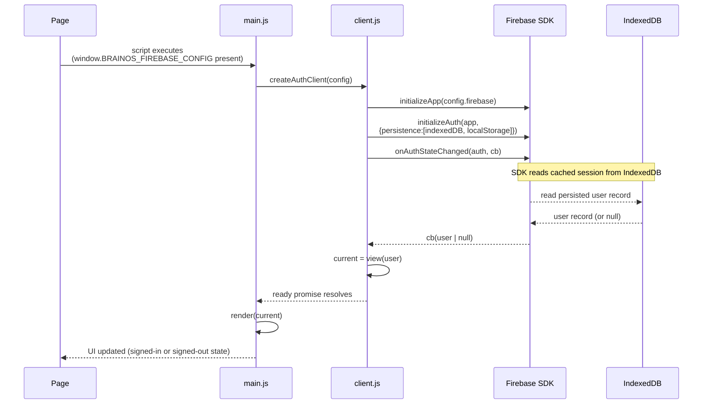

### 7.2 Social provider sign-in (new or returning user)

Triggered when the learner clicks a provider button while **not** authenticated (`data-auth-link="false"`).

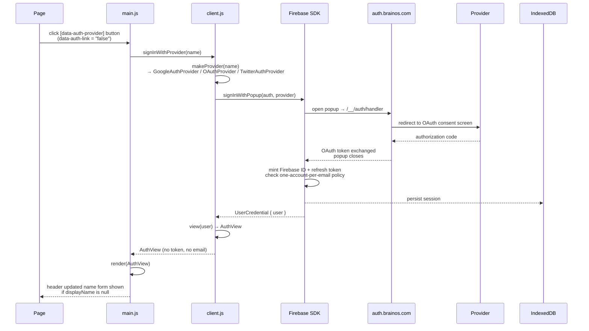

**Error path — popup blocked or cancelled:**

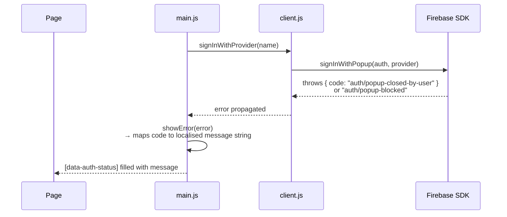

**Error path — account exists with different credential:**

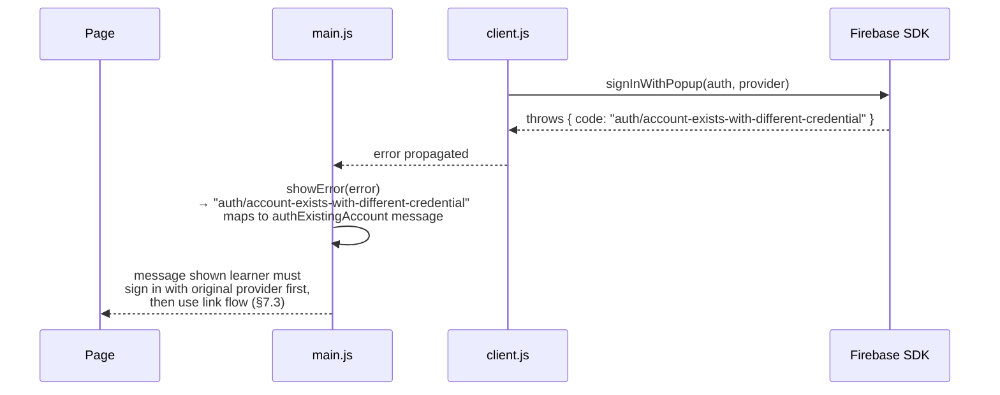

### 7.3 Provider linking (add second sign-in method)

Triggered when the learner clicks a provider button while **already authenticated** (`data-auth-link="true"`). Requires `auth.currentUser` to be non-null.

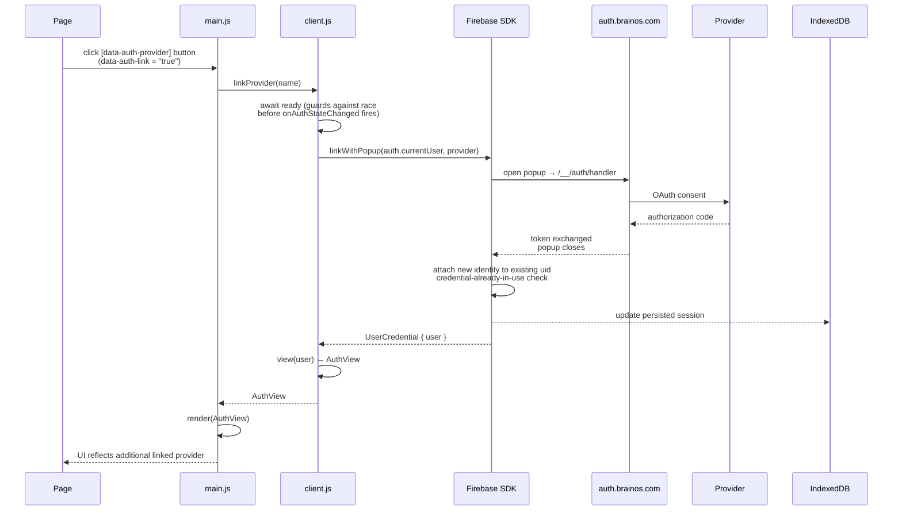

### 7.4 Phone OTP — sign-in (phone-only account)

Triggered when the learner submits `[data-auth-phone-form]` while **not** authenticated. The reCAPTCHA element `[data-auth-recaptcha]` must be present in the page HTML.

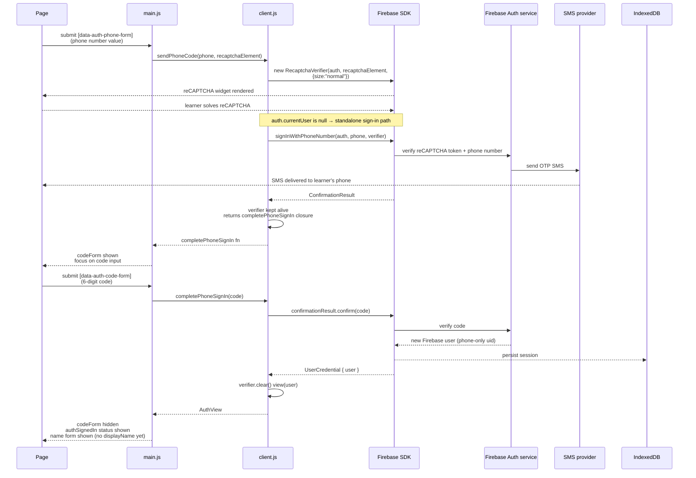

**Error path — bad code or reCAPTCHA failure:**

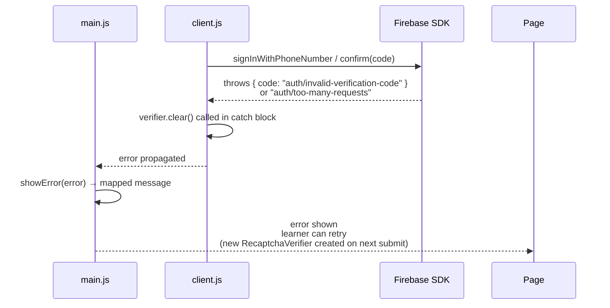

### 7.5 Phone OTP — link to existing account

Triggered when the learner submits the phone form while **already authenticated**. Same HTML form; `client.js` branches on `auth.currentUser`.

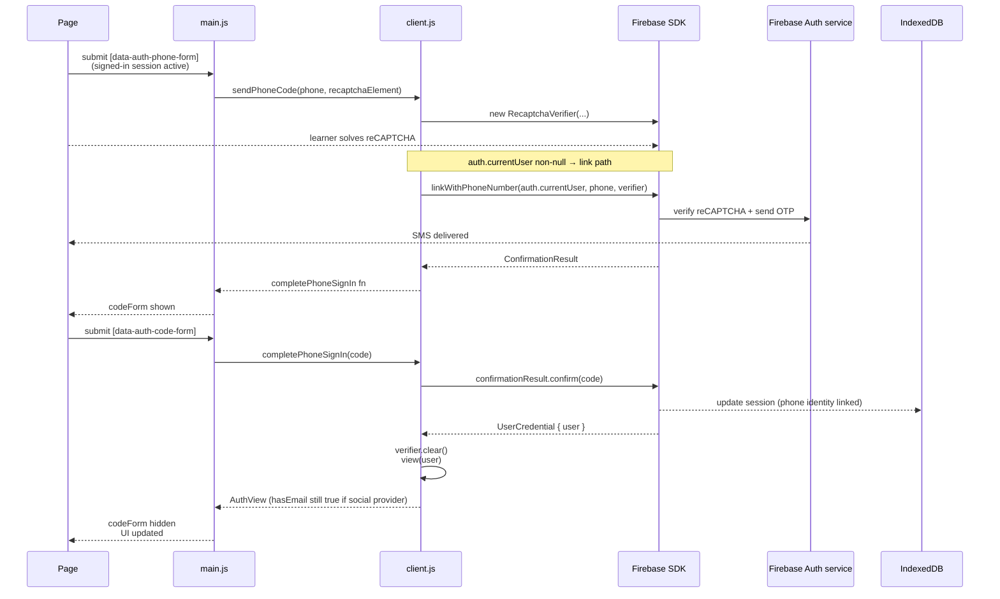

### 7.6 Save display name

Triggered by `[data-auth-name-form]` submit, the edit-name button, or the `#edit-name` URL hash on page load. Requires an authenticated session.

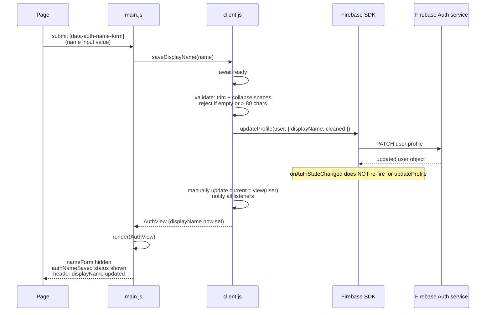

### 7.7 Sign out

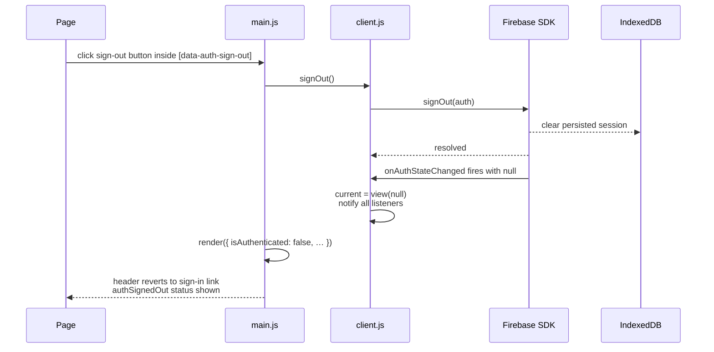

### 7.8 Native host bridge (Android / iOS)

When `window.BrainosNativeAuth.version === 1` is present, `createAuthClient` returns a thin adapter that delegates every operation to the native bridge instead of calling Firebase SDK directly. Firebase SDK is **not** initialised on the web side; the native layer owns the session.

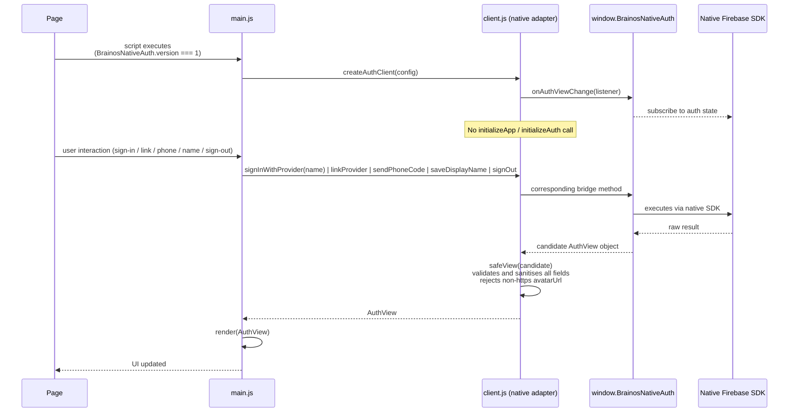

## References

- [Firebase pricing plans](https://firebase.google.com/docs/projects/billing/firebase-pricing-plans)
- [Firebase Authentication](https://firebase.google.com/docs/auth/)
- [Firebase web auth and redirect best practices](https://firebase.google.com/docs/auth/web/redirect-best-practices)
- [Firebase custom Authentication persistence](https://firebase.google.com/docs/auth/web/custom-dependencies)
- [Firebase phone sign-in on the web](https://firebase.google.com/docs/auth/web/phone-auth)
- [Firebase account linking](https://firebase.google.com/docs/auth/web/account-linking)
- [Firebase manage users](https://firebase.google.com/docs/auth/web/manage-users)
- [Firebase custom OAuth provider configuration](https://firebase.google.com/docs/auth/configure-oauth-rest-api)
- [Firebase Hosting custom domains](https://firebase.google.com/docs/hosting/custom-domain)
