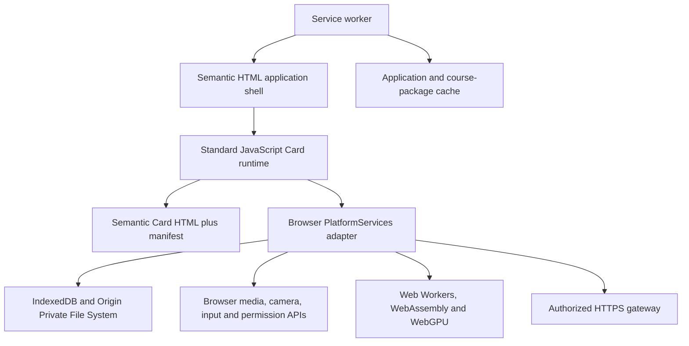

# Progressive Web App Platform Scheme

**Status:** Candidate design; not selected  
**Scheme:** Installable Progressive Web App (PWA) using semantic HTML, Cascading Style Sheets (CSS), and standard JavaScript  
**Parent design:** [App skeleton technical design](APP_SKELETON_TECH_DESIGN.md)  
**Product contract:** [Platform and logical presentation specification](../spec/platform_spec.md)

## 1. Decision this scheme tests

This scheme tests whether the complete Telugu Tutor can run as an installable browser application on Android, iOS, Windows, and macOS without a native application host. It has the smallest host dependency and preserves semantic Hypertext Markup Language (HTML) directly, but it is acceptable only if browser facilities can satisfy the product's offline, intelligence, evidence, media, input, authorization, and accessibility contracts.

The current platform specification treats Web as optional and requires first-class installed applications on the four required platforms. This scheme is therefore a feasibility candidate, not currently a compliant implementation. Selecting it would require evidence that an installed PWA is first-class enough for the product and a deliberate amendment to that fixed platform decision.

## 2. Architecture

No Card imports a model or directly selects a browser API. The browser adapter registers compatible service handles only after feature detection and scheme-specific conformance checks.

## 3. Application and Card delivery

- The application shell is semantic HTML, CSS, and ECMAScript modules.
- A web app manifest supplies install metadata.
- A service worker installs and versions the application shell and approved bootstrap assets.
- Card presentation remains reviewed semantic HTML accompanied by a structured Card manifest.
- Course content is installed as immutable, integrity-checked packages in browser-managed storage.
- Content packages cannot contain executable scripts, inline event handlers, unrestricted styles, arbitrary remote URLs, or WebAssembly modules.
- Application-owned JavaScript activates declared Card actions through the browser `PlatformServices` adapter.

The PWA must remain useful when launched offline after its required application and course resources have been installed.

## 4. Platform-service implementation

| Shared contract | PWA implementation |
|---|---|
| `PreferenceService` | IndexedDB records with declared defaults |
| `LocalizationService` | Versioned JavaScript Object Notation (JSON) catalogues, localized Card packages, and standard `Intl` APIs |
| `AuthorizationService` | Browser-side validation of signed offline ability envelopes; server revalidation for connected protected operations |
| `ContentRepository` | Integrity-checked package records in Cache Storage, IndexedDB, or the Origin Private File System (OPFS) |
| `AssetResolver` | Logical references resolved to verified cached responses or OPFS objects |
| `LearnerStore` | IndexedDB transactions with explicit schema versions |
| `EvidenceStore` | Encrypted browser-managed objects with purpose, consent, retention, and deletion metadata |
| `PermissionService` | Browser permission and media-device APIs, normalized into product states |
| `CapabilityDiscovery` | Feature detection plus tested support policy, not user-agent-name assumptions |
| Intelligence handles | Web Workers running WebAssembly (Wasm), WebGPU, or deterministic JavaScript providers |
| `ConnectedGateway` | `fetch` over Hypertext Transfer Protocol Secure (HTTPS) with explicit authentication and privacy policy |

Browser support for an API is not enough to register a service. The implementation must also pass the shared behavioral, reliability, language, privacy, and accessibility tests for that handle.

## 5. Internationalization

- Use `lang` on the Card and on language changes within a Card.
- Use `dir` for right-to-left instruction languages and isolate mixed-direction content correctly.
- Use JSON catalogues with stable keys for shell text.
- Use the standard JavaScript `Intl` APIs for locale-sensitive formatting and segmentation where supported.
- Resolve instruction language, interface locale, transliteration, and accessibility preferences independently.
- Re-resolve localized Card content when a preference changes without changing Card identity or progress.
- Disclose the actual fallback language visibly and through the accessibility tree.
- Test Telugu shaping, combining marks, font fallback, selection, line breaking, zoom, and input-method composition in every supported browser and operating-system combination.

## 6. Authorization and identity

- Public course content must not require sign-in.
- Connected sign-in uses OpenID Connect (OIDC) over OAuth 2.0 Authorization Code flow with Proof Key for Code Exchange (PKCE).
- Restricted offline use relies on a signed, time-bounded ability envelope stored in protected browser storage as far as the platform permits.
- The browser evaluator checks issuer, audience, expiry, ability, resource scope, policy version, and applicable consent before protected local operations.
- Connected protected operations are evaluated again by the server.
- Unknown, expired, malformed, or unsupported grants fail closed for the protected action.

Browser storage does not provide the same credential-protection guarantees as every operating system's secure credential store. The acceptable token lifetime and reauthentication policy are release decisions for this scheme.

## 7. Assets, persistence, and evidence

### Authored content

- The service worker caches the versioned application shell.
- Course packages and model resources are stored separately from the shell so they can be updated or removed independently.
- Every downloaded object is checked against an approved manifest digest before activation.
- Activation is atomic from the application perspective; a failed update leaves the prior package usable.

### Learner records

- Use IndexedDB for transactional metadata and the Student Card map.
- Use OPFS or another tested browser-managed object store for large evidence and model objects.
- Never use `localStorage` for durable learner records, tokens, raw evidence, or package state.
- Maintain an explicit storage-health check and report eviction, quota, or unavailable storage honestly.
- Evidence deletion removes both metadata and stored bytes.

Browser storage may be cleared by the learner, operating system, or storage-pressure policy. This scheme must either accept device-local loss, provide an authorized export/synchronization option, or demonstrate persistent-storage behavior adequate for the release.

## 8. Local intelligence

The PWA can register local intelligence providers implemented through:

- deterministic JavaScript;
- WebAssembly in a dedicated Web Worker;
- WebGPU in a dedicated worker where supported;
- WebLLM for compatible Large Language Model (LLM) families; or
- Transformers.js or another evaluated browser runtime for speech, image, embedding, or text models.

The main thread must never perform long-running inference. Model installation reports download size, expected storage, broad device impact, and removal controls before download.

Each provider registration declares:

- service-contract version;
- supported language, script, and media contracts;
- model and runtime provenance;
- WebGPU or Wasm prerequisites;
- minimum memory and storage policy;
- reliability information; and
- the explicit unavailable path.

The scheme fails for a required platform if a required first-release intelligence handle cannot run with adequate quality and responsiveness on the supported device matrix. A remote fallback cannot be silently substituted.

## 9. Security boundary

- Apply a restrictive Content Security Policy (CSP).
- Serve only application-owned executable JavaScript and Wasm.
- Validate Card HTML against an allowed element, attribute, URL, and style policy.
- Do not evaluate strings as code or insert untrusted content through unsafe HTML APIs.
- Separate authored assets from learner evidence in storage keys, manifests, access paths, and deletion logic.
- Encrypt sensitive evidence before durable storage when the browser cryptographic and key-protection design meets the threat model.
- Treat browser extensions, developer tools, shared devices, storage clearing, and compromised application origins as explicit threats.

## 10. Distribution and updates

- Publish the PWA over HTTPS.
- Provide an installable web app manifest.
- Version the service worker and application shell independently from course and model packages.
- Do not activate an application update while a Card operation is in progress unless the transition is proven safe.
- Detect an unrecoverable version mismatch and retain or restore a compatible shell/package combination.
- Store publishing and package manifests in the same controlled release process used by other schemes.

Application-store listing is platform-dependent and not assumed by this design.

## 11. Main advantages

- Literal semantic HTML and standard JavaScript.
- One presentation and execution environment.
- Lowest application-host dependency.
- Immediate optional Web delivery because Web is the primary delivery.
- Simple browser-based development, inspection, accessibility testing, and content review.
- Updates can be published without an application-store release.
- Local LLM and other inference are technically possible through WebGPU and Wasm.

## 12. Main risks

- Conflicts with the current fixed decision that Web is optional and required platforms receive first-class applications.
- PWA installation and store presence differ across platforms.
- WebGPU, Wasm performance, memory, storage quota, and model compatibility vary by browser and device.
- Mobile background suspension can interrupt capture, download, or inference.
- Browser-managed evidence and credential protection may not meet the release threat model.
- Media capture, file export, stylus behavior, and persistent-storage guarantees vary.
- Browser updates can alter runtime behavior independently of an application release.

## 13. Required feasibility spike

Run the same representative Cards on supported Android, iOS, Windows, and macOS browser versions:

1. localized Telugu read/listen Card;
2. microphone record, replay, cancel, permission refusal, and interruption;
3. camera or upload, preview, retake, replace, and delete;
4. mouse, touch, and stylus writing where hardware permits;
5. signed course-package install, corrupt-update rejection, activation, and rollback;
6. durable Student Card map, Submission, Evaluation, and evidence deletion;
7. a real local speech or language model using WebGPU or Wasm;
8. screen-reader, keyboard, text-scale, focus, live-region, and language-switch behavior; and
9. offline relaunch after application, course, and model installation.

## 14. Acceptance conditions

This scheme remains viable only if:

- an installed PWA is accepted as a first-class product experience on all required platforms;
- required local intelligence passes the supported-device quality and resource gates;
- evidence and credential storage meet the security and retention requirements;
- browser suspension and storage eviction have honest recovery paths;
- all required Cards work without platform-specific Card HTML; and
- selecting the scheme is accompanied by the necessary platform-specification amendment.

## 15. References

- [Making Progressive Web Apps installable](https://developer.mozilla.org/en-US/docs/Web/Progressive_web_apps/Guides/Making_PWAs_installable)
- [WebLLM](https://github.com/mlc-ai/web-llm)
- [Transformers.js](https://huggingface.co/docs/transformers.js/main/index)
- [OAuth 2.0 for Native Apps, RFC 8252](https://datatracker.ietf.org/doc/html/rfc8252)
