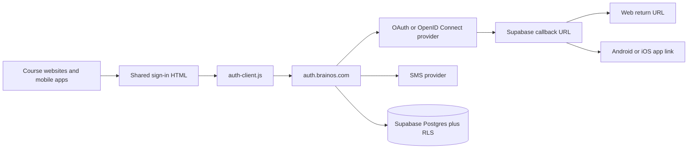

# Supabase authentication design and URL setup

> **Superseded for implementation on 3 October 2026:** Firebase is now the selected authentication provider. Use [Firebase Authentication design and setup](FIREBASE_AUTH_DESIGN.md) for the current setup. The architecture below is retained as the earlier Supabase proposal and comparison reference.

**Status:** Proposed implementation design  
**Applies to:** every TutorBrains course website, Android WebView, and iOS WKWebView  
**Backend boundary:** Supabase Auth only; no TutorBrains authentication server

## 1. Decision

Use one shared Supabase project and the custom domain `auth.brainos.com` as the identity authority for every TutorBrains course, including Telugu Tutor, Math Tutor, and future products. Each course reuses the same semantic sign-in page and separately bundled JavaScript authentication library based on `@supabase/supabase-js`. Supabase owns users, identities, one-time passwords (OTPs), JSON Web Token (JWT) sessions, refresh, and sign-out. Provider secrets exist only in Supabase and the provider consoles.

This creates one learner identifier across all courses. Course enrolment, progress, preferences, and advertising choices remain separate application records keyed by that identifier. A course must not infer enrolment in another course merely because the learner has a shared identity. Each course keeps its own browser/app session; sessions are not copied or silently shared between courses.

The browser application may use the Supabase publishable key. It must never contain the Supabase secret/service-role key or any provider client secret. Row Level Security (RLS) protects every learner-owned Supabase table.



## 2. Provider feasibility

| Learner-facing choice | Supabase provider value          | Decision                                                                                                    |
| --------------------- | -------------------------------- | ----------------------------------------------------------------------------------------------------------- |
| Google                | `google`                         | Supported                                                                                                   |
| Apple                 | `apple`                          | Supported; Apple Developer configuration and periodic secret rotation are required                          |
| Facebook              | `facebook`                       | Supported                                                                                                   |
| Microsoft             | `azure`                          | Supported; request the `email` scope                                                                        |
| X                     | `x`                              | Supported through OAuth 2.0; do not start a new integration with legacy Twitter OAuth 1.0a                  |
| LinkedIn              | `linkedin_oidc`                  | Supported; use LinkedIn OpenID Connect (OIDC), not the removed legacy provider                              |
| Phone OTP             | `signInWithOtp` plus `verifyOtp` | Supported later only as a secondary identity linked to an existing verified-email account                    |
| Reddit                | none                             | Not supported by hosted Supabase Auth as a built-in provider; Reddit OAuth is not a generic OIDC substitute |
| Instagram             | none                             | Not a general Supabase sign-in provider; Facebook sign-in does not make a separate Instagram identity       |

Reddit and Instagram cannot honestly be enabled under the current “Supabase or cookies, no own backend” constraint. Keep them out of active controls. Revisit only if Supabase adds them, or if the architecture later permits a managed identity broker or a trusted backend.

### 2.1 Firebase versus Supabase cost and capability trade-off

The following comparison was verified against the vendors' published documentation on 3 October 2026. It is decision support rather than a change to the Supabase architecture proposed by this document. Recheck pricing and provider terms immediately before implementation.

| Consideration | Firebase Spark (free) | Firebase Blaze (minimum paid) | Supabase Free | Supabase Pro (minimum paid) |
|---|---|---|---|---|
| Base platform charge | No charge and no payment method required | No fixed Firebase plan charge; eligible usage is billed as consumed | No charge | $25 per organization per month; project compute and add-ons can increase the invoice |
| Standard authentication allowance | Basic Firebase Authentication offers most email and social authentication without a monthly-active-user charge; normal service limits and abuse controls still apply | Same basic authentication allowance unless the project is upgraded to Identity Platform | 50,000 monthly active users (MAU) | 100,000 MAU included, then $0.00325 for each additional MAU |
| Optional enterprise identity tier | If upgraded to Firebase Authentication with Identity Platform, Spark is limited to 3,000 daily active users for email, social, anonymous, and custom authentication, and 2 daily active users for Security Assertion Markup Language (SAML) or OpenID Connect (OIDC) | Identity Platform includes 50,000 standard MAU and 50 SAML/OIDC MAU; excess standard usage is approximately $0.0025-$0.0055 per MAU and excess SAML/OIDC usage is $0.015 per MAU | Single sign-on is unavailable | 50 single-sign-on MAU included, then $0.015 per MAU |
| Supported requested social providers | Google, Apple, Facebook, Microsoft, X, and LinkedIn are supported provider configurations | Same | Google, Apple, Facebook, Microsoft/Azure, X, and LinkedIn OIDC | Same, plus custom OAuth/OIDC provider support |
| Reddit and Instagram | Neither is a standard built-in sign-in provider; enabling either would require a separately supported identity broker or custom trusted integration | Same | Neither is a standard built-in provider | Custom OAuth/OIDC may broaden options, but Reddit and Instagram still require provider-specific feasibility and security review |
| Phone OTP | Production SMS authentication is not available without billing | Billed per SMS or phone-number verification according to destination country | Supabase does not supply free SMS; configure Twilio, Vonage, or MessageBird and pay that provider | Same |
| Vendor-supplied authentication email | Address verification: 1,000 emails per day; password reset: 150 per day; email-link sign-in: 5 per day | Address verification: 100,000 per day; password reset: 10,000 per day; email-link sign-in: 25,000 per day | Built-in sender is limited to 2 authentication emails per hour and is unsuitable for production launch volume | Use a production Simple Mail Transfer Protocol (SMTP) provider; its charges and limits are separate |
| Custom authentication domain | A Firebase Hosting custom domain and Secure Sockets Layer (SSL) certificate have no separate charge within Hosting quotas; otherwise use `<project-id>.firebaseapp.com` | Same, subject to Hosting usage charges above its allowance | Supabase custom domains are unavailable on Free | Paid-plan add-on at $0.0137 per hour, approximately $10 per month for each project domain |
| Inactive project behavior | Authentication is not routinely paused merely because the project is quiet | Not routinely paused | A low-activity project can be paused after a seven-day inactivity assessment and must be resumed | Paid projects are not automatically paused for inactivity |
| User-data access | Firebase manages the authentication store; the client receives the user and token interfaces rather than direct database access to Auth tables | Same | Auth is backed by the project's PostgreSQL database and integrates directly with Row Level Security (RLS) | Same |
| Data-region model | Firebase Authentication is a global service and does not provide per-user India, United States, or European Union/United Kingdom Auth placement | Same | Each project has one selected primary region | Same; strict three-region residency requires separate projects, routing, and identity reconciliation |
| Web, Android, and iOS | Mature first-party client software development kits (SDKs), including web | Same | Web and mobile clients are supported through Supabase libraries and OAuth redirects | Same |
| Operational fit for the current static design | Lowest initial cost and no database requirement; use the default Firebase domain first | Add billing only for phone OTP or other paid services | Fits the present Supabase design but has email-delivery and inactivity constraints | Removes inactivity risk and increases quotas, but the custom domain makes the practical starting platform cost about $35 per month before additional compute or usage |

Decision update: use Firebase Authentication on Blaze, with `auth.brainos.com` as the Firebase Hosting auth domain, because production phone OTP is required. Standard social providers remain enabled according to provider setup; phone-only accounts are allowed, so an individual may have separate phone and social accounts until they explicitly link them. Upgrade to Identity Platform only to enable LinkedIn OIDC. This Firebase implementation and its manual setup are documented in [FIREBASE_AUTH_DESIGN.md](FIREBASE_AUTH_DESIGN.md). Supabase-specific architecture below is retained as the previous proposal. Neither provider supplies built-in Reddit or Instagram sign-in under the no-own-backend constraint.

### 2.2 Email identity and duplicate prevention

A verified email address is the canonical human-readable uniqueness key. Application records still reference the immutable Supabase `user.id`; never use an email address as a database foreign key because addresses can change.

Supabase automatically links ordinary OAuth identities when they return the same verified email. Configure every enabled provider to return a verified email and keep automatic identity linking enabled. Do not offer anonymous account creation. Do not allow phone OTP to create a standalone account; phone may be linked later as a secondary recovery/sign-in identity after an email-backed account exists.

Email uniqueness cannot prove that two different addresses belong to the same person. Apple “Hide My Email,” separate work/personal addresses, or providers returning different primary addresses can still create separate accounts. Do not merge these accounts by name, device, phone guess, or advertising data. Offer authenticated manual identity linking before the learner adds another provider, and provide a reviewed account-recovery/merge procedure for exceptional duplicates. SAML identities are outside this design because Supabase does not automatically link them by email.

TutorBrains stores the verified email only inside the protected authentication/account boundary and uses it for uniqueness, sign-in, recovery, security notices, and account administration. Do not copy it into course progress, learner-visible public profiles, analytics events, or advertising tables, and do not use it for marketing without separate consent.

## 3. Canonical URLs

Use one provider callback domain and explicit return URLs for every course. Replace illustrative future-course URLs after their production domains and mobile application identifiers are approved.

| Purpose | Value pattern |
|---|---|
| Shared Supabase/Auth URL | `https://auth.brainos.com` |
| Provider callback after custom-domain activation | `https://auth.brainos.com/auth/v1/callback` |
| Default Supabase callback retained during migration | `https://<project-ref>.supabase.co/auth/v1/callback` |
| Telugu Tutor sign-in | `https://learntelugu.brainos.in/en/sign-in.html` |
| Telugu Tutor return | `https://learntelugu.brainos.in/en/auth-callback.html` |
| Future course return | Exact URL such as `https://mathtutor.example/auth-callback.html` |
| Android/iOS return | A verified App/Universal Link belonging to the specific app; choose final application identifiers before defining fallback custom schemes |

There are two different callbacks. Google, Apple, and the other providers receive only the shared **Supabase provider callback** at `auth.brainos.com`. Supabase then sends the learner to an allowlisted **course return URL** supplied as `redirectTo`. Provider consoles do not need every course return URL.

Supabase supports one custom domain per project, which is sufficient because every course shares this project. A Supabase custom domain is a paid-plan add-on; on the Free plan, use the `<project-ref>.supabase.co` callback while keeping `auth.brainos.com` as the planned production address. Do not place an ordinary Cloudflare proxy in front of Supabase Auth as a substitute for the supported custom-domain feature.

Do not use broad wildcards for production web returns. Add each production and staging course callback explicitly. Wildcards are acceptable only for controlled preview environments. Keep `localhost` entries development-only.

### 3.1 Session behavior across courses

All courses receive the same Supabase `user.id` after the same verified-email identity is linked, but browser storage and cookies are scoped to an origin. A session created on `learntelugu.brainos.in` is not automatically readable by `auth.brainos.com`, `brainos.com`, or another course origin. This isolation is intentional and must not be bypassed by placing access or refresh tokens in query strings.

Each course starts its own OAuth/PKCE flow and receives its own local session. Because the learner may already be signed in at the external provider, later course sign-ins can be short, but they are still explicit sign-ins. A truly silent session shared across unrelated domains would require a trusted central session broker, which is outside the current no-own-backend design.

The session ID alone is not an authorization credential. The locally persisted Supabase session contains a short-lived access-token JSON Web Token (JWT) and a rotating refresh token; the JWT carries the `session_id` claim. Course code uses the cached access token when authorization is needed, and the shared library refreshes it near expiry. Never send a bare session ID as proof of identity.

### 3.2 Shared-project risks and controls

- **Shared failure and quota boundary:** an Auth outage, configuration error, abuse spike, or project quota can affect every course. Roll provider changes out through one test course before enabling them globally.
- **Shared security boundary:** a weak RLS policy in one course can expose another course's records. Every learner-owned table needs both `user_id = auth.uid()` and an explicit stable `course_id`; test cross-user and cross-course denial.
- **Shared identity is personal data:** using one identifier across courses makes activity correlatable. Do not assemble cross-course behavioural or advertising profiles merely because the database can join them. Obtain specific consent for any cross-course personalization.
- **Global deletion semantics:** deleting the shared Auth user affects access to every course. The interface must distinguish “leave this course,” “delete this course's data,” and “delete my BrainOS account everywhere.”
- **Branding:** provider consent screens identify BrainOS rather than an individual tutor product. Explain that BrainOS is the shared account used by all TutorBrains courses.
- **Regional coupling:** one Supabase project has one primary region. A later move to jurisdiction-specific projects would split the identity authority and require an explicit migration or federation design.

## 4. Step-by-step configuration

1. Create the production Supabase project in the intended data region. Record its Project URL and publishable key. Do not copy the service-role key into the frontend.
2. In **Authentication → URL Configuration**, select one safe default Site URL and add the exact callback for every approved course, staging deployment, Android App Link, and iOS Universal Link. Add a custom-scheme callback only if verified HTTPS links are not available.
3. On a paid plan, configure the single supported Supabase custom domain as `auth.brainos.com`. Add its Domain Name System (DNS) CNAME and verification records, but do not activate it until every provider accepts the new callback.
4. In **Authentication → Providers**, enable one provider at a time. During custom-domain migration, register both `https://<project-ref>.supabase.co/auth/v1/callback` and `https://auth.brainos.com/auth/v1/callback` in each provider console. After activation, every course initializes the Supabase client with `https://auth.brainos.com`. Store client secrets only in Supabase.
5. Start with Google. Configure consent branding, the minimum `openid`, email, and profile scopes, and web/iOS/Android client identifiers as required. Verify one new user and one returning user.
6. Configure Apple with the App ID, Services ID, web return domain, key, and generated client secret. Assign an owner and calendar reminder because the Apple OAuth secret expires. Verify both “share email” and “hide my email.”
7. Configure Facebook with email permission; Microsoft through Azure/Entra with the `email` scope; X using OAuth 2.0 with “Request email”; and LinkedIn using the OIDC product. Repeat the new/returning-user checks after each provider.
8. Keep phone sign-up disabled initially. If phone is later added, allow it only as a secondary identity linked by an already signed-in email-backed learner; configure its provider, rate limits, CAPTCHA, country allowlist, and recovery policy before release.
9. Keep automatic OAuth identity linking enabled and test that two providers returning the same verified email resolve to one `user.id`. Apple private relay and genuinely different emails remain different accounts unless the signed-in learner explicitly links them.
10. Create a private `learner_profiles` row keyed by `auth.uid()` with a learner-chosen `display_name` and optional small `avatar`. A provider display name and photo may be offered as initial suggestions; let the learner edit or remove them. Do not copy location, birthday, contacts, social graph, or other provider metadata.
11. Store advertising consent separately from authentication. An `advertising_preferences` record may contain consent status, timestamp, policy version, broad learner-selected interests, and course context. Do not treat provider metadata as an “advertisement profile,” request extra OAuth scopes for advertising, or infer sensitive traits. Disable personalized advertising for children unless the applicable legal and verified-consent requirements have been satisfied.
12. Enable RLS on every application table. Policies should use `auth.uid()` and deny access by default. Provider identity proves who the learner is; it does not itself grant course-management, cross-course, advertising, or administrative abilities.
13. Add privacy policy, terms, support, and account-deletion URLs before requesting provider production approval. Disclose that the identity provider and Supabase may process provider-returned authentication data even when TutorBrains does not use it. Provide in-app sign-out and account-deletion entry points. Apple requires Sign in with Apple when other third-party sign-in choices are offered in an iOS app, subject to its current review rules.
14. Test every course callback in staging, then production, using real devices. Provider-console configuration is external state; a successful local HTML build is not authentication evidence.

## 5. Shared JavaScript contract

Maintain one framework-neutral source module, `assets/js/auth-client.js`, for all courses. The learner-web build owns its versioning and publication: it bundles the pinned official Supabase client locally, copies the same reviewed authentication module into every course distribution, and generates only a small course-specific configuration containing `https://auth.brainos.com` (or the temporary Supabase project URL), the publishable key, exact return URL, course identifier, and enabled-provider flags. Do not fork authentication logic per course or load executable authentication code from a public content-delivery network.

The build must fail if authentication is enabled but the pinned client, shared module, or required course configuration is missing. Authentication code changes require one shared test suite plus a smoke test against every generated course callback. Course content and localization files cannot inject provider names, project URLs, keys, redirect targets, or executable authentication behavior.

```js
export interface AuthClient {
  signInWithProvider(provider, returnUrl): Promise<void>;
  linkProvider(provider, returnUrl): Promise<void>;
  getAuthView(): Promise<AuthView>;
  signOut(): Promise<void>;
  onAuthViewChange(listener): Unsubscribe;
}

export interface AuthView {
  isAuthenticated: boolean;
  userId: string | null;
  displayName: string | null;
  avatarUrl: string | null;
  initials: string | null;
}
```

Provider buttons map only to the values in the feasibility table. Each course build owns a fixed return URL; the library does not accept an arbitrary query-string redirect. Calling HTML obtains presentation-safe authentication and identity data only through `getAuthView()` or its change listener; it does not receive the Supabase session, tokens, verified email, raw provider metadata, or storage records. Show a generic error in the page and keep detailed diagnostics and provider attributes out of learner-visible URLs and logs.

## 6. Local identity and session storage

The shared script owns an `AuthStorage` capability rather than allowing pages to access browser storage directly. Its preferred implementation for websites, Android WebView, and iOS WKWebView is Indexed Database API (IndexedDB). IndexedDB stores the persisted Supabase session plus a small normalized learner-identity cache containing only `userId`, `displayName`, optional local avatar reference, initials, and cache/version timestamps.

Keep the session record and presentation-profile record logically separate. Course and lesson HTML may receive the name, initials, and optional avatar through `AuthClient`; it must never receive the refresh token or raw provider response. Clear both records on account deletion. On ordinary course sign-out, clear that course's session and decide explicitly whether the non-sensitive display cache should also be removed from the device.

For each static, client-rendered course, initialize one shared Supabase client with persisted sessions and automatic token refresh, using `AuthStorage` as the Supabase-compatible storage adapter. Read the current session and learner identity from IndexedDB at application start and keep the resolved state in memory. Ordinary static page navigation, language changes, lessons, and public course content must not call Supabase merely to re-check authentication. Supabase is contacted only for sign-in/callback completion, refresh near token expiry, explicit sign-out, identity linking/recovery, or a genuinely protected Supabase data request.

Do not call `getUser()` on every URL or page transition. `getSession()` normally reads the locally persisted session, but course code should still centralize it through `AuthClient` rather than repeatedly constructing clients or refresh loops. Register one auth-state listener per application shell. On mobile, start automatic refresh only while the app is active and stop it while backgrounded.

If a future app host cannot provide reliable IndexedDB, implement the same `AuthStorage` interface through app-private filesystem or database storage. That fallback is deferred until the native host is selected. It must use operating-system protected storage for refresh credentials or encrypt the app-private record with a key held by the platform secure store; do not write readable token files to general device storage. Calling HTML remains unchanged because the host adapter implements the same storage contract.

HTTP-only cookies require a server that can read and refresh them, so they cannot be the sole session mechanism for the shared static HTML/WebView design. Do not write a second cross-domain authentication cookie. Signing out of one course clears that course's local session; a later phase may offer explicit “sign out of all Supabase sessions,” but must not pretend that browser storage on other origins was erased.

On mobile, open OAuth in the system browser, not an embedded provider WebView. Return through an Android App Link or iOS Universal Link and let the shared library complete the Proof Key for Code Exchange (PKCE) flow. Prefer IndexedDB for parity with the website; use the protected native fallback only when the chosen WebView cannot meet persistence and reliability tests. Do not expose refresh tokens to lesson content or log them.

## 7. Sign-in interaction

The first view shows Google and Apple. “More ways to sign in” discloses Facebook, Microsoft, X, and LinkedIn. Each provider must return a verified email. The same form serves sign-up and sign-in; Supabase resolves whether the identity is new or returning and automatically links matching verified emails. After first sign-in, ask only “What should we call you?” and offer any provider name as editable text rather than silently accepting it. Phone is not shown as a standalone registration option; if introduced later, it appears only in signed-in account settings as a secondary linked identity.

Authenticated headers show a small circular learner icon beside the display name. Prefer the learner-approved provider photo when available; otherwise render locally generated initials over a neutral background and use the existing generic user icon when no usable name exists. The image is decorative when adjacent text already names the learner (`alt=""`); an icon-only account control needs an accessible label such as “Account for Priya.” Validate image type and size, avoid hotlinking an untrusted provider URL indefinitely, and allow the learner to remove or replace the image.

Guest learning remains separate. Signing in later must not silently merge guest progress; use an explicit, reversible “move this device’s progress to my account” confirmation when that feature is designed.

## 8. Mobile HTML reuse

Course pages and lessons remain delivered as semantic HTML on the website and inside Android/iOS WebViews. Package the same built HTML, CSS, localized text, authentication module, identity-return contract, and IndexedDB storage implementation in Android and iOS. Only a narrow host adapter differs:

- web opens OAuth normally and returns to an HTTPS callback;
- Android/iOS opens the system authentication session and receives an App/Universal Link;
- the host provides lifecycle events and, only when IndexedDB is inadequate, the protected `AuthStorage` fallback;
- provider secrets and Supabase service credentials never enter either app package.

The HTML must not branch on `android` or `ios`. Capability detection chooses a browser or native redirect/storage adapter; provider mapping, error messages, account state, display-name delivery, and avatar behavior stay shared.

## 9. Verification checklist

- New account, returning account, cancellation, denied consent, expired callback, offline return, and provider outage for each enabled provider.
- Same verified email through two providers resolves to one user; different emails remain separate until explicit authenticated linking.
- Android App Link and iOS Universal Link from a terminated, backgrounded, and foreground app.
- Refresh after restart, explicit sign-out, remote session revocation, and account deletion.
- No token, OTP, provider secret, phone number, or callback fragment in analytics, crash logs, or browser history.
- The same provider produces the same Supabase user ID from every course; every course callback rejects unallowlisted destinations.
- Provider email and metadata remain in the Auth boundary and are not copied to learner or advertising tables.
- Static navigation produces no Supabase request; refresh occurs only near token expiry and is owned by one client instance.
- Every generated course contains the same pinned authentication-library version and only its own validated configuration.
- Website, Android WebView, and iOS WKWebView persist and restore the session and normalized identity through IndexedDB, or pass the same conformance tests through the protected native fallback.
- Calling HTML receives display name, initials, and optional avatar but cannot access refresh tokens or raw provider metadata.
- Missing, invalid, oversized, removed, and offline avatar cases fall back to initials or the generic user icon.
- Advertising remains contextual until separately recorded, legally valid personalization consent exists.
- Keyboard-only use, screen-reader names, visible focus, 200% zoom, slow network, English, and Hindi.
- RLS attempts for anonymous, signed-in owner, another learner, and administrative roles.

## 10. Delivery phases

1. Inventory every production, staging, Android, and iOS callback and confirm ownership of `brainos.com` DNS.
2. Start on the Free plan with the default Supabase project URL; make the build publish the locally bundled shared client and generated configuration to one course, then enable Google only.
3. Verify email uniqueness, matching-email automatic linking, session persistence, refresh, and zero Auth requests during ordinary page navigation.
4. Add Apple, then Facebook, Microsoft, X, and LinkedIn one at a time; require verified email and test duplicate-account edge cases for each.
5. On a paid plan, provision the custom-domain add-on, configure and activate `auth.brainos.com`, then migrate each course and provider without removing the default callback prematurely.
6. Reuse the same build-owned authentication module for later courses; add each exact callback and run cross-course identity and version-parity tests.
7. Add phone only later as an explicitly linked secondary identity if required.
8. Reassess Reddit and Instagram only if the no-backend constraint or Supabase provider support changes.

## References

- [Supabase Auth](https://supabase.com/docs/guides/auth)
- [Social login](https://supabase.com/docs/guides/auth/social-login)
- [Redirect URLs](https://supabase.com/docs/guides/auth/redirect-urls)
- [Native mobile deep linking](https://supabase.com/docs/guides/auth/native-mobile-deep-linking)
- [Phone OTP sign-in](https://supabase.com/docs/reference/javascript/auth-signinwithotp)
- [User sessions](https://supabase.com/docs/guides/auth/sessions)
- [Custom domains](https://supabase.com/docs/guides/platform/custom-domains)
- [User identities](https://supabase.com/docs/guides/auth/identities)
- [Identity linking](https://supabase.com/docs/guides/auth/auth-identity-linking)
- [Supabase JavaScript Auth client](https://supabase.com/docs/reference/javascript/auth)
- [Supabase billing and included usage](https://supabase.com/docs/guides/platform/billing-on-supabase)
- [Supabase monthly active users](https://supabase.com/docs/guides/platform/manage-your-usage/monthly-active-users)
- [Supabase authentication rate limits](https://supabase.com/docs/guides/auth/rate-limits)
- [Supabase Free project pausing](https://supabase.com/docs/guides/platform/free-project-pausing)
- [Supabase custom-domain pricing](https://supabase.com/docs/guides/platform/manage-your-usage/custom-domains)
- [Firebase pricing](https://firebase.google.com/pricing)
- [Firebase pricing plans](https://firebase.google.com/docs/projects/billing/firebase-pricing-plans)
- [Firebase Authentication and Identity Platform pricing](https://firebase.google.com/docs/auth/)
- [Firebase Authentication limits](https://firebase.google.com/docs/auth/limits)
- [Firebase supported OAuth providers](https://firebase.google.com/docs/auth/configure-oauth-rest-api)
