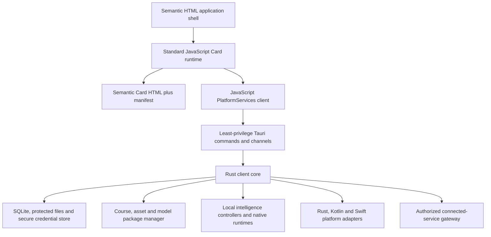

# Tauri Platform Scheme

**Status:** Candidate design; not selected  
**Scheme:** Tauri 2.0 installed applications with a vanilla semantic HTML and JavaScript frontend and a Rust client core  
**Parent design:** [App skeleton technical design](APP_SKELETON_TECH_DESIGN.md)  
**Product contract:** [Platform and logical presentation specification](../spec/platform_spec.md)

## 1. Decision this scheme tests

This scheme tests whether Tauri 2.0 can preserve semantic Hypertext Markup Language (HTML) Cards and a small frontend dependency surface while supplying complete installed applications, protected local storage, native device integration, and local intelligence on Android, iOS, Windows, and macOS.

Tauri is an application host, not the Card model. Cards and standard JavaScript depend only on shared `PlatformServices` contracts. Tauri commands, Rust types, plug-in names, and model identities do not enter Card definitions.

## 2. Architecture



The Rust core owns privileged operations. The web view never receives unrestricted filesystem, process, database, credential, or model-runtime access.

## 3. Application and Card delivery

- Start from Tauri's vanilla JavaScript project shape without a frontend component framework.
- Package application-owned HTML, CSS, JavaScript, shell localization catalogues, and bootstrap assets with the installed application.
- Keep Card presentation in reviewed semantic HTML and Card authority in the structured Card manifest.
- Application-owned JavaScript activates declared actions through narrow service clients.
- Do not expose raw Tauri APIs to Card modules.
- Content packages cannot provide scripts, inline handlers, arbitrary remote URLs, unrestricted styles, WebAssembly, or command names.
- Validate Card HTML and manifests before installing or activating a package.

The same Card HTML must run unchanged on all four required platforms. Platform-specific behavior belongs behind a service handle or application-shell adapter.

## 4. Platform-service implementation

| Shared contract | Tauri implementation |
|---|---|
| `PreferenceService` | Rust repository over SQLite with declared defaults |
| `LocalizationService` | Packaged JSON catalogues and versioned localized content resolved through Rust or deterministic JavaScript |
| `AuthorizationService` | Rust evaluator for signed ability envelopes and current local policy |
| `ContentRepository` | Rust package repository with immutable versions and integrity checks |
| `AssetResolver` | Logical reference to a verified local resource handle or authorized download plan |
| `PackageService` | Rust install, verify, activate, rollback, and removal operations |
| `SecureStore` | Operating-system credential/key store through evaluated plug-ins or platform adapters |
| `LearnerStore` | SQLite transactions and explicit migrations |
| `EvidenceStore` | Encrypted private files plus SQLite purpose, consent, retention, and deletion metadata |
| `PermissionService` | Rust facade over Tauri or custom Kotlin/Swift permission plug-ins |
| `CapabilityDiscovery` | Registered desktop/mobile adapters plus runtime service probes |
| Intelligence handles | Rust controllers calling deterministic logic, Rust libraries, or native C/C++ model runtimes |
| `ConnectedGateway` | Rust network boundary with token attachment, privacy policy, and bounded retry |

Results crossing the JavaScript/Rust boundary are explicit success, unavailable, denied, invalid, or failed values. Large binary objects remain in protected local storage and cross the boundary by opaque handle. Streaming intelligence results use bounded Tauri channels.

## 5. Internationalization

- Use semantic `lang` and `dir` attributes in Card HTML.
- Use JSON catalogues with stable keys and standard JavaScript `Intl` APIs for the application shell.
- Keep canonical Telugu, instruction language, interface locale, transliteration, and accessibility preferences independent.
- Resolve localized course HTML and assets from versioned packages.
- Report requested language, actual language, content version, and fallback state.
- Re-resolve an open Card after a supported preference change without changing learner records or progress.
- Test Telugu shaping, combining marks, line breaking, input methods, text selection, scaling, and screen-reader language behavior in WebView2, Android WebView, and WKWebView.

Tauri does not bundle one renderer across the four platforms. Windows uses WebView2, Android uses the system Android WebView, and Apple platforms use WKWebView. Equivalent behavior must be demonstrated rather than inferred from one platform.

## 6. Authorization and Tauri permissions

Two separate decisions protect a privileged operation:

```text
Tauri permission: may this web view invoke this command?
Telugu Tutor authorization: may this actor exercise this ability on this resource?
```

- Define small Tauri capability files for the application window.
- Do not enable a broad default command surface merely for convenience.
- Expose application-level commands such as `resolveAsset`, `recordSubmission`, or `requestEvaluation`, not unrestricted filesystem or process commands.
- Evaluate actor ability, resource scope, expiry, consent, and usage constraints inside Rust before acting.
- Revalidate connected protected operations on the server.
- Keep access tokens in memory where practical and refresh credentials or device keys in operating-system secure storage.
- Use the system browser for OpenID Connect (OIDC) authorization and Proof Key for Code Exchange (PKCE).

Tauri permissions do not replace the product's ability model, and a signed Card package does not grant an ability.

## 7. Assets, persistence, and evidence

### Authored content and models

- Package bootstrap assets with the application.
- Store course and localized asset packages in an application-controlled data directory.
- Store model packages separately so they can be installed, updated, rolled back, or removed without changing course content or progress.
- Verify every package manifest, digest, compatibility requirement, and provenance record before activation.
- Keep the prior compatible package active until a replacement verifies completely.

### Learner data

- Use SQLite for preferences, package metadata, Student Card map entries, Submissions, Evaluations, Accomplishments, consent, and evidence metadata.
- Keep large audio, image, video, stroke, and model objects outside SQLite and reference them transactionally.
- Encrypt sensitive evidence and keep encryption keys outside general preferences or the web view.
- Implement deletion as one recoverable operation that removes or schedules removal of metadata and bytes.
- Do not expose application data directories or learner-selected arbitrary paths to Card code.

## 8. Local intelligence

The Rust core registers intelligence controllers that can invoke:

- deterministic Rust logic;
- Rust-native inference libraries;
- C or C++ runtimes through a stable native interface;
- platform-specific acceleration adapters; or
- an explicitly approved connected provider when policy, consent, authorization, and connectivity allow it.

Cards ask for service capabilities, never models. Each registration records the service-contract version, controller, runtime, model and variant where applicable, locality, supported languages/media, resource requirements, reliability information, and provenance.

Model execution must not block the web-view or application main thread. Installation reports approximate size and device impact. Memory pressure, application backgrounding, cancellation, and model removal have explicit states.

## 9. Native and plug-in boundary

- Prefer portable Rust for shared platform services.
- Use official Tauri plug-ins only after checking their platform support, permission behavior, maintenance, and transitive dependencies.
- Use Kotlin/Java on Android and Swift on iOS for device functions that cannot be implemented adequately in Rust or browser APIs.
- Keep custom mobile plug-ins narrow and capability-oriented.
- Do not allow differences in plug-in implementation to change Card meaning.

Likely proof areas are microphone interruption handling, ordinary camera capture, image orientation, protected storage, learner-selected export, direct stylus input, background behavior, and platform-specific model acceleration.

## 10. Security boundary

- Apply a restrictive Content Security Policy (CSP).
- Disable remote executable content.
- Validate Card HTML through an allowlist policy before storage or rendering.
- Do not use unsafe HTML insertion for learner or model-generated content.
- Scope Tauri commands by window and permission.
- Treat a compromised frontend as unable to bypass Rust authorization, path validation, evidence policy, or package verification.
- Keep model output as text or structured data and render it through safe DOM construction.
- Separate course assets, learner evidence, exports, model files, and credentials physically and logically.

## 11. Distribution and updates

- Produce signed Android, iOS, Windows, and macOS application packages.
- Package the same reviewed frontend resources in every build.
- Build iOS and macOS releases on approved Apple tooling and Windows releases on approved Windows tooling.
- Version the application shell separately from course and model packages.
- Do not activate an incompatible application, course, or model combination.
- Treat application self-update support as platform-specific; application-store rules remain authoritative.

## 12. Dependency policy

- No frontend component framework in the initial skeleton.
- Count JavaScript packages, Rust crates, Tauri plug-ins, native libraries, model runtimes, fonts, and build tools in the dependency inventory.
- Record purpose, owner, license, supported platforms, pinned version, transitive surface, and removal path.
- Do not write custom cryptography, Unicode shaping, HTML sanitization, database engines, or model runtimes merely to avoid a focused maintained dependency.
- Do not load executable code from a content package or Content Delivery Network (CDN).

Tauri reduces the frontend framework and bundled-browser surface; it does not make the full native and model dependency graph small automatically.

## 13. Main advantages

- One host scheme covers all four required platforms.
- Cards remain literal semantic HTML with standard JavaScript behavior.
- Rust provides a strong client-side location for protected services and local models.
- Does not require a bundled Chromium runtime.
- Optional Web can reuse the Card and frontend layer through a browser adapter.
- Course, model, and learner data can use application-controlled storage and operating-system protection.
- Native integrations can be added without changing Card definitions.

## 14. Main risks

- Different operating-system web views can differ in rendering, input, media, lifecycle, and accessibility.
- Official plug-in coverage may not satisfy camera, microphone, stylus, secure-storage, export, or model requirements.
- Custom Kotlin and Swift plug-ins increase the maintained platform-specific surface.
- Local model packaging and acceleration remain independent hard problems.
- Powerful Rust commands increase the impact of a frontend or content-injection defect unless permissions are narrow.
- Tauri 2.0 mobile development and third-party plug-ins need product-specific maturity validation.

## 15. Required feasibility spike

On Android, iOS, Windows, and macOS, test:

1. the same localized semantic Card HTML;
2. Narrator, VoiceOver, and TalkBack structure, focus, announcements, and language changes;
3. audio playback and interruption-aware microphone capture;
4. camera/upload, preview, orientation, replace, retake, and delete;
5. pointer, touch, and stylus writing where supported;
6. SQLite migration and transactional Submission/Evaluation recording;
7. encrypted evidence retention and deletion;
8. signed course-package and model-package installation and rollback;
9. local authorization of exact, wrong, expired, and malformed ability scopes; and
10. a real local speech or language model loaded through the Rust intelligence boundary.

## 16. Acceptance conditions

This scheme remains viable only if:

- the same Card HTML and JavaScript modules operate across all required platforms;
- platform-specific code remains confined to narrow adapters;
- required accessibility, media, input, storage, and model behavior passes shared conformance tests;
- the native dependency inventory remains reviewable;
- the frontend cannot bypass Rust authorization or evidence policy; and
- missing or unreliable services produce the configured alternative or **Not assessed**.

## 17. References

- [Tauri 2.0 overview](https://v2.tauri.app/)
- [Tauri vanilla project setup](https://v2.tauri.app/start/create-project/)
- [Tauri architecture](https://v2.tauri.app/concept/architecture/)
- [Calling Rust from JavaScript](https://v2.tauri.app/develop/calling-rust/)
- [Tauri capabilities](https://v2.tauri.app/security/capabilities/)
- [Tauri mobile plug-in development](https://v2.tauri.app/develop/plugins/develop-mobile/)
- [Tauri web-view versions](https://v2.tauri.app/reference/webview-versions/)
