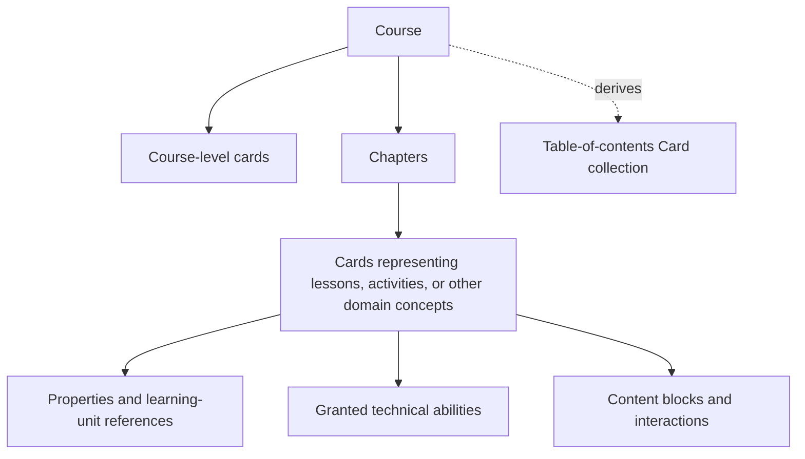
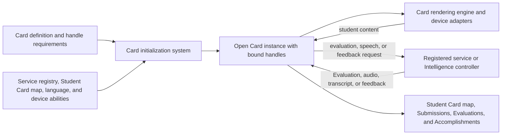

# Telugu Tutor Platform and Logical Presentation Specification

**Status:** Draft  
**Scope:** Platform requirements, logical runtime components, and platform-neutral course presentation entities  
**Related specifications:** `common_spec.md`, `capability_matrix.md`, `characters_spec.md`, `grammar_spec.md`, `vocabulary_spec.md`, and `sentence_spec.md`

**Implementation design:** [App skeleton technical design](../design/APP_SKELETON_TECH_DESIGN.md) compares three potential implementation schemes. The [Architecture Decision Record log](../design/ARCHITECTURE_DECISION_LOG.md) summarizes fixed, accepted, proposed, and deferred decisions. Candidate designs do not change the fixed platform decisions in this specification unless this specification is explicitly amended.

## 1. Purpose and boundary

This document defines the product-level platform shape required to present and run Telugu Tutor lessons consistently across supported devices. It identifies logical components and their responsibilities without selecting programming languages, application frameworks, storage products, model vendors, service boundaries, or deployment architecture.

This document does not define visual styling, screen layouts, wireframes, application programming interfaces, persistence schemas, or the implementation of a particular lesson. Chapter and lesson specifications continue to own learning objectives, teaching sequences, examples, evidence requirements, and completion rules.

## 2. Fixed platform decisions

- Android, iOS, Windows, and macOS are required product platforms.
- Web is an optional product platform because it has not yet been established that the required local Artificial Intelligence (AI) services can run adequately inside supported browsers through WebAssembly (Wasm), JavaScript, or another browser execution facility. A web version must not become a prerequisite for using any required platform.
- Each required platform must provide a first-class application experience rather than merely redirecting the student to a website.
- The product must be able to run all intelligence on the student's device. A permanent network connection or remote inference service must not be an assumed dependency for any tutor decision.
- Each required platform must provide a local model runtime plus one or more registered Intelligence controllers or equivalent service providers. Cards access them only through service handles bound during Card initialization.
- Required platforms may use different model families, variants, providers, runtimes, or Intelligence controller arrangements behind the same registered service handle. Each implementation must satisfy the handle contract and pass shared behavioural and reliability evaluation for that capability.
- Cards and Card definitions must not receive model or provider identity and must not alter their behaviour merely because the implementation behind a compatible service handle changes.
- The initial local model-backed services must use open-source models where available, or openly licensed open-weight models whose terms permit the required local execution, packaging, redistribution, evaluation, and modification. The exact models and platform assignments are not selected by this specification.
- The service registry must retain implementation provenance, including the service-contract version, controller or provider, applicable model and model variant, runtime version, and whether execution is local or connected. An Evaluation must retain or reference the provenance of the implementation that produced it.
- A change of implementation requires learner disclosure or renewed consent only when it materially changes privacy, data routing, consent, cost, availability, or learner-facing behaviour. Model identity by itself is not part of the Card contract.
- Course content and tutoring behaviour must use shared logical contracts across platforms. Platform-specific code may adapt rendering, permissions, media, storage, and device input, but must not redefine the lesson semantics.
- Every required platform must support internationalized presentation. Telugu remains the canonical target language; the learner's instruction language, interface locale, transliteration preferences, and accessibility preferences are resolved independently and may be changed without changing Telugu content or learning progress.
- Presentation definitions are declarative and platform-neutral. A Card rendering engine decides how to express them using the conventions and accessibility facilities of that platform.
- The exact division between shared and platform-specific implementation is deferred until the logical contracts and local-intelligence requirements have been validated.
- The learning applications and Telugu Tutor platform do not own commercial offers, checkout, payment processing, subscription billing, refunds, tax handling, or transaction reconciliation. Those responsibilities belong to a separate commerce application or service.
- A commerce application may cause access to be granted, changed, renewed, suspended, restored, or revoked, but it communicates that outcome to Telugu Tutor only as explicit ability or entitlement changes. Each grant identifies its resource and operation scope, effective or expiry time where applicable, issuer, policy version, and provenance.
- Paid access is not a special authorization mechanism. Complimentary, assigned, sponsored, purchased, subscribed, and restored access are evaluated through the same ability-based authorization contract. Cards do not receive prices, payment methods, transaction identifiers, subscription state, refund state, or commerce-provider identity.
- Losing or refunding one commercial source removes only the abilities derived from that source. It must not remove unrelated abilities, learner progress, Accomplishments, or permitted Submission history.
- The connected platform requirements include identity integration, authorization-token validation for restricted content, ability and entitlement evaluation, course-package and approved-asset delivery, and explicitly authorized learner-data operations. They do not require Telugu Tutor to implement commerce.

### Platform support matrix

| Platform | Product requirement | Local intelligence     | Native device capabilities                                                                                                                            |
| -------- | ------------------- | ---------------------- | ----------------------------------------------------------------------------------------------------------------------------------------------------- |
| Android  | Required            | Supported              | Audio, microphone, camera, image selection, touch and stylus where available                                                                          |
| iOS      | Required            | Supported              | Audio, microphone, camera, image selection, touch and stylus where available                                                                          |
| Windows  | Required            | Supported              | Audio, microphone, camera where available, file selection, mouse, keyboard, touch and stylus where available                                          |
| macOS    | Required            | Supported              | Audio, microphone, camera where available, file selection, mouse, keyboard, touch or stylus input where available through supported devices           |
| Web      | Optional            | Best effort if offered | Browser- and device-dependent; must not determine the contracts used by required platforms. On Web no Intelligence support is available free of cost. |

A missing physical capability must follow the alternatives and **Not assessed** behaviour in `common_spec.md`; it must not produce a different learning objective.

### Why web remains optional

The required applications can package and control their local model runtimes, model files, memory use, acceleration, persistence, updates, and device integration. Browser execution introduces additional uncertainty around whether WebAssembly (Wasm), JavaScript, browser storage, memory limits, background lifecycle, hardware acceleration, and browser security restrictions can provide compatible local implementations of the required intelligence service handles with acceptable speed, reliability, privacy, offline behaviour, and device coverage.

The web product must remain optional until testing demonstrates that it can satisfy the same service-handle contracts, tutor behaviour, and reliability requirements. It need not use the same model as a required platform. A remote-only implementation materially changes data routing and therefore requires an explicit product decision, appropriate learner disclosure and consent, and documented behavioural validation.

## 3. Platform principles

### One tutor, multiple platform expressions

The same Card definition, service-handle contract, request meaning, and Accomplishment rule must have the same educational meaning on every platform. Screen size, input mechanism, permission flow, native control, registered provider, and controller arrangement may differ. Canonical Telugu, instruction-language meaning, transliteration policy, help level, evidence meaning, and accomplishment outcome may not differ solely because of the platform.

### Local-first does not mean local-only

Each intelligent capability must declare whether it can run locally, requires a connected service, or can use either. Local execution is preferred when it improves responsiveness, privacy, offline continuity, or operating cost and provides adequate quality. A connected implementation may be used when the student has permitted the relevant data use and the capability cannot be performed adequately on the device.

The tutor must know when a capability is unavailable or its result is unreliable. It must never turn a model, device, network, or service limitation into a false judgment of the student.

### Logical entities do not own platform resources

A logical presentation entity refers to content, media, learner evidence, and actions by stable logical reference. It does not directly open a microphone, camera, file picker, audio device, drawing surface, or operating-system permission prompt. Platform adapters perform those operations and return normalized events or results.

### Internationalization, multilingual presentation, and preferences

Telugu is the target language of the course. The **instruction language** is the supported language used for interface text, instructions, explanations, meanings, prompts, and feedback. The instruction language is not fixed to the operating-system language. English is the declared default when no instruction language has been selected, as specified in `common_spec.md`.

The platform must keep these concerns independent:

- canonical Telugu content and its version;
- instruction language and regional variant;
- interface locale for platform labels, numbers, dates, and other locale-sensitive formatting;
- transliteration visibility, script, and convention appropriate to the instruction language;
- preferred voice, speaking rate, caption, transcript, text-size, and other supported presentation or accessibility preferences; and
- language-independent learner Submissions, Evaluations, Accomplishments, and progress.

The device locale may be offered as an initial suggestion, but it must not overwrite an explicit learner choice. Changing a presentation preference must not create a new Card definition, alter canonical Telugu, invalidate learner evidence, remove Accomplishments, or restart a Lesson. The currently open Card must re-resolve affected presentation content where safe; an operation already in progress may finish using the preference snapshot with which it began.

Card definitions refer to localizable content by stable logical reference rather than assuming embedded English. A Card may declare that particular wording, audio, transliteration, captions, or accessibility alternatives are required. The Localization resolver chooses a compatible asset for the active preferences and reports the language and variant actually used. If an exact localization is unavailable, the interface must visibly or accessibly disclose the fallback language; it must not silently present English as though it were the selected language.

Internationalization includes Unicode text handling, Telugu and instruction-language font fallback, combining marks, bidirectional and right-to-left presentation where required, locale-sensitive formatting, line breaking, text scaling, input methods, screen-reader language metadata, and localized accessibility labels. Service requests that process or produce language must carry explicit target, instruction, locale, script, or transliteration context as applicable. The service registry must not bind a provider that does not declare support for the requested language and script contract.

Learner preferences are independent reusable facts, not Card properties, submission content, or completion records. A Card may consume the resolved preferences and may offer an authorized preference-changing action, but it does not own the preference store or redefine the available preference values. Preference persistence and synchronization must not be prerequisites for opening or completing a Card; declared defaults apply whenever an optional preference is absent.

## 4. Logical component inventory

These components describe responsibilities, not necessarily separate processes, packages, or deployable services.

### Course and content components

| Logical component            | Responsibility                                                                                                                                             |
| ---------------------------- | ---------------------------------------------------------------------------------------------------------------------------------------------------------- |
| Course catalogue             | Describes available courses and resolves access without owning lesson execution.                                                                           |
| Versioned content repository | Resolves approved course, chapter, lesson, character, grammar, vocabulary, sentence, card, prompt, media, and localization versions by stable reference.   |
| Learner preference resolver  | Resolves explicit instruction-language, locale, transliteration, presentation, and accessibility choices with declared defaults for absent optional values. |
| Localization resolver        | Selects compatible instruction-language and regional assets, reports the language actually used, labels fallbacks, and keeps canonical Telugu separate from localized support. |
| Transliteration provider     | Produces or retrieves transliteration appropriate to the selected instruction language and script at runtime.                                              |
| Media and asset resolver     | Resolves reviewed audio, stock or authored images, illustrations, animations, and accessibility alternatives without exposing storage details to a lesson. |
| Content validator            | Detects missing references, unsupported blocks, missing accessibility information, and incompatible content versions before publication or use.            |

### Working Card concept and activity model

There is no Session coordinator, Lesson orchestrator, general Tutor decision engine, Presentation composer, shared Response collector, Feedback composer, or Recovery manager in the logical model.

> **Working definition — not finalized:** A Card is a domain concept with a corresponding presentation boundary; it is not merely a visual component. A Card may represent a whole Lesson or a smaller learning activity. The exact semantic boundary, composition rules, and criteria for choosing Lesson-level versus activity-level Cards must evolve through curriculum and interface evidence before they become a fixed contract.

Under the current working model, each Card owns or references:

- its instructional content and learning-unit references;
- the technical abilities it may request;
- the required and optional service-handle contracts for those abilities;
- the student submission kinds it accepts;
- the expected content, comparison target, rubric, accepted variants, and other inputs it passes through a bound evaluation handle;
- the feedback intent or approved feedback inputs it passes through a bound feedback handle;
- its help, retry, completion, and accomplishment rules; and
- the student-content fields that may be recorded for that Card.

The Card does not own a model runtime, evaluator implementation, feedback generator, speech generator, or Intelligence controller. It calls the service handles bound to its Card instance.

A Lesson may be represented by one Card or by independently meaningful activity Cards, depending on what the lesson needs. That choice is not finalized. Internal authoring may use names such as **Listen**, **Learn**, **Build**, **Talk**, or **Check** when useful; those labels alone do not create Card identities, prescribe an order, or require student-interface presentation.

### Registered service and Intelligence components

| Logical component | Responsibility |
|---|---|
| Card initialization system | Creates an open Card instance and binds its declared service-handle requirements to compatible registered services. It does not choose the Card, control Lesson order, or make tutoring decisions. |
| Service registry | Records available service contracts, handle names, provider versions, input and output shapes, supported languages and media, locality, reliability information, and runtime prerequisites. |
| Intelligence controller | Exposes one or more registered service handles and routes their requests to deterministic logic, local models, or an allowed connected provider. One application may have one controller or several specialized controllers. |
| Local model runtime | Loads and runs the local models used behind registered service handles. Cards never call or own the model runtime directly. |
| Evaluation service | Accepts the Card-provided expected content or rubric, the learner submission, and evaluation options, then returns a reliability-aware Evaluation. Specialized implementations may evaluate pronunciation, transcription, spoken meaning, typed text, handwriting, choice, matching, or construction. |
| Speech service | Accepts Card-provided Telugu text or audio intent and returns or plays natural, slow, generated, or approved recorded speech. |
| Feedback service | Accepts an Evaluation, Card feedback intent, instruction language, and approved constraints, then returns feedback such as success acknowledgement, improvement guidance, retry guidance, or unavailable-assessment explanation. |

Services are registered independently of Cards. Initialization binds handles; it does not copy a service or model into the Card. The same Intelligence controller may satisfy evaluation, speech, and feedback handles, or different controllers may satisfy them.

Initial intelligence service-handle contracts include:

| Service handle                  | Card request                                                                                                  | Returned result                                                                                                     |
| ------------------------------- | ------------------------------------------------------------------------------------------------------------- | ------------------------------------------------------------------------------------------------------------------- |
| Evaluate response               | Expected content or rubric, learner submission, accepted variants, options, and required reliability          | Evaluation outcome, reliability, supported correction, score where valid, or **Not assessed** reason                |
| Evaluate pronunciation          | Approved pronunciation target, learner audio or derived features, comparison focus, and required reliability  | Pronunciation Evaluation with supported observations and uncertainty                                                |
| Transcribe speech               | Learner audio, expected language, and transcription options                                                   | Transcript, alternatives where supported, reliability, or unavailable result                                        |
| Speak content                   | Telugu text or approved content reference, natural or slow intent, and voice constraints                      | Playable speech result or unavailable result                                                                        |
| Produce feedback                | Evaluation, success or improvement intent, approved messages or constraints, instruction language, and tone   | Success acknowledgement, improvement feedback, retry guidance, or unavailable-assessment explanation                |
| Evaluate handwriting            | Expected Character, Word, or Sentence units, learner image or strokes, criteria, and required reliability     | Usability result, recognized content, supported writing observations, score where valid, or **Not assessed** reason |
| Evaluate image content          | Expected content, learner image, image-quality criteria, and required reliability                             | Image usability, supported recognition result, observations, or unavailable result                                  |
| Produce constrained explanation | Card topic, approved source content, learner context allowed by policy, instruction language, and constraints | Bounded explanation or unavailable result                                                                           |

A Card may call only handles declared by its definition and bound during initialization. Handle names and request contracts remain stable even when their registered provider or Intelligence controller changes.

There is no general Tutor decision result. A Card receives only the result of the handle it called and applies its own retry and Accomplishment rules.

### Technical service requirements and Card use

| Technical service                          | Required relationship to Cards                                                                           | Responsibility                                                                                                                                                                                              |
| ------------------------------------------ | -------------------------------------------------------------------------------------------------------- | ----------------------------------------------------------------------------------------------------------------------------------------------------------------------------------------------------------- |
| Application shell and lifecycle service    | Required platform infrastructure; opens and closes Cards but is not called by authored Cards             | Owns application launch, lifecycle, native navigation boundaries, and locally recorded last access.                                                                                                         |
| Card initialization system                 | Required when any Card is opened; invoked by the application rather than by the Card                     | Resolves the Card definition, learner state, platform abilities, and registered service handles into an open Card instance.                                                                                 |
| Service registry                           | Required by Card initialization; not called directly by authored Cards                                   | Supplies compatible technical and intelligence service registrations and their contracts.                                                                                                                   |
| Capability-discovery service               | Required by Card initialization; not called directly by authored Cards                                   | Reports which rendering, media, input, intelligence, storage, permission, and connectivity capabilities are currently available.                                                                            |
| Card rendering engine                      | Required for every open Card                                                                             | Renders Card content blocks, interaction controls, presentation state, accessibility semantics, and responsive platform layout. It delegates specialized media and mathematical notation to bound services. |
| Content and unit resolver                  | Required for every Card that references content or learning units                                        | Resolves versioned Card, Character, Grammar, Vocabulary, Sentence, prompt, and related content references.                                                                                                  |
| Media-asset resolver                       | Required for every Card that references audio, video, images, illustrations, or animations               | Resolves approved versions, local availability, accessibility alternatives, and provenance without exposing storage details to the Card.                                                                    |
| Localization service                       | Required for every learner-facing Card containing localizable content                                    | Resolves instruction-language content and discloses any fallback language.                                                                                                                                  |
| Learner preference service                 | Required by Card initialization; called by a Card only when it is explicitly allowed to change a preference | Resolves and stores independent instruction-language, locale, transliteration, presentation, and accessibility preferences without treating them as Card progress.                                        |
| Telugu and general text renderer           | Required for every Card containing Telugu or other text                                                  | Renders Telugu combining marks, localized scripts, text scaling, selection, reading order, and accessible text.                                                                                             |
| Mathematical notation renderer             | Required only by a Card granted **Render mathematical notation**                                         | Renders a semantic mathematical expression with Telugu-and-math font fallback, scaling, copy support, and accessible linear or spoken alternatives.                                                         |
| Authored image and animation renderer      | Required only by a Card presenting authored visual media                                                 | Renders approved images or animations with provenance and accessibility alternatives.                                                                                                                       |
| Video playback service                     | Required only by a Card granted **Show or play video**                                                   | Plays approved video with playback state, captions, transcript, audio description where supplied, controls, and failure handling.                                                                           |
| Audio playback service                     | Required only by a Card granted **Speak or play audio**                                                  | Plays natural, slow, generated, approved recorded, or learner audio and reports playback state.                                                                                                             |
| Speech-capture service                     | Required only by a Card granted **Listen**                                                               | Captures, cancels, and returns learner audio without interpreting its educational meaning.                                                                                                                  |
| Image-input service                        | Required only by a Card accepting upload or camera content                                               | Selects, captures, previews, replaces, retakes, and deletes learner images.                                                                                                                                 |
| Direct-writing service                     | Required only by a Card granted **Accept direct writing**                                                | Captures pointer, touch, or stylus strokes and provides undo, clear, preview, and submit behaviour.                                                                                                         |
| Submission-record service                  | Required only by a Card granted **Record submission history**                                            | Creates durable Submission records and links them to the Card, units, learner, Evaluation, and curriculum context.                                                                                          |
| Evidence-storage service                   | Required only by a Card granted **Retain raw evidence**                                                  | Stores permitted raw audio, text, image, video, or stroke evidence under consent, retention, authorization, and deletion rules.                                                                             |
| Accomplishment-record service              | Required only when a Card can create or update an Accomplishment                                         | Applies the Card's Accomplishment rule to a returned result or configured self-check and records the outcome.                                                                                               |
| Student Card-map service                   | Required for learner Cards whose access or state is recorded                                             | Reads and updates last access, saved student content, help, Evaluation, Submission, and Accomplishment references.                                                                                          |
| Navigation service                         | Required only by a Card granted **Navigate**; leaving an open Card remains an application-shell function | Opens the referenced Course, Chapter, Lesson, Card collection, Card, or unit target.                                                                                                                        |
| Permission service                         | Required only when a bound handle needs an operating-system permission                                   | Requests permission in context and returns granted, denied, restricted, or unavailable state.                                                                                                               |
| Accessibility mapping service              | Required for every open Card                                                                             | Maps Card semantics, focus, state announcements, captions, transcripts, text scaling, reduced motion, and interaction alternatives to platform accessibility facilities.                                    |
| Secure local persistence service           | Required platform infrastructure; Cards use only bound record or evidence handles                        | Persists learner preferences, Student Card-map entries, Evaluations, Submissions, Accomplishments, consent, and permitted evidence with platform-appropriate protection.                                    |
| Content-package and cache service          | Required platform infrastructure; not called directly by authored Cards                                  | Installs, versions, integrity-checks, resolves, updates, and removes approved Card content, media, and local model resources.                                                                               |
| Authorization service                      | Required during initialization or a protected handle call; not owned by the Card                         | Checks explicitly granted actor and system abilities before protected content, evidence, intelligence, or navigation operations.                                                                            |
| Connectivity and connected-service gateway | Required only for explicitly allowed connected handles                                                   | Reports connectivity and provides the policy boundary for a connected service without silently changing a local Card request.                                                                               |
| Diagnostics service                        | Platform infrastructure; never a learner-content requirement of a Card                                   | Records approved service availability, failures, performance, and reliability events without silently collecting sensitive submissions.                                                                     |
| Notification service                       | Optional platform infrastructure; never required to render or use a Card                                 | Delivers permitted reminders or return prompts without controlling Card access or Lesson order.                                                                                                             |

### Intelligence service requirements and Card use

| Intelligence service | Required relationship to Cards | Responsibility |
|---|---|---|
| Intelligence controller | Required platform infrastructure; never owned or called directly as a model by a Card | Exposes registered intelligence handles and routes calls to deterministic logic, the local model runtime, or an explicitly allowed provider. One or many controllers may be registered. |
| Local model runtime | Required platform infrastructure for model-backed local handles; never owned by a Card | Loads, executes, versions, and reports the local models used by registered services. |
| Response-evaluation service | Required only by a Card that evaluates expected content against submitted content | Evaluates typed, chosen, matched, ordered, constructed, spoken, or recognized responses against Card-provided expectations or rubrics. |
| Pronunciation-evaluation service | Required only by a Card evaluating pronunciation | Compares learner speech with the approved target and returns supported observations and reliability. |
| Speech-transcription service | Required only by a Card granted **Transcribe speech** | Produces a transcript, alternatives where supported, and reliability from captured audio. |
| Speech-generation service | Required only when a Card requests generated speech rather than approved recorded audio | Produces natural or slow speech from Card-provided Telugu text and voice constraints. |
| Handwriting-evaluation service | Required only by a Card evaluating a learner image or direct-writing submission | Checks usability, expected content, recognizable writing, and configured handwriting criteria. |
| Image-understanding service | Required only by a Card evaluating learner-provided image content | Checks image usability and evaluates only the Card-provided expected visual content or rubric. |
| Feedback service | Required only by a Card granted **Request feedback** | Produces constrained success, improvement, retry, or unavailable-assessment feedback from an Evaluation and Card-provided feedback intent. |
| Transliteration service | Required only by a Card granted **Present transliteration** when the value is produced dynamically | Produces instruction-language- and script-appropriate transliteration without changing canonical Telugu. |
| Constrained-explanation service | Required only by a Card permitted to request a dynamic explanation | Produces a bounded explanation from approved content, Card context, language, and safety constraints. |

A single registered service may satisfy several handles, and one Intelligence controller may host several services. The tables define logical contracts, not a requirement for one process, model, or deployable component per row.

### Presentation components

| Logical component | Responsibility |
|---|---|
| Card definition | Defines one reusable learning or navigation activity through properties, unit references, technical abilities, accepted student content, service-handle requirements, request inputs, and accomplishment rules. |
| Card collection | Groups directly addressable Card references for a Chapter, Course, table of contents, review view, or another presentation and may supply a recommended order. A Lesson Card may link to a collection or peer Card but does not contain it. |
| Card instance | Combines a Card definition with the current learner's Card-map entry, language, available device abilities, bound service handles, current submission, and returned results. |
| Evaluation | Records the result returned through an evaluation handle, including outcome, reliability, supported correction, score where valid, and unavailable-assessment state. |
| Accomplishment | Records what the learner accomplished for a Card or referenced unit and identifies the Evaluation, self-check, view, or submission that supports it. |
| Content block | Represents one ordered piece of Card content, such as Telugu text, instruction text, transliteration, mathematical notation, audio, video, or an image. |
| Interaction | Represents a learner affordance such as speak, write, reveal, choose, replay, retry, continue, or submit. |
| Presentation state | Represents ready, active, processing, feedback, retry, complete, or unavailable state without prescribing its visual treatment. |
| Presentation event | Reports a normalized learner action, platform result, timeout, cancellation, or failure to the active Card instance. |
| Card rendering engine | Converts an open Card instance into native visual, semantic, media, and input controls and delegates specialized blocks to bound render or playback services. |

### Device and platform components

| Logical component | Responsibility |
|---|---|
| Application shell | Owns launch, lifecycle, native navigation boundaries, deep links if supported, and platform integration. |
| Capability discovery | Reports available microphone, camera, image selection, audio, video playback, mathematical notation rendering, keyboard, pointer, touch, stylus, local intelligence, storage, and connectivity capabilities. |
| Permission coordinator | Requests a native permission only in context and returns granted, denied, restricted, or unavailable state. |
| Audio adapter | Plays natural and slow audio, exposes playback state, and supports accessible controls. |
| Video adapter | Plays approved video, exposes playback state and controls, and presents supplied captions, transcript, and audio-description alternatives. |
| Speech-capture adapter | Captures, cancels, and returns a complete spoken attempt without interpreting its educational meaning. |
| Image-input adapter | Selects or captures a learner image and supports preview, retake, replacement, and deletion. |
| Direct-writing adapter | Captures pointer, touch, or stylus strokes and supports clear, undo, preview, replay where applicable, and submit. |
| Secure local data adapter | Persists downloaded content, preferences, last-accessed Card, Student Card-map entries, Evaluations, Accomplishments, consent, and permitted evidence using platform-appropriate protection. |
| Connectivity adapter | Reports connection state without making Card behaviour depend silently on a network-specific path. |
| Accessibility adapter | Maps logical labels, roles, focus, alternatives, announcements, text scaling, contrast, and reduced-motion intent to platform facilities. |
| Notification adapter | Delivers permitted reminders using platform conventions; reminders are not required for the active lesson loop. |

### Data, connection, and operational components

| Logical component | Responsibility |
|---|---|
| Local content cache | Makes the required lesson package and approved local-intelligence resources available without repeated downloads. |
| Learner-preference store | Keeps explicit instruction-language, regional-variant, interface-locale, transliteration, presentation, and accessibility preferences distinct from Card content and learning progress. |
| Student Card map | Maps each learner and Card identity to last access, current or saved student content, help used, Evaluation references, Submission references, and Accomplishment references. This is the direct relationship between a Lesson Card or another Card and learner state. |
| Evaluation repository | Preserves each Card-scoped Evaluation with the Card request version, bound service handle, provider and version, outcome, reliability, supported correction, score where valid, and **Not assessed** reason where applicable. |
| Accomplishment repository | Preserves Card- and unit-scoped Accomplishment records, including what was accomplished, the supporting Evaluation or self-check, help used, time, and curriculum context. Lesson or Chapter summaries are derived from these records. |
| Learner-submission repository | Preserves authorized submission history as distinct Submission records linked to the learner, Card and Card version, referenced units, Course, Chapter, Lesson, time, Evaluation, score where valid, and raw-evidence reference where retained. |
| Submission-history resolver | Retrieves all submissions an authorized learner or tutor may inspect and produces filtered or ordered review collections without changing the original Cards. |
| Sensitive-evidence store | Retains raw audio, video, images, text, or strokes only under the applicable purpose, consent, retention, access, and deletion rules. |
| Connected-service gateway | Provides one policy-controlled boundary for remote intelligence, content delivery, account, authorization, ability or entitlement updates, and synchronization capabilities. Commerce-provider protocols and payment operations remain outside this boundary; only their resulting ability changes may enter it. |
| Authorization evaluator | Checks explicitly granted abilities for protected content, data, and costly operations. |
| Telemetry and diagnostics | Records approved product and reliability events without silently collecting sensitive learner evidence. |
| Content administration and publication | Supports review, versioning, validation, approval, release, withdrawal, and rollback of course packages. |

Cross-device progress recovery is not required. The initial last-accessed Card and Student Card map may remain local to each device. Accounts and restricted-content authorization are included in the first slice; synchronization, notifications, and connected intelligence may be introduced later without changing the Card-owned activity model. Commerce remains a separate application or service and can affect learning access only through explicit ability changes.

## 5. Logical presentation and composition model

Composition is the common rule at every level:

1. A **course** composes course-level Cards and chapters; this domain structure does not require an independent learner-facing Course page.
2. A **chapter** composes directly navigable Cards and may recommend a presentation order.
3. A **lesson** is a curriculum concept that may map to one Lesson-level Card or to independently meaningful activity Cards; this mapping remains under design.
4. A **card** is a domain concept with a presentation and may have properties, learning-unit references, content blocks, and explicitly granted technical abilities.
5. A **learning unit** may itself be atomic or composite and is presented through a Card that references it.
6. **Presentation state** and **presentation events** connect the open Card to its device abilities, Evaluation, and Student Card-map entry.

Under the current flat-Card constraint, composition between Cards belongs outside a Card definition. A Card never contains or inherits from another Card. Collections use stable Card references rather than copied definitions. How Lesson concepts relate to Lesson-level or activity-level Cards remains open and must not be inferred from this preliminary collection model.

### Course, chapter, lesson, and table-of-contents composition

| Entity | Composition rule |
|---|---|
| Course | Contains directly addressable course-level Card and Chapter references. It may recommend an overall sequence and derives summaries from Accomplishments. |
| Chapter | Is a content-neutral navigable collection whose entries are Card references, including Cards whose purpose is a Lesson. It may recommend an order. |
| Lesson | Is a curriculum concept that may correspond to one Card or be expressed through independently meaningful activity Cards. The selection rule remains open; optional teaching labels alone do not determine Card boundaries, a mandatory sequence, or student-interface elements. |
| Table of contents (TOC) | Is a resolved Card collection derived from the accessible course, chapter, lesson, and optional direct-card hierarchy. Its cards navigate to stable targets and may include progress or access state. |

The table of contents (TOC) is therefore a collection of navigation Cards. It may use the curriculum's recommended display order, but every accessible target remains directly reachable. It is a presentation of the canonical hierarchy, not a separately authored duplicate of that hierarchy.

An **Alphabet** or **Telugu script** chapter may therefore be a collection of Cards that reference Character units. A **Grammar** chapter may be a collection of Cards that reference Grammar units and related Sentence or Vocabulary units. Vocabulary, sentences, pronunciation, conversation, or another curricular grouping may use the same Chapter contract. A Chapter does not require Lessons when direct Cards are the clearer curriculum structure.

### Card as a flat domain and presentation entity

A Card represents a concept in the learning domain and has a corresponding independently addressable, renderable presentation. It may represent a Lesson, an activity, a reference, navigation, feedback, or another concept justified by the domain. This is a working definition rather than a finalized ontology or data contract. The current constraints are:

- Cards do not contain other Cards.
- Cards do not inherit from other Cards.
- A Card has properties rather than a subtype hierarchy.
- A Card receives each technical ability explicitly; no ability is implied by its purpose or referenced unit.
- Course, Chapter, and Card collection entities arrange Cards outside the Card definition.

A Card may serve a Lesson, one tutor turn or activity, a reference item, a navigation item, a unit presentation, feedback, or a summary. These are candidate domain purposes, not settled Card classes. The definition must be refined before deciding whether purpose is represented by properties, relationships, or another contract. An open Card keeps no more than one required learner action in focus at a time so the common **one turn, one task** rule remains intact.

Cards may reference one or more units from `characters_spec.md`, `grammar_spec.md`, `vocabulary_spec.md`, and `sentence_spec.md`. The unit is the canonical learning object; the Card owns the properties and explicitly granted technical abilities used to present or interact with that unit. Unit identity, Card identity, and runtime Card-instance identity remain distinct.

Terms such as **Character Card**, **Grammar Card**, **Vocabulary Card**, and **Sentence Card** are descriptive shorthand for a Card whose primary unit reference has that unit kind. They do not denote subclasses, inheritance, or fixed bundles of abilities.

### Card properties

The exact property names and representation are deferred, but a Card must be able to express these concerns independently:

| Property concern               | Purpose                                                                                                                                                                                                                           |
| ------------------------------ | --------------------------------------------------------------------------------------------------------------------------------------------------------------------------------------------------------------------------------- |
| Identity and version           | Keeps the reusable Card stable and allows a Course, Chapter, Lesson, or collection to reference an approved version.                                                                                                              |
| Purpose                        | Describes why the Card exists, such as orientation, unit presentation, practice, feedback, summary, or navigation, without changing the Card contract.                                                                            |
| Primary unit reference         | Identifies the main Character, Grammar, Vocabulary, or Sentence unit when the Card presents one.                                                                                                                                  |
| Related unit references        | Identifies additional units needed for context, decomposition, comparison, prompting, or assessment.                                                                                                                              |
| Content                        | Identifies ordered text, transliteration, semantic mathematical notation, audio, video, imagery, prompts, feedback, and other content blocks.                                                                                       |
| Interaction configuration      | Constrains how a granted ability is offered, including instructions, limits, reveal order, retry rules, and completion events.                                                                                                    |
| Accepted student content       | States which speech, typed text, choice, image, stroke, or other student content the Card accepts and how it maps into the Student Card map.                                                                                      |
| Service-handle requirements    | Declares the rendering, mathematical notation, audio, video, evaluation, transcription, speech, feedback, storage, or other handle contracts the Card may call and whether each handle is required or optional.                    |
| Evaluation request             | Provides expected content, comparison target, rubric, accepted variants, evaluation options, reliability requirement, and allowed result vocabulary to a bound evaluation handle. It does not select an evaluator implementation. |
| Feedback request               | Provides the Evaluation, feedback intent, approved messages or constraints, and instruction-language context to a bound feedback handle.                                                                                          |
| Accomplishment rule            | States which Evaluation, self-check, view, or submission outcome creates or updates a Card- or unit-scoped Accomplishment.                                                                                                        |
| Evidence and retention policy  | Distinguishes transient input from consented evidence and provides the applicable deletion behaviour.                                                                                                                             |
| Submission-history scope       | When the Card presents prior work, identifies the authorized learner, unit, Card, Course, Chapter, Lesson, time, or submission-kind filters to apply.                                                                             |
| Navigation target              | Identifies a stable Course, Chapter, Lesson, Card collection, Card, or unit target when navigation is the Card's purpose.                                                                                                         |
| Accessibility and localization | Supplies semantics, alternatives, instruction-language behaviour, and fallback disclosure.                                                                                                                                        |

### Card technical abilities

A technical ability is an explicitly granted operation that a Card may request through a bound device or service handle. It is not inheritance and does not mean the Card implements the operation, owns the provider, or owns the model runtime.

Card technical abilities are separate from the actor and system abilities in `capability_matrix.md`. A Card grant declares what that presentation is allowed to request. Authorization independently decides whether the current actor and runtime may perform the requested operation.

Initial technical abilities are:

| Technical ability | What it permits the Card to do |
|---|---|
| Present text | Display canonical Telugu or localized instructional text. |
| Present transliteration | Resolve and display transliteration for the selected instruction language and script. |
| Render mathematical notation | Call a bound mathematical notation renderer with semantic math content and accessibility alternatives. |
| Speak or play audio | Call a bound speech or audio handle to present natural, slow, generated, approved recorded, or learner audio. |
| Show or play video | Call a bound video playback handle to present approved video and its supplied captions, transcript, and accessibility alternatives. |
| Listen | Capture a spoken learner submission or support a non-recording self-check route. |
| Transcribe speech | Call a bound transcription handle with learner audio and the Card's language and transcription options. |
| Present authored media | Display an approved stock, original, or licensed image, illustration, or animation. |
| Accept learner image | Hold a transient reference to an uploaded or captured learner image in the Card instance. |
| Capture camera input | Request and receive a camera capture through the platform adapter after contextual permission. |
| Accept direct writing | Provide a writing surface and hold submitted stroke or rendered-image evidence in the Card instance. |
| Accept submission | Receive an allowed speech, text, choice, image, or writing submission and hold its current processing state. |
| Assess submission | Call a bound evaluation handle with the Card's expected content or rubric and the learner submission. |
| Score submission | Call a bound evaluation handle for a score only when the Card defines a valid scale and the registered service supports a reliable result. |
| Request feedback | Call a bound feedback handle for success, improvement, retry, or unavailable-assessment feedback using the returned Evaluation and Card constraints. |
| Reveal help | Reveal configured meaning, transliteration, construction, example, or other scaffold and report the help used. |
| Record submission history | Create a durable Submission record containing the permitted submission context, assessment, score, and evidence reference. |
| Retain raw evidence | Save permitted raw text, audio, image, or writing evidence only after the required purpose explanation, consent, authorization, and retention checks. |
| Present submission history | Retrieve and present all Submission records within the authorized and configured history scope. |
| Navigate | Open a stable Course, Chapter, Lesson, Card collection, Card, or unit target. |

Granting an ability in a Card definition makes the ability permitted, not guaranteed. At initialization it is enabled only when a compatible service or device handle is registered and the required permission, authorization, connectivity policy, and consent state are satisfied. Otherwise the Card instance exposes the applicable unavailable or alternative path.

A reusable Card definition does not contain one learner's submission history because the same definition may be reused by many learners, lessons, and sessions. This does not prevent permanent submission history.

A Card granted **Accept submission** may cause its runtime Card instance to hold the current submission and processing state. A Card granted **Record submission history** may then create a durable Submission record in the learner-submission repository. Each record links back to the Card definition and version, relevant units and curriculum context, so every attempt remains discoverable even after the runtime Card instance ends or the same Card is reused elsewhere.

An authorized learner or tutor can receive a Card with **Present submission history** and an appropriate history scope to inspect all permitted submissions, including attempts for one Character, Grammar concept, Vocabulary item, Sentence, Card, Lesson, Chapter, or Course. Raw recordings, images, or strokes remain separately governed and may be deleted or expire even when a permitted nonsensitive record of the attempt and result remains.

### Card contract

Every card must logically provide:

- a stable definition identity and version;
- a purpose and property set;
- zero or more stable learning-unit references;
- an owning course, chapter, lesson, or collection context when applicable;
- an explicit set of granted technical abilities;
- an ordered set of content blocks;
- zero or more allowed interactions, with no more than one required learner task at a time;
- reveal and help rules rather than permanently exposing all support;
- accessibility semantics and text or interaction alternatives;
- a resolved presentation state;
- event and response expectations; and
- evidence and retention intent for any learner-created content.

Exact property names and serialization are deferred. Card rendering engines must consume the logical meaning rather than depend on an authoring-file shape.

### Card rules

- A Card does not structurally compose, contain, extend, or inherit from another Card. A navigation property may target another Card without making it a child.
- A Card may reference several unit kinds by stable identity and compatible version without copying their canonical definitions.
- Descriptive purpose and primary-unit kind do not grant technical abilities; every permitted ability is explicit.
- An interaction may be offered only when its corresponding technical ability is granted and available at runtime.
- A Card may be reused by many collections without inheriting their learner progress or presentation state.
- A collection may provide context and a recommended order but must not choose the current Card or change a Card's or unit's canonical content.
- Current submission and transient processing state belong to the resolved Card instance. Durable attempts and results belong to the learner-submission repository; raw evidence belongs to the sensitive-evidence store. None belong to the reusable Card definition.
- A renderer may visually stack, page, collapse, or navigate among Cards in a collection, provided it preserves educational order, meaning, state, and accessibility.

### Initial card content blocks

| Content block | Logical content | Required behaviour |
|---|---|---|
| Telugu text | Canonical Telugu expression, word, syllable, or character reference | Preserve correct script, combining marks, reading order, selection, scaling, and assistive text. |
| Instruction text | Localized instruction, meaning, hint, explanation, or feedback reference | Resolve for the selected instruction language and visibly disclose fallback language. |
| Transliteration | Runtime or reviewed transliteration tied to canonical Telugu | Remain optional help, identify its language and script convention, and change when instruction language changes. |
| Mathematical notation | Semantic mathematical expression or stable expression reference plus accessible alternatives | Preserve mathematical structure, scale correctly with surrounding Telugu and instructional text, support copying where feasible, and provide linear text or spoken meaning. A bitmap alone is insufficient. |
| Audio cue | Natural, slow, learner, or generated audio reference plus playback intent | Use the audio adapter; expose ready, playing, paused, complete, and unavailable states accessibly. |
| Video cue | Approved video reference plus playback and accessibility intent | Use the video service; expose loading, ready, playing, paused, complete, caption, transcript, and unavailable states accessibly. |
| Authored image | Reviewed stock, licensed, or original course image or illustration reference | Include purpose, alternative text, rights or provenance metadata, and localized variants where needed. |
| Learner image | A temporary or retained reference to an image selected or captured by the learner | Keep consent, retention, replacement, and deletion state separate from authored imagery. The card must not copy learner evidence into course content. |
| Writing prompt | The target and guidance for a written response | Pair with a writing interaction and preserve the exact learning target across input methods. |
| Evaluation feedback | Evidence-supported success, improvement, retry, or unavailable-assessment message returned through a bound feedback handle | Use the Evaluation, Card feedback intent, approved constraints, and returned reliability. |

### Initial card interactions

| Interaction | Logical request | Platform responsibility |
|---|---|---|
| Speak | Capture or self-check a spoken response | Present recording state, use the speech-capture adapter, and provide a non-recording alternative. |
| Write | Collect handwriting or other written evidence | Offer available image upload, camera, and direct-writing routes without changing the objective. |
| Reveal | Show an allowed help item such as meaning or transliteration | Preserve help order and report the greatest help used. |
| Play or replay | Present natural, slow, learner, or alternative audio | Use native audio controls and return playback events. |
| Play video | Present an approved video | Use the bound video service, expose supplied captions and transcript, and return playback or unavailable events. |
| Choose | Select one allowed answer, option, or input route | Provide keyboard and assistive alternatives and do not rely on drag or colour alone. |
| Submit | Confirm a prepared response or learner-created item | Validate completeness and preserve a recoverable pending state until accepted. |
| Retry | Repeat the current response when pedagogically useful | Apply the retry rule stored by the Card and retain previous evidence as configured. |
| Continue or leave | Close the current interaction after completion, skip, self-check, or unavailable assessment | Return to the containing collection or open a student-selected target without choosing the next Card. |

The Card definition contains expected content, request inputs, service-handle requirements, and Accomplishment rules; it does not implement microphone, camera, rendering, storage, evaluation, feedback generation, or model execution. The Card instance calls its bound handles and maps returned results to student content, Evaluations, feedback, Submissions, and Accomplishments. Nothing advances the Lesson or chooses another Card.

## 6. Opening and rendering a Card

A Card instance is created when the student opens an accessible Card. The Card initialization system resolves dependencies without acting as a Presentation composer or Lesson orchestrator. It resolves:

- the Card definition and containing Course, Chapter, Lesson, or Card-collection context;
- canonical content references and approved versions;
- selected instruction language and disclosed fallbacks;
- resolved interface locale, transliteration, presentation, and accessibility preferences;
- current help level and prior reveals;
- available platform and accessibility capabilities;
- the required Card rendering engine;
- the Card's granted technical abilities and compatible registered service handles;
- the learner's Student Card-map entry, Submissions, Evaluations, Accomplishments, and consent state; and
- transient operation state such as listening, processing, or unavailable.

Initialization, service calls, and returned results must not mutate the reusable Card definition. Student-specific state is written only to the Student Card map and its linked Submission, Evaluation, Accomplishment, and evidence records. The same Card requests and compatible registered service contracts should produce educationally equivalent Card behaviour on each required platform.

## 7. Local-intelligence contract

### Initial model-backed service requirement

For capabilities implemented using a Large Language Model (LLM), each initial Android, iOS, Windows, and macOS implementation must use an approved open-source or qualifying openly licensed open-weight model. Implementations may differ by model family, variant, size, quantization, runtime, accelerator, or provider when each passes the shared tests for its service-handle contract, tutor behaviour, safety boundaries, supported languages, result structure, and reliability rules.

The service registry records implementation provenance outside the Card definition and Card-facing handle. Model identity and model-runtime identity must be recorded separately where a model is used. An Evaluation must retain or reference the service-contract and implementation provenance needed to interpret, reproduce, audit, or compare its result. A future implementation change must be versioned and evaluated against the applicable shared service contract, but it does not require the same model or a coordinated model release across all platforms.

Every intelligent request must identify:

- the capability requested, not a vendor or model name;
- the minimum input required;
- whether the input is sensitive learner evidence;
- whether local execution is required, preferred, optional, or unsupported for that capability;
- whether connected execution is allowed by product policy, student consent, connectivity, and authorization;
- the acceptable result and reliability information; and
- the fallback when no adequate provider is available.

If no compatible local service is registered for a Card handle, the initialization system or Intelligence controller must not silently transmit speech, images, writing strokes, profile information, or other sensitive evidence. It may bind or use a connected service only when the Card policy, product policy, student consent, connectivity, and authorization allow it; otherwise the handle is unavailable and the Card applies its configured alternative, self-check, or **Not assessed** behaviour.

Model and rule resources needed locally must be versioned, integrity-checked, replaceable, and removable independently of learner progress. The product must be able to explain which broad capability requires a download and its approximate device impact before obtaining a large optional resource.

## 8. Cross-platform consistency requirements

- Stable content, Card, block, interaction, Evaluation, and event identities retain their meaning across required platforms.
- Card definitions use stable service-handle contracts and never depend directly on a model runtime, controller implementation, provider, or vendor.
- One or more Intelligence controllers may be registered, but compatible handle requests and returned result meanings remain consistent across required platforms.
- Different model, provider, runtime, or controller implementations may satisfy the same handle on different platforms when they pass the shared contract, behavioural, safety, and reliability evaluations.
- Cards remain unaware of implementation identity; implementation provenance is retained by the service registry and linked Evaluation records.
- Card rendering engines may choose native controls and responsive arrangements but may not change Card meaning or reveal help early.
- Telugu text, localized support, transliteration, audio purpose, evidence meaning, and objective status remain platform-independent.
- Instruction language, interface locale, transliteration, presentation, and accessibility preferences remain independent of Card definitions and learner progress and can be changed without losing either.
- Required platforms support the scripts, bidirectional presentation, locale formatting, input methods, font fallback, and assistive-language metadata needed by every instruction language they claim to support.
- Learner-created images and authored images remain distinct types with different provenance, consent, retention, and deletion rules.
- A learner may switch among available writing input methods without reopening the Card or changing its Evaluation criteria.
- Platform capability discovery happens before an interaction is offered, while permission requests occur only after the learner selects the relevant action.
- Local-intelligence failure, missing hardware, permission denial, or lost connectivity produces a Card-scoped unavailable state and configured alternative rather than a platform-specific dead end.
- Each device records the last-accessed Card locally. Reopening may offer that Card while preserving direct access to every other accessible Card.
- All required interactions expose accessible names, states, focus behaviour, scaling, and non-drag alternatives using the facilities of the current platform.
- Every open Card uses its platform's Card rendering engine; specialized mathematical notation, video, audio, input, evaluation, and feedback services are bound only when the Card declares the corresponding ability or handle requirement.
- Mathematical notation remains semantic and accessible across required platforms rather than being stored only as an image.
- Cards presenting video provide supplied captions and transcript access and recover from unsupported or failed playback without trapping the learner.

## 9. Acceptance criteria for this logical boundary

- One authored card definition can be resolved and rendered on Android, iOS, Windows, and macOS without changing its educational meaning.
- Web rendering, if later offered, consumes the same logical presentation contract and remains optional.
- Web remains optional until compatible local implementations of its required intelligence service handles can run in supported browsers with acceptable performance, reliability, privacy, offline behaviour, and device coverage.
- Initial required-platform model-backed services use approved open-source or qualifying openly licensed open-weight models; platform implementations may differ when they satisfy the same applicable service contracts and shared behavioural, safety, and reliability evaluations.
- A Card cannot observe or depend on model, provider, runtime, or controller identity behind a compatible service handle.
- The service registry records implementation provenance, and each model-produced Evaluation retains or references the provenance needed to interpret or audit its result.
- An implementation change triggers learner disclosure or renewed consent only when it materially changes privacy, data routing, consent, cost, availability, or learner-facing behaviour.
- Character, Grammar, Vocabulary, and Sentence units are independently presentable through Cards that reference them without combining unit and Card identity.
- A Card is a domain concept with a presentation boundary and may represent a Lesson or an activity; the exact Card boundary remains an open design decision. A content-neutral Chapter may contain Cards, and a Course composes Cards and Chapters without requiring a learner-facing Course page.
- Alphabet or script, Grammar, Vocabulary, Sentence, pronunciation, and conversation collections can each be represented as Chapters when that matches the curriculum.
- The course table of contents is rendered as a directly navigable Card collection derived from the canonical course hierarchy rather than maintained as duplicate content.
- No Lesson Card or other Card contains or inherits from another Card; Card-to-Card composition occurs only in external Card collections.
- A Card's properties and explicitly granted technical abilities determine what it may present, collect, assess, score, retain, or navigate to.
- Each activity Card declares the service handles it needs and supplies expected content, accepted variants, rubric or options, feedback intent, retry behaviour, and Accomplishment rule without selecting or owning a provider.
- The Card initialization system binds compatible registered evaluation, speech, transcription, feedback, storage, or other service handles to the open Card instance.
- One Intelligence controller may provide many handles, or several specialized controllers may be registered; Cards remain unchanged.
- Student content, Evaluations, Submissions, and Accomplishments map directly to the learner and Card identity without a shared Response collector.
- A runtime Card instance can accept the current submission, while durable Submission records preserve all authorized attempts and results independently of the reusable Card definition.
- An authorized learner or tutor can inspect submission history filtered by unit, Card, Course, Chapter, Lesson, time, or submission kind.
- A card can present Telugu text, localized instruction text, instruction-language-specific transliteration, audio, authored imagery, and learner imagery as distinct blocks.
- A learner can change the instruction language or another supported presentation preference without changing canonical Telugu, Card identity, Submissions, Evaluations, Accomplishments, or progress.
- Device locale is only an initial suggestion; an explicit learner language or locale choice takes precedence.
- Missing localized content visibly or accessibly identifies the fallback language rather than silently substituting English.
- A language-processing service is bound only when its registration supports the requested language, locale, and script contract.
- A Card granted **Render mathematical notation** can render semantic mathematics alongside Telugu or instructional text with an accessible linear or spoken alternative.
- A Card granted **Show or play video** can present approved video with playback state, controls, supplied captions, transcript, and unavailable handling.
- A card can request speaking, writing, reveal, replay, choice, submit, retry, and continue interactions without directly invoking platform resources.
- Opening an accessible Card invokes the Card initialization system, which creates its Card instance from the definition, Student Card map, resolved language and presentation preferences, disclosed fallbacks, available device abilities, and registered service handles without orchestrating the Lesson.
- A Card rendering engine can report every learner action, cancellation, timeout, denial, device failure, and unavailable capability as a normalized presentation event.
- Learner images cannot be mistaken for stock or authored course assets and retain consent, deletion, and provenance state.
- Selected tutor capabilities can execute locally and can report reliability or unavailability without requiring a remote service.
- No sensitive evidence is sent to a connected provider merely because local intelligence is absent or inadequate.
- The student can leave any Card, open any other accessible Card, and later return; no Lesson workflow or Recovery manager is required.

## 10. Deferred decisions

- The application framework and how much implementation is shared across the four required platforms.
- Whether required platforms share a Card rendering-engine implementation or provide separate engines that implement the same logical contract.
- Which intelligence capabilities must work fully offline in the first release and their minimum supported quality.
- Which open-source or qualifying openly licensed open-weight models and variants satisfy each first-release service-handle requirement on each platform.
- Which platform runtimes, packaging formats, acceleration paths, and numerical optimizations satisfy the shared behavioural, safety, and reliability evaluations for each model-backed service.
- Which semantic math authoring and interchange format to adopt. UnicodeMath remains a candidate input format, but MathML conversion, LaTeX-based alternatives, Telugu-and-math font fallback, accessibility, copy and paste, editing, unsupported-expression fallback, and all required platforms must be tested before selection.
- Which video formats, codecs, packaging, caption formats, offline-download rules, and accessibility requirements are supported on every required platform.
- The local model, rule, and lesson-package download sizes and device eligibility policy.
- The persistence format, synchronization protocol, conflict rules, and account requirements.
- The exact card, block, interaction, event, and content serialization schemas.
- The exact identifiers and configuration contracts for Card technical abilities and their runtime prerequisites.
- Whether a card may contain multiple optional interactions simultaneously and which combinations are pedagogically valid.
- Which additional Card properties, technical abilities, or content blocks are required for dialogue, script construction, timed practice, and reference material.
- The visual system, navigation patterns, responsive breakpoints, and platform-specific interaction conventions.
- The initial supported instruction languages, regional variants, transliteration conventions, preference catalogue, and localization-completeness threshold for each release.
- Whether learner preferences remain device-local or may optionally synchronize through an account, and the applicable conflict rules.
- Whether WebAssembly (Wasm), JavaScript, or another browser runtime can provide compatible local implementations of the required intelligence service handles within the required performance, reliability, privacy, offline, storage, and device-coverage limits, and therefore whether and when to offer a web product.
